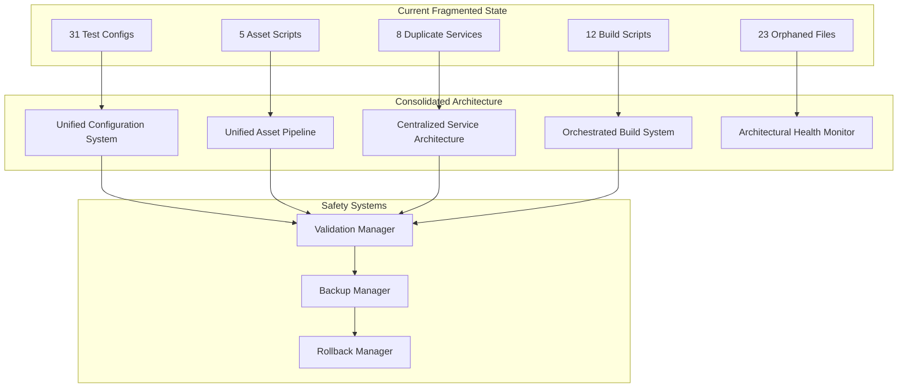
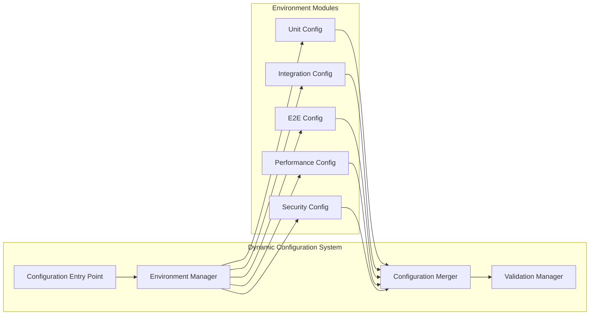
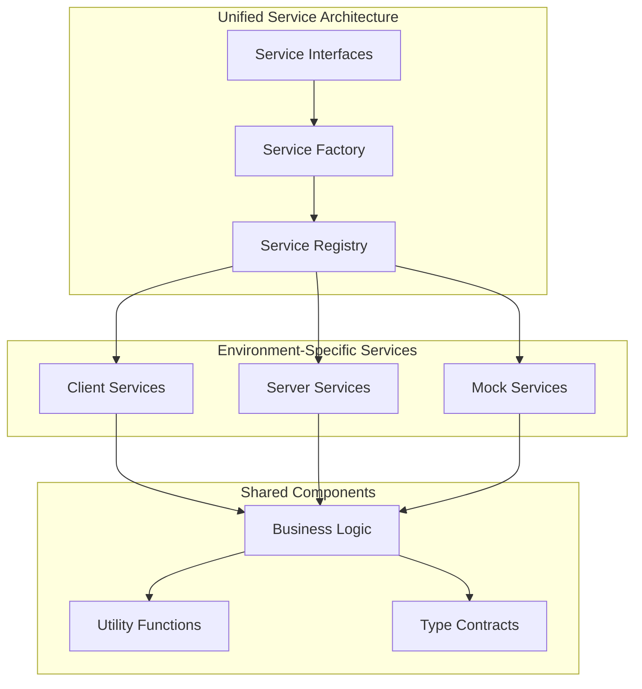

# Design Document

## Overview

This design addresses the systematic consolidation of fragmented architectural components across the codebase. The current architecture suffers from configuration proliferation (31 Vitest configs), script duplication (12+ build scripts), and scattered asset management that creates maintenance overhead. The solution implements a unified configuration system, centralized service architecture, and automated health monitoring to transform 100+ fragmented files into cohesive, maintainable systems.

The design follows a phased approach with safety gates and rollback procedures to ensure zero-downtime migration while preserving all existing functionality. Each consolidation effort includes comprehensive validation and monitoring to prevent regressions.

## Architecture

### System Architecture Overview



### Configuration Consolidation Architecture

The unified configuration system replaces 31 fragmented Vitest configurations with a dynamic system that adapts based on environment variables and runtime context.



### Service Architecture Consolidation

The service layer consolidation eliminates duplicate implementations while maintaining architectural boundaries through a factory pattern with unified interfaces.



## Components and Interfaces

### Unified Configuration System

**Core Components:**
- `config/vitest/vitest.config.ts` - Single entry point for all test configurations
- `config/vitest/environments/` - Environment-specific configuration modules
- `config/vitest/modes.ts` - Configuration mode definitions and merging logic
- `config/vitest/validation.ts` - Configuration validation and error reporting

**Key Interfaces:**

```typescript
interface TestEnvironmentConfig {
  name: string;
  testMatch: string[];
  setupFiles: string[];
  environment: 'node' | 'jsdom' | 'happy-dom';
  coverage?: CoverageConfig;
  timeout?: number;
  parallel?: boolean;
}

interface ConfigurationMode {
  id: string;
  environments: TestEnvironmentConfig[];
  globalSetup?: string;
  globalTeardown?: string;
  reporters: string[];
}

interface DynamicConfigManager {
  loadConfiguration(mode: string): Promise<ConfigurationMode>;
  validateConfiguration(config: ConfigurationMode): ValidationResult;
  mergeConfigurations(base: ConfigurationMode, override: Partial<ConfigurationMode>): ConfigurationMode;
}
```

### Unified Asset Pipeline

**Core Components:**
- `scripts/asset-pipeline/pipeline.ts` - Main orchestration engine
- `scripts/asset-pipeline/processors/` - Specialized asset processors
- `config/asset-manifest.json` - Declarative asset configuration
- `scripts/asset-pipeline/validation.ts` - Asset verification and cleanup

**Key Interfaces:**

```typescript
interface AssetManifest {
  favicon: {
    sizes: number[];
    formats: ('png' | 'ico' | 'svg')[];
    source: string;
  };
  images: {
    optimization: {
      quality: number;
      formats: string[];
      responsive: boolean;
    };
  };
  cleanup: {
    patterns: string[];
    preservePatterns: string[];
  };
}

interface AssetProcessor {
  process(input: AssetInput): Promise<AssetOutput[]>;
  validate(output: AssetOutput): ValidationResult;
  cleanup(directory: string): Promise<CleanupResult>;
}

interface AssetPipeline {
  generateAssets(manifest: AssetManifest): Promise<GenerationResult>;
  validateAssets(manifest: AssetManifest): Promise<ValidationResult>;
  cleanupAssets(manifest: AssetManifest): Promise<CleanupResult>;
}
```

### Centralized Service Architecture

**Core Components:**
- `src/services/service-factory.ts` - Environment-aware service instantiation
- `server/services/service-registry.ts` - Server-side service management
- `shared/contracts/service-interfaces.ts` - Unified service contracts
- `shared/types/service-responses.ts` - Shared response type definitions

**Key Interfaces:**

```typescript
interface ServiceFactory {
  createService<T>(serviceType: ServiceType, context: ExecutionContext): T;
  registerService<T>(serviceType: ServiceType, implementation: ServiceImplementation<T>): void;
  getAvailableServices(): ServiceType[];
}

interface ServiceRegistry {
  register<T>(name: string, service: T): void;
  resolve<T>(name: string): T;
  dispose(name: string): void;
  health(): HealthStatus;
}

interface UnifiedServiceInterface<TRequest, TResponse> {
  execute(request: TRequest): Promise<ServiceResult<TResponse>>;
  validate(request: TRequest): ValidationResult;
  getMetadata(): ServiceMetadata;
}
```

### Orchestrated Build System

**Core Components:**
- `scripts/build-pipeline/orchestrator.ts` - Build orchestration engine
- `config/build-targets.json` - Declarative build configuration
- `scripts/build-pipeline/stages/` - Specialized build stages
- `scripts/build-pipeline/validation.ts` - Build validation and verification

**Key Interfaces:**

```typescript
interface BuildTarget {
  name: string;
  environment: 'development' | 'testing' | 'staging' | 'production';
  stages: BuildStage[];
  validation: ValidationRule[];
  artifacts: ArtifactSpec[];
}

interface BuildOrchestrator {
  executeBuild(target: BuildTarget): Promise<BuildResult>;
  validateBuild(result: BuildResult): Promise<ValidationResult>;
  rollbackBuild(buildId: string): Promise<RollbackResult>;
}

interface BuildStage {
  name: string;
  execute(context: BuildContext): Promise<StageResult>;
  validate(result: StageResult): ValidationResult;
  rollback(context: BuildContext): Promise<void>;
}
```

### Architectural Health Monitor

**Core Components:**
- `scripts/monitoring/arch-health.ts` - Main health monitoring system
- `scripts/monitoring/metrics/` - Specialized metric analyzers
- `scripts/monitoring/gates/` - Quality gates and deployment blockers
- `scripts/monitoring/reporting.ts` - Health reporting and alerting

**Key Interfaces:**

```typescript
interface ArchitecturalHealthMonitor {
  analyzeHealth(): Promise<HealthReport>;
  validateQualityGates(report: HealthReport): Promise<GateResult[]>;
  generateReport(report: HealthReport): Promise<string>;
  alertOnIssues(report: HealthReport): Promise<void>;
}

interface HealthMetric {
  name: string;
  value: number;
  threshold: number;
  status: 'healthy' | 'warning' | 'critical';
  trend: 'improving' | 'stable' | 'degrading';
}

interface QualityGate {
  name: string;
  condition: (metrics: HealthMetric[]) => boolean;
  severity: 'blocking' | 'warning' | 'info';
  message: string;
}
```

## Data Models

### Configuration Models

```typescript
// Unified configuration data model
interface ConsolidatedConfiguration {
  version: string;
  environments: Record<string, EnvironmentConfig>;
  shared: SharedConfig;
  validation: ValidationRules;
  metadata: ConfigurationMetadata;
}

interface EnvironmentConfig {
  name: string;
  inherits?: string;
  overrides: ConfigurationOverrides;
  features: FeatureFlags;
  resources: ResourceLimits;
}

interface SharedConfig {
  paths: PathConfiguration;
  dependencies: DependencyConfiguration;
  optimization: OptimizationSettings;
}
```

### Asset Models

```typescript
// Asset pipeline data models
interface AssetConfiguration {
  version: string;
  sources: AssetSource[];
  processors: ProcessorConfiguration[];
  outputs: OutputConfiguration[];
  validation: AssetValidationRules;
}

interface AssetSource {
  id: string;
  path: string;
  type: AssetType;
  metadata: AssetMetadata;
}

interface ProcessorConfiguration {
  name: string;
  input: AssetType[];
  output: AssetType[];
  options: ProcessorOptions;
}
```

### Service Models

```typescript
// Service architecture data models
interface ServiceConfiguration {
  services: ServiceDefinition[];
  factories: FactoryConfiguration[];
  registries: RegistryConfiguration[];
  contracts: ContractDefinition[];
}

interface ServiceDefinition {
  name: string;
  interface: string;
  implementations: ImplementationMap;
  dependencies: string[];
  lifecycle: ServiceLifecycle;
}

interface ImplementationMap {
  client: string;
  server: string;
  mock: string;
  test?: string;
}
```

### Health Monitoring Models

```typescript
// Health monitoring data models
interface HealthConfiguration {
  metrics: MetricDefinition[];
  gates: QualityGateDefinition[];
  alerts: AlertConfiguration[];
  reporting: ReportingConfiguration;
}

interface MetricDefinition {
  name: string;
  type: MetricType;
  source: MetricSource;
  thresholds: ThresholdConfiguration;
  collection: CollectionSettings;
}

interface QualityGateDefinition {
  name: string;
  metrics: string[];
  condition: GateCondition;
  actions: GateAction[];
}
```

## Error Handling

### Comprehensive Error Management Strategy

The consolidation process implements multi-layered error handling to ensure system stability during migration and operation.

**Error Categories:**
1. **Configuration Errors** - Invalid or missing configuration data
2. **Migration Errors** - Issues during consolidation process
3. **Runtime Errors** - Problems during normal operation
4. **Validation Errors** - Failed quality gates or health checks

**Error Handling Components:**

```typescript
interface ErrorHandler {
  handleConfigurationError(error: ConfigurationError): Promise<ErrorResolution>;
  handleMigrationError(error: MigrationError): Promise<ErrorResolution>;
  handleRuntimeError(error: RuntimeError): Promise<ErrorResolution>;
  handleValidationError(error: ValidationError): Promise<ErrorResolution>;
}

interface ErrorResolution {
  strategy: 'retry' | 'fallback' | 'rollback' | 'abort';
  actions: ResolutionAction[];
  recovery: RecoveryPlan;
  notification: NotificationPlan;
}

interface RecoveryPlan {
  immediate: RecoveryAction[];
  delayed: RecoveryAction[];
  manual: ManualIntervention[];
}
```

**Fallback Mechanisms:**
- Configuration fallback to legacy systems during transition
- Service fallback to original implementations on factory failure
- Build fallback to individual scripts on orchestration failure
- Asset fallback to manual generation on pipeline failure

**Error Monitoring and Alerting:**
- Real-time error tracking with structured logging
- Automated alerting for critical failures
- Error trend analysis and predictive warnings
- Integration with existing monitoring infrastructure

## Testing Strategy

### Comprehensive Testing Approach

The testing strategy ensures that consolidation efforts maintain functionality while improving architecture.

**Testing Phases:**

1. **Pre-Consolidation Testing**
   - Baseline functionality verification
   - Performance benchmarking
   - Integration testing of existing systems

2. **Parallel System Testing**
   - Side-by-side comparison of old and new systems
   - Output verification and behavioral matching
   - Performance comparison and optimization

3. **Migration Testing**
   - Gradual rollout with canary deployments
   - Rollback procedure validation
   - Error handling verification

4. **Post-Consolidation Testing**
   - Full system integration testing
   - Performance validation against benchmarks
   - Long-term stability monitoring

**Testing Components:**

```typescript
interface ConsolidationTestSuite {
  preConsolidationTests: TestSuite[];
  parallelSystemTests: ComparisonTestSuite[];
  migrationTests: MigrationTestSuite[];
  postConsolidationTests: ValidationTestSuite[];
}

interface ComparisonTestSuite {
  name: string;
  oldSystemTest: TestCase;
  newSystemTest: TestCase;
  comparisonRules: ComparisonRule[];
  tolerances: ToleranceSettings;
}

interface MigrationTestSuite {
  name: string;
  migrationSteps: MigrationStep[];
  rollbackTests: RollbackTestCase[];
  dataIntegrityTests: IntegrityTestCase[];
}
```

**Automated Testing Infrastructure:**
- Continuous integration with quality gates
- Automated regression testing
- Performance monitoring and alerting
- Test result aggregation and reporting

**Manual Testing Procedures:**
- User acceptance testing for developer experience
- Edge case validation
- Disaster recovery testing
- Documentation verification

This comprehensive design provides a robust foundation for consolidating the fragmented architecture while maintaining system reliability and developer productivity.