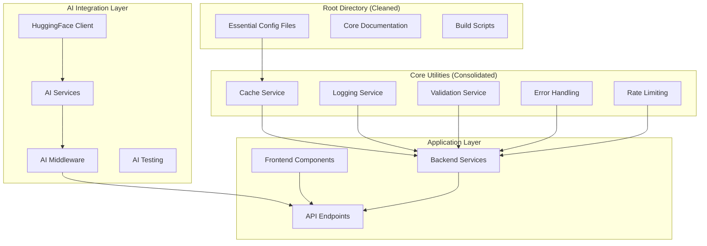
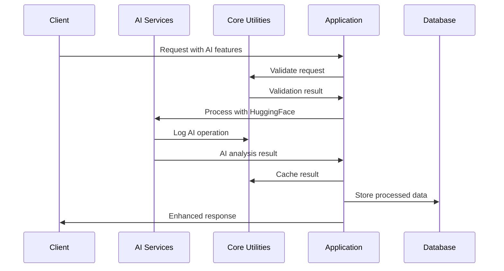

# Codebase Modernization - Design Document

## Overview

This design document outlines the comprehensive modernization of the codebase through three integrated initiatives: root directory cleanup, HuggingFace AI integration completion, and core utilities migration finalization. The design ensures minimal disruption to existing functionality while significantly improving code organization, AI capabilities, and architectural consistency.

## Architecture

### High-Level Architecture



### Component Integration Flow



## Components and Interfaces

### 1. Root Directory Cleanup Module

#### CleanupOrchestrator
```typescript
interface CleanupOrchestrator {
  analyzeRootDirectory(): Promise<CleanupPlan>;
  executeCleanup(plan: CleanupPlan): Promise<CleanupResult>;
  validateCleanup(): Promise<ValidationResult>;
}

interface CleanupPlan {
  filesToRemove: string[];
  filesToMove: FileMove[];
  filesToConsolidate: FileConsolidation[];
  scriptsToMerge: ScriptMerge[];
}

interface FileMove {
  source: string;
  destination: string;
  reason: string;
}

interface FileConsolidation {
  sources: string[];
  target: string;
  strategy: 'merge' | 'replace' | 'combine';
}
```

#### Cleanup Categories
- **Redundant Scripts**: Migration scripts, test scripts, consolidation scripts
- **Outdated Documentation**: Analysis files, summary files, temporary docs
- **Obsolete Configuration**: Duplicate env files, unused config files
- **Temporary Files**: Test files, debug files, backup files

### 2. HuggingFace AI Integration Module

#### Enhanced AI Service Architecture
```typescript
interface AIServiceManager {
  initializeServices(): Promise<void>;
  getPropertyAnalysisService(): PropertyAnalysisAI;
  getDocumentProcessingService(): DocumentProcessingAI;
  getFraudDetectionService(): FraudDetectionAI;
  getRecommendationService(): RecommendationAI;
}

interface PropertyAnalysisAI {
  analyzePropertyValue(data: PropertyData): Promise<ValuationResult>;
  assessPropertyRisk(data: PropertyData): Promise<RiskAssessment>;
  generatePropertyInsights(data: PropertyData): Promise<PropertyInsights>;
}

interface DocumentProcessingAI {
  extractDocumentData(document: Buffer): Promise<DocumentData>;
  validateDocumentAuthenticity(document: Buffer): Promise<AuthenticityResult>;
  classifyDocument(document: Buffer): Promise<DocumentClassification>;
}
```

#### AI Integration Points
- **Property Valuation**: Automated property value estimation
- **Document Analysis**: OCR and document validation
- **Fraud Detection**: Pattern recognition and anomaly detection
- **Recommendation Engine**: Personalized property recommendations
- **Sentiment Analysis**: Review and feedback analysis

### 3. Core Utilities Migration Module

#### Migration Strategy
```typescript
interface MigrationOrchestrator {
  analyzeDependencies(): Promise<DependencyMap>;
  createMigrationPlan(): Promise<MigrationPlan>;
  executeMigration(plan: MigrationPlan): Promise<MigrationResult>;
  validateMigration(): Promise<ValidationResult>;
}

interface MigrationPlan {
  utilitiesToMigrate: UtilityMigration[];
  importsToUpdate: ImportUpdate[];
  filesToRemove: string[];
  testsToUpdate: TestUpdate[];
}

interface UtilityMigration {
  source: string;
  target: string;
  dependencies: string[];
  conflicts: string[];
}
```

#### Core Utilities Structure
```
core/
├── src/
│   ├── cache/           # Multi-tier caching system
│   ├── logging/         # Structured logging with context
│   ├── validation/      # Zod-based validation framework
│   ├── error-handling/  # Comprehensive error management
│   ├── rate-limiting/   # Advanced rate limiting algorithms
│   ├── config/          # Configuration management
│   ├── health/          # Health monitoring system
│   └── middleware/      # Unified middleware patterns
```

## Data Models

### AI Service Configuration
```typescript
interface AIConfiguration {
  huggingface: {
    apiKey?: string;
    baseUrl: string;
    timeout: number;
    retryAttempts: number;
    rateLimits: RateLimitConfig;
  };
  services: {
    propertyAnalysis: ServiceConfig;
    documentProcessing: ServiceConfig;
    fraudDetection: ServiceConfig;
    recommendations: ServiceConfig;
  };
  fallback: {
    enabled: boolean;
    mockResponses: boolean;
    cacheResults: boolean;
  };
}

interface ServiceConfig {
  enabled: boolean;
  model: string;
  confidence: number;
  timeout: number;
  caching: CacheConfig;
}
```

### Cleanup Configuration
```typescript
interface CleanupConfiguration {
  rules: {
    removePatterns: string[];
    preservePatterns: string[];
    moveRules: MoveRule[];
    consolidationRules: ConsolidationRule[];
  };
  safety: {
    createBackups: boolean;
    dryRun: boolean;
    confirmationRequired: boolean;
  };
  validation: {
    checkImports: boolean;
    runTests: boolean;
    validateBuild: boolean;
  };
}
```

### Migration Tracking
```typescript
interface MigrationState {
  phase: 'analysis' | 'planning' | 'execution' | 'validation' | 'complete';
  progress: {
    completed: number;
    total: number;
    currentTask: string;
  };
  results: {
    migratedFiles: string[];
    updatedImports: string[];
    removedFiles: string[];
    errors: MigrationError[];
  };
}
```

## Error Handling

### AI Service Error Handling
```typescript
class AIServiceError extends Error {
  constructor(
    message: string,
    public service: string,
    public operation: string,
    public statusCode?: number,
    public retryable: boolean = false
  ) {
    super(message);
  }
}

interface AIErrorHandler {
  handleServiceError(error: AIServiceError): Promise<AIResponse>;
  implementFallback(service: string, operation: string): Promise<AIResponse>;
  logAIError(error: AIServiceError, context: RequestContext): void;
}
```

### Migration Error Handling
```typescript
class MigrationError extends Error {
  constructor(
    message: string,
    public file: string,
    public operation: string,
    public recoverable: boolean = true
  ) {
    super(message);
  }
}

interface MigrationErrorHandler {
  handleMigrationError(error: MigrationError): Promise<void>;
  rollbackChanges(checkpoint: string): Promise<void>;
  createRecoveryPlan(errors: MigrationError[]): Promise<RecoveryPlan>;
}
```

### Cleanup Error Handling
```typescript
class CleanupError extends Error {
  constructor(
    message: string,
    public file: string,
    public operation: 'remove' | 'move' | 'consolidate',
    public critical: boolean = false
  ) {
    super(message);
  }
}

interface CleanupErrorHandler {
  handleCleanupError(error: CleanupError): Promise<void>;
  restoreFromBackup(file: string): Promise<void>;
  validateCleanupSafety(): Promise<SafetyReport>;
}
```

## Testing Strategy

### AI Integration Testing
```typescript
interface AITestSuite {
  testServiceInitialization(): Promise<TestResult>;
  testAPIConnectivity(): Promise<TestResult>;
  testServiceResponses(): Promise<TestResult>;
  testFallbackMechanisms(): Promise<TestResult>;
  testErrorHandling(): Promise<TestResult>;
  testPerformance(): Promise<TestResult>;
}
```

### Migration Testing
```typescript
interface MigrationTestSuite {
  testDependencyAnalysis(): Promise<TestResult>;
  testImportUpdates(): Promise<TestResult>;
  testFunctionalityPreservation(): Promise<TestResult>;
  testPerformanceRegression(): Promise<TestResult>;
  testRollbackCapability(): Promise<TestResult>;
}
```

### Cleanup Testing
```typescript
interface CleanupTestSuite {
  testFileIdentification(): Promise<TestResult>;
  testSafetyValidation(): Promise<TestResult>;
  testBackupCreation(): Promise<TestResult>;
  testCleanupExecution(): Promise<TestResult>;
  testSystemIntegrity(): Promise<TestResult>;
}
```

## Implementation Phases

### Phase 1: Analysis and Planning
1. **Root Directory Analysis**
   - Scan and categorize all root files
   - Identify redundant and obsolete files
   - Create cleanup plan with safety checks

2. **AI Integration Assessment**
   - Audit current HuggingFace implementation
   - Identify missing integrations
   - Plan service enhancements

3. **Migration Dependency Analysis**
   - Map all utility dependencies
   - Identify migration conflicts
   - Create migration sequence

### Phase 2: Core Infrastructure
1. **Enhanced AI Services**
   - Implement robust HuggingFace client
   - Add comprehensive error handling
   - Create fallback mechanisms

2. **Migration Framework**
   - Build migration orchestrator
   - Implement safety mechanisms
   - Create rollback capabilities

3. **Cleanup Framework**
   - Build cleanup orchestrator
   - Implement backup systems
   - Create validation tools

### Phase 3: Execution and Integration
1. **Root Directory Cleanup**
   - Execute cleanup plan
   - Validate system integrity
   - Update documentation

2. **AI Integration Completion**
   - Deploy enhanced AI services
   - Integrate with existing features
   - Test all AI endpoints

3. **Utilities Migration**
   - Execute migration plan
   - Update all imports
   - Remove redundant code

### Phase 4: Validation and Optimization
1. **Comprehensive Testing**
   - Run full test suite
   - Validate all functionality
   - Performance testing

2. **Documentation Updates**
   - Update API documentation
   - Create migration guides
   - Update developer guides

3. **Performance Optimization**
   - Optimize AI service calls
   - Enhance caching strategies
   - Monitor system performance

## Security Considerations

### AI Service Security
- **API Key Management**: Secure storage and rotation of HuggingFace API keys
- **Data Privacy**: Ensure sensitive data is not sent to external AI services
- **Rate Limiting**: Implement proper rate limiting for AI service calls
- **Input Validation**: Validate all inputs to AI services
- **Response Sanitization**: Sanitize AI responses before use

### Migration Security
- **Backup Integrity**: Ensure backups are secure and tamper-proof
- **Permission Preservation**: Maintain file permissions during migration
- **Audit Trail**: Log all migration activities for security auditing
- **Rollback Security**: Secure rollback mechanisms to prevent unauthorized changes

### Cleanup Security
- **File Validation**: Validate file integrity before removal
- **Permission Checks**: Verify permissions before file operations
- **Backup Creation**: Create secure backups before cleanup
- **Recovery Mechanisms**: Implement secure recovery procedures

## Performance Considerations

### AI Service Performance
- **Caching Strategy**: Cache AI responses to reduce API calls
- **Async Processing**: Use async processing for AI operations
- **Connection Pooling**: Implement connection pooling for API calls
- **Timeout Management**: Proper timeout handling for AI services
- **Load Balancing**: Distribute AI service load effectively

### Migration Performance
- **Batch Processing**: Process migrations in optimized batches
- **Parallel Execution**: Execute non-dependent migrations in parallel
- **Progress Tracking**: Provide real-time progress updates
- **Resource Management**: Manage system resources during migration
- **Incremental Migration**: Support incremental migration for large codebases

### Cleanup Performance
- **File System Optimization**: Optimize file system operations
- **Batch Operations**: Batch file operations for efficiency
- **Progress Monitoring**: Monitor cleanup progress and performance
- **Resource Usage**: Manage disk space and memory usage
- **Concurrent Operations**: Support concurrent cleanup operations where safe

## Monitoring and Observability

### AI Service Monitoring
- **API Usage Metrics**: Track HuggingFace API usage and costs
- **Response Times**: Monitor AI service response times
- **Error Rates**: Track AI service error rates and types
- **Success Rates**: Monitor AI operation success rates
- **Resource Usage**: Track CPU and memory usage for AI operations

### Migration Monitoring
- **Progress Tracking**: Real-time migration progress monitoring
- **Error Tracking**: Comprehensive error tracking and reporting
- **Performance Metrics**: Monitor migration performance metrics
- **Resource Usage**: Track system resource usage during migration
- **Completion Status**: Monitor migration completion status

### System Health Monitoring
- **Service Health**: Monitor health of all modernized services
- **Performance Metrics**: Track system performance after modernization
- **Error Rates**: Monitor error rates across all components
- **Resource Usage**: Track system resource usage
- **User Experience**: Monitor user experience metrics