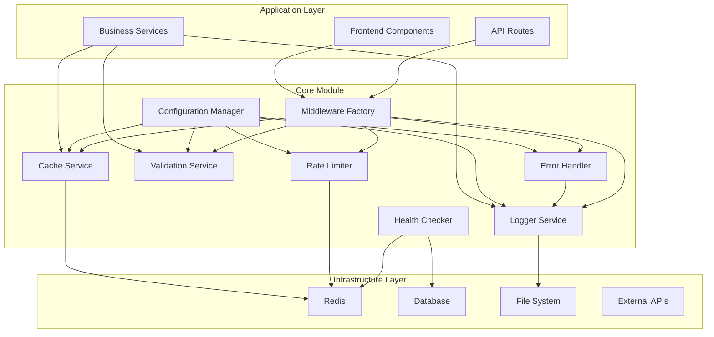

# Core Utilities Consolidation - Design Document

## Overview

This design document outlines the consolidation of cross-cutting utilities into a unified `core` module that merges existing implementations with the enhanced patterns from `refined_cross_cutting.ts`. The design focuses on creating a modular, high-performance, and maintainable architecture that eliminates code duplication while preserving backward compatibility during migration.

The core module will be structured as a standalone package within the monorepo, providing consistent interfaces for caching, logging, validation, error handling, rate limiting, configuration management, health monitoring, and middleware integration.

## Architecture

### High-Level Architecture



### Module Structure

```
core/
├── index.ts                          # Main barrel export
├── config/
│   ├── index.ts                      # Configuration manager
│   ├── schema.ts                     # Zod validation schemas
│   └── types.ts                      # Configuration types
├── cache/
│   ├── index.ts                      # Cache service factory
│   ├── adapters/
│   │   ├── redis-adapter.ts          # Redis implementation
│   │   ├── memory-adapter.ts         # In-memory implementation
│   │   └── multi-tier-adapter.ts     # L1/L2 cache
│   ├── decorators.ts                 # Cache decorators
│   └── types.ts                      # Cache interfaces
├── logging/
│   ├── index.ts                      # Logger service
│   ├── logger.ts                     # Main logger class
│   ├── middleware.ts                 # Request logging middleware
│   └── types.ts                      # Logging interfaces
├── validation/
│   ├── index.ts                      # Validation service
│   ├── schemas/                      # Common validation schemas
│   │   ├── common.ts                 # Reusable patterns
│   │   ├── auth.ts                   # Authentication schemas
│   │   └── property.ts               # Property-specific schemas
│   ├── middleware.ts                 # Validation middleware
│   └── types.ts                      # Validation interfaces
├── error-handling/
│   ├── index.ts                      # Error handling exports
│   ├── errors.ts                     # Error classes
│   ├── circuit-breaker.ts            # Circuit breaker implementation
│   ├── middleware.ts                 # Error handling middleware
│   └── types.ts                      # Error interfaces
├── rate-limiting/
│   ├── index.ts                      # Rate limiter factory
│   ├── stores/
│   │   ├── redis-store.ts            # Redis-based rate limiting
│   │   └── memory-store.ts           # Memory-based rate limiting
│   ├── algorithms/                   # Rate limiting algorithms
│   │   ├── sliding-window.ts         # Sliding window implementation
│   │   ├── token-bucket.ts           # Token bucket implementation
│   │   └── fixed-window.ts           # Fixed window implementation
│   ├── middleware.ts                 # Rate limiting middleware
│   └── types.ts                      # Rate limiting interfaces
├── health/
│   ├── index.ts                      # Health checker
│   ├── checks/                       # Individual health checks
│   │   ├── redis-check.ts            # Redis health check
│   │   ├── database-check.ts         # Database health check
│   │   └── memory-check.ts           # Memory usage check
│   └── types.ts                      # Health check interfaces
├── middleware/
│   ├── index.ts                      # Middleware factory
│   ├── auth.ts                       # Authentication middleware
│   ├── validation.ts                 # Validation middleware
│   ├── rate-limiting.ts              # Rate limiting middleware
│   ├── logging.ts                    # Logging middleware
│   └── error-handling.ts             # Error handling middleware
└── utils/
    ├── decorators.ts                 # Utility decorators
    ├── async-context.ts              # Async context utilities
    └── performance.ts                # Performance monitoring utilities
```

## Components and Interfaces

### Configuration Manager

The configuration manager consolidates environment-based configuration with comprehensive validation and hot reloading capabilities.

```typescript
// core/config/types.ts
export interface AppConfig {
  app: {
    name: string;
    version: string;
    environment: "development" | "staging" | "production" | "test";
    port: number;
    host: string;
  };
  cache: {
    provider: "redis" | "memory" | "cloudflare-kv";
    defaultTtlSec: number;
    redisUrl: string;
    legacyCompression: boolean;
    legacyPrefixing: boolean;
    maxMemoryMB: number;
    compressionThreshold: number;
  };
  log: {
    level: "fatal" | "error" | "warn" | "info" | "debug" | "trace";
    pretty: boolean;
    redactPaths: string[];
    asyncTransport: boolean;
    maxFileSize: string;
    maxFiles: number;
    enableMetrics: boolean;
  };
  // ... other configuration sections
}

// core/config/index.ts
export class ConfigManager extends EventEmitter {
  private _config: AppConfig;

  constructor();
  get config(): AppConfig;
  isFeatureEnabled(featureName: string, userId?: string): boolean;
  configure(overrides: Partial<AppConfig>): void;
  private loadConfiguration(): void;
  private validateRuntimeDependencies(): void;
}
```

### Multi-Tier Cache Service

The cache service consolidates existing implementations into a unified interface with multi-tier support and comprehensive metrics.

```typescript
// core/cache/types.ts
export interface CacheService {
  get<T>(key: string): Promise<T | null>;
  set<T>(key: string, value: T, ttlSec?: number): Promise<void>;
  del(key: string): Promise<void>;
  flush?(): Promise<void>;
  mget?<T>(keys: string[]): Promise<(T | null)[]>;
  mset?<T>(entries: [string, T, number?][]): Promise<void>;
  getMetrics?(): CacheMetrics;
  exists?(key: string): Promise<boolean>;
  ttl?(key: string): Promise<number>;
}

export interface CacheMetrics {
  hits: number;
  misses: number;
  hitRate: number;
  operations: number;
  avgResponseTime: number;
  errors: number;
}

// core/cache/index.ts
export class MultiTierCache implements CacheService {
  private l1Cache: MemoryAdapter;
  private l2Cache: RedisAdapter;

  constructor(l1MaxSizeMB: number, redisUrl: string);
  async get<T>(key: string): Promise<T | null>;
  async set<T>(key: string, value: T, ttlSec?: number): Promise<void>;
  // ... other methods
}

export class SingleFlightCache implements CacheService {
  private pending: Map<string, Promise<any>>;
  private circuitBreaker: Map<string, CircuitBreakerState>;

  constructor(private adapter: CacheService);
  // ... implementation with deduplication and circuit breaking
}
```

### Enhanced Structured Logging

The logging service provides structured logging with async context preservation and multiple transport support.

```typescript
// core/logging/types.ts
export interface LogContext {
  requestId?: string;
  userId?: string;
  traceId?: string;
  spanId?: string;
  operationName?: string;
  [key: string]: any;
}

// core/logging/logger.ts
export class Logger {
  private pino: pino.Logger;
  private metrics: LogMetrics;

  constructor(options: LoggerOptions);
  withContext<T>(context: LogContext, fn: () => T): T;

  // Enhanced logging methods
  fatal(obj: any, msg?: string): void;
  error(obj: any, msg?: string): void;
  warn(obj: any, msg?: string): void;
  info(obj: any, msg?: string): void;
  debug(obj: any, msg?: string): void;
  trace(obj: any, msg?: string): void;

  // Structured logging for specific event types
  logRequest(req: any, res?: any, duration?: number): void;
  logDatabaseQuery(query: string, duration: number, params?: any[]): void;
  logCacheOperation(
    operation: string,
    key: string,
    hit: boolean,
    duration?: number
  ): void;
  logBusinessEvent(event: string, data: any): void;
  logSecurityEvent(event: string, details: any): void;
}
```

### Comprehensive Validation Framework

The validation service provides Zod-based validation with preprocessing and caching capabilities.

```typescript
// core/validation/types.ts
export interface ValidationErrorDetail {
  field: string;
  message: string;
  code: string;
  received?: any;
}

export class ValidationError extends Error {
  public readonly errors: ValidationErrorDetail[];
  public readonly statusCode = 422;

  constructor(zodError: ZodError);
}

// core/validation/index.ts
export class ValidationService {
  private schemaCache: Map<string, ZodSchema>;
  private resultCache: Map<string, CachedResult>;

  registerSchema(name: string, schema: ZodSchema): void;
  getSchema(name: string): ZodSchema | undefined;

  async validate<T>(
    schema: ZodSchema<T>,
    data: unknown,
    options?: ValidationOptions
  ): Promise<T>;
  async validateSafe<T>(
    schema: ZodSchema<T>,
    data: unknown
  ): Promise<ValidationResult<T>>;
  async validateBatch<T>(
    schema: ZodSchema<T>,
    dataArray: unknown[]
  ): Promise<BatchValidationResult<T>>;

  private preprocessData(data: unknown): unknown;
}
```

### Enhanced Error Handling System

The error handling system provides categorized errors with circuit breaker integration and comprehensive context preservation.

```typescript
// core/error-handling/errors.ts
export class AppError extends Error {
  constructor(
    message: string,
    public statusCode: number = 500,
    public code?: string,
    public details?: any,
    public isOperational: boolean = true
  );
}

export class ValidationError extends AppError { /* ... */ }
export class NotFoundError extends AppError { /* ... */ }
export class UnauthorizedError extends AppError { /* ... */ }
export class ForbiddenError extends AppError { /* ... */ }
export class ConflictError extends AppError { /* ... */ }
export class TooManyRequestsError extends AppError { /* ... */ }
export class ServiceUnavailableError extends AppError { /* ... */ }

// core/error-handling/circuit-breaker.ts
export class CircuitBreaker {
  private failures: number = 0;
  private successes: number = 0;
  private state: 'closed' | 'open' | 'half-open' = 'closed';
  private nextAttempt: number = 0;
  private responseTimeWindow: number[] = [];
  private adaptiveThreshold: number;

  constructor(
    private threshold: number = 5,
    private timeout: number = 60000,
    private successThreshold: number = 3,
    private slowCallThreshold: number = 5000,
    private slowCallRateThreshold: number = 0.5
  );

  async call<T>(fn: () => Promise<T>, timeoutMs?: number): Promise<T>;
  getState(): CircuitBreakerState;
}
```

### Advanced Rate Limiting System

The rate limiting system supports multiple algorithms with comprehensive metrics and burst allowance.

```typescript
// core/rate-limiting/types.ts
export interface RateLimitStore {
  hit(
    key: string,
    max: number,
    windowMs: number,
    algorithm?: string
  ): Promise<RateLimitResult>;
  getMetrics?(): RateLimitMetrics;
}

export interface RateLimitResult {
  allowed: boolean;
  remaining: number;
  resetTime: Date;
  retryAfter: number;
}

export interface RateLimitMetrics {
  totalRequests: number;
  blockedRequests: number;
  blockRate: number;
  avgProcessingTime: number;
}

// core/rate-limiting/index.ts
export class RateLimiter {
  private store: RateLimitStore;
  private algorithm: string;

  constructor(store: RateLimitStore, algorithm = "sliding-window");
  async checkLimit(
    key: string,
    max: number,
    windowMs: number,
    algorithm?: string
  ): Promise<RateLimitResult>;
  getMetrics(): RateLimitMetrics | null;
}

export class RedisRateLimitStore implements RateLimitStore {
  private redis: Redis;
  private scripts: Map<string, string>;
  private metrics: RateLimitMetrics;

  constructor(redis: Redis);
  private initializeScripts(): void; // Lua scripts for atomic operations
  async hit(
    key: string,
    max: number,
    windowMs: number,
    algorithm?: string
  ): Promise<RateLimitResult>;
}
```

### Health Monitoring System

The health monitoring system provides comprehensive dependency checking with timeout protection.

```typescript
// core/health/types.ts
export interface HealthCheck {
  name: string;
  check: () => Promise<{ status: "healthy" | "unhealthy"; details?: any }>;
}

export interface HealthResult {
  status: "healthy" | "unhealthy";
  checks: Record<string, any>;
  timestamp: string;
}

// core/health/index.ts
export class HealthChecker {
  private checks: Map<string, HealthCheck>;

  register(check: HealthCheck): void;
  async runChecks(): Promise<HealthResult>;
}
```

## Data Models

### Configuration Schema

The configuration schema uses Zod for comprehensive validation with environment-specific defaults.

```typescript
const configSchema = z.object({
  app: z.object({
    name: z.string().default("app"),
    version: z.string().default("1.0.0"),
    environment: z
      .enum(["development", "staging", "production", "test"])
      .default("development"),
    port: z.coerce.number().min(1).max(65535).default(3000),
    host: z.string().default("localhost"),
  }),
  cache: z.object({
    provider: z.enum(["redis", "memory", "cloudflare-kv"]).default("redis"),
    defaultTtlSec: z.coerce.number().min(1).max(86400).default(300),
    redisUrl: z.string().url().default("redis://localhost:6379"),
    legacyCompression: z.coerce.boolean().default(true),
    legacyPrefixing: z.coerce.boolean().default(true),
    maxMemoryMB: z.coerce.number().min(1).max(1000).default(100),
    compressionThreshold: z.coerce.number().min(100).default(1024),
  }),
  // ... other configuration sections
});
```

### Cache Entry Model

Cache entries include comprehensive metadata for performance optimization and debugging.

```typescript
interface CacheEntry<T = any> {
  data: T;
  timestamp: number;
  ttl: number;
  accessCount: number;
  lastAccessed: number;
  tags: string[];
  size: number;
  compressed?: boolean;
}
```

### Audit Event Model

Audit events provide comprehensive tracking for security and compliance monitoring.

```typescript
interface AuditEvent {
  id: string;
  timestamp: Date;
  eventType: AuditEventType;
  severity: AuditSeverity;
  category: AuditCategory;
  userId?: string;
  sessionId?: string;
  ipAddress?: string;
  userAgent?: string;
  resource?: string;
  action: string;
  details: Record<string, any>;
  metadata: AuditMetadata;
  riskScore: number;
  complianceFlags: string[];
}
```

## Error Handling

### Error Classification

Errors are classified into operational and programming errors with appropriate handling strategies:

1. **Operational Errors** (expected, recoverable):
   - ValidationError (422)
   - NotFoundError (404)
   - UnauthorizedError (401)
   - ForbiddenError (403)
   - TooManyRequestsError (429)

2. **Programming Errors** (unexpected, non-recoverable):
   - TypeError
   - ReferenceError
   - SyntaxError

### Circuit Breaker Pattern

The circuit breaker implementation provides automatic failure detection and recovery:

```typescript
// Circuit breaker states and transitions
enum CircuitBreakerState {
  CLOSED = "closed", // Normal operation
  OPEN = "open", // Failing fast
  HALF_OPEN = "half-open", // Testing recovery
}

// State transitions:
// CLOSED -> OPEN: When failure threshold is exceeded
// OPEN -> HALF_OPEN: After timeout period
// HALF_OPEN -> CLOSED: When success threshold is met
// HALF_OPEN -> OPEN: When failure occurs during testing
```

### Global Error Handlers

Global error handlers ensure graceful shutdown and comprehensive error reporting:

```typescript
export function setupGlobalErrorHandlers(): void {
  process.on("uncaughtException", (err) => {
    logger.fatal({ err }, "Uncaught exception - shutting down");
    process.exit(1);
  });

  process.on("unhandledRejection", (reason, promise) => {
    logger.error({ reason, promise }, "Unhandled promise rejection");
    if (config.app.environment !== "production") {
      process.exit(1);
    }
  });

  process.on("SIGTERM", () => {
    logger.info("SIGTERM received - shutting down gracefully");
    // Implement graceful shutdown logic
    process.exit(0);
  });
}
```

## Testing Strategy

### Unit Testing

Each core module will have comprehensive unit tests with the following structure:

```
core/
├── cache/
│   ├── __tests__/
│   │   ├── redis-adapter.test.ts
│   │   ├── memory-adapter.test.ts
│   │   ├── multi-tier-cache.test.ts
│   │   └── single-flight-cache.test.ts
├── logging/
│   ├── __tests__/
│   │   ├── logger.test.ts
│   │   ├── middleware.test.ts
│   │   └── context-preservation.test.ts
├── validation/
│   ├── __tests__/
│   │   ├── validation-service.test.ts
│   │   ├── common-schemas.test.ts
│   │   └── middleware.test.ts
// ... other modules
```

### Integration Testing

Integration tests will verify cross-module functionality and external dependencies:

```typescript
// Example integration test structure
describe("Core Module Integration", () => {
  describe("Cache + Logging Integration", () => {
    it("should log cache operations with proper context");
    it("should handle cache failures gracefully");
  });

  describe("Rate Limiting + Error Handling Integration", () => {
    it("should handle rate limit exceeded with proper error responses");
    it("should log security events for rate limit violations");
  });

  describe("Configuration + All Modules Integration", () => {
    it("should configure all modules based on environment settings");
    it("should handle configuration changes with hot reloading");
  });
});
```

### Performance Testing

Performance tests will ensure the core utilities meet performance requirements:

```typescript
describe("Performance Tests", () => {
  describe("Cache Performance", () => {
    it("should handle 10,000 operations per second");
    it("should maintain sub-millisecond response times for memory cache");
    it("should handle concurrent operations without blocking");
  });

  describe("Rate Limiting Performance", () => {
    it("should process rate limit checks in under 5ms");
    it("should handle burst traffic without degradation");
  });

  describe("Logging Performance", () => {
    it("should handle high-volume logging without blocking");
    it("should maintain async transport performance");
  });
});
```

### Migration Testing

Migration tests will ensure backward compatibility and smooth transition:

```typescript
describe("Migration Compatibility", () => {
  describe("Cache Service Migration", () => {
    it("should maintain compatibility with existing cache interfaces");
    it("should migrate data from old cache implementations");
  });

  describe("Middleware Migration", () => {
    it("should work with existing Express middleware patterns");
    it("should maintain request/response compatibility");
  });
});
```

## Migration Strategy

### Phase 1: Core Module Setup (Week 1)

1. Create core module structure
2. Implement configuration manager with Zod validation
3. Set up build and test infrastructure
4. Create migration utilities and adapters

### Phase 2: Cache Service Consolidation (Week 2)

1. Implement unified cache interfaces
2. Migrate Redis adapter from server/cache/CacheService.ts
3. Migrate memory adapter from src/shared/services/CacheService.ts
4. Implement multi-tier cache with L1/L2 support
5. Add circuit breaker and single-flight patterns

### Phase 3: Logging and Validation (Week 3)

1. Implement structured logging with pino and async context
2. Migrate existing logging patterns
3. Implement comprehensive validation service with Zod
4. Migrate existing validation schemas and middleware

### Phase 4: Error Handling and Rate Limiting (Week 4)

1. Implement error classification and circuit breaker patterns
2. Migrate existing error handling middleware
3. Implement advanced rate limiting with multiple algorithms
4. Add comprehensive metrics and monitoring

### Phase 5: Health Monitoring and Middleware (Week 5)

1. Implement health checking system
2. Consolidate existing middleware patterns
3. Add performance monitoring and metrics collection
4. Implement audit trail integration

### Phase 6: Integration and Testing (Week 6)

1. Comprehensive integration testing
2. Performance benchmarking and optimization
3. Migration of existing services to use core utilities
4. Documentation and migration guides

### Backward Compatibility Strategy

To ensure smooth migration, the core module will provide adapter patterns:

```typescript
// Legacy adapter for existing cache implementations
export class LegacyCacheAdapter {
  constructor(private coreCache: CacheService) {}

  // Maintain existing method signatures
  async get(key: string): Promise<any> {
    return this.coreCache.get(key);
  }

  async set(key: string, value: any, ttl?: number): Promise<boolean> {
    await this.coreCache.set(key, value, ttl);
    return true;
  }

  // ... other legacy methods
}

// Usage in existing code
const legacyCache = new LegacyCacheAdapter(coreCache);
// Existing code continues to work without changes
```

This design ensures a comprehensive, performant, and maintainable core utilities module that consolidates existing implementations while providing enhanced functionality and backward compatibility.
