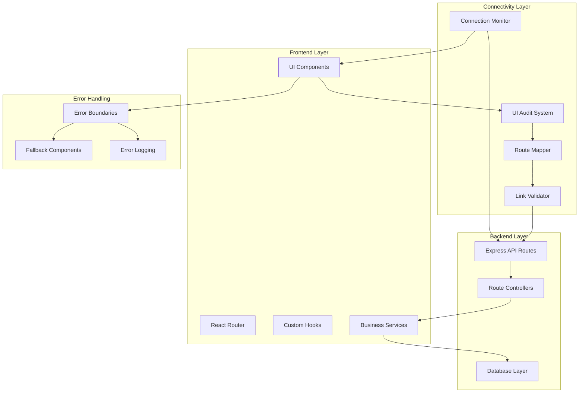

# Design Document

## Overview

This design addresses the systematic resolution of the frontend facade issue by implementing a comprehensive audit and connectivity framework. The solution involves creating automated discovery tools, implementing missing backend endpoints, establishing proper error handling, and ensuring all UI elements connect to functional backend services.

The design follows a phased approach: discovery and mapping, backend implementation, frontend integration, and monitoring. This ensures minimal disruption to existing functionality while systematically addressing each non-functional element.

## Architecture

### High-Level Architecture



### Component Architecture

The system is organized into four main architectural layers:

1. **Discovery Layer**: Automated tools to identify non-functional UI elements
2. **Implementation Layer**: Backend services and API endpoints
3. **Integration Layer**: Frontend-backend connection logic
4. **Monitoring Layer**: Health checks and performance tracking

## Components and Interfaces

### 1. UI Audit System

**Purpose**: Automatically discover and catalog all interactive UI elements

**Key Components**:
- `UIElementScanner`: Traverses React component tree to find interactive elements
- `RouteAnalyzer`: Analyzes routing configuration and identifies missing routes
- `LinkValidator`: Tests all navigation links and API calls
- `AuditReporter`: Generates comprehensive reports of findings

**Interface**:
```typescript
interface UIAuditSystem {
  scanComponents(): Promise<UIElement[]>;
  validateRoutes(): Promise<RouteValidationResult[]>;
  testAPIConnections(): Promise<APIConnectionResult[]>;
  generateReport(): Promise<AuditReport>;
}

interface UIElement {
  id: string;
  type: 'button' | 'link' | 'form' | 'input';
  location: ComponentLocation;
  currentBehavior: string;
  intendedBehavior: string;
  priority: 'critical' | 'high' | 'medium' | 'low';
  status: 'working' | 'broken' | 'missing';
}
```

### 2. Backend Implementation Framework

**Purpose**: Systematically implement missing backend functionality

**Key Components**:
- `EndpointGenerator`: Creates API endpoint stubs based on frontend requirements
- `ServiceImplementor`: Implements business logic for new endpoints
- `DatabaseMigrator`: Creates necessary database schema changes
- `ValidationLayer`: Ensures data integrity and security

**Interface**:
```typescript
interface BackendImplementationFramework {
  generateEndpoints(requirements: EndpointRequirement[]): Promise<void>;
  implementServices(services: ServiceDefinition[]): Promise<void>;
  migrateDatabase(migrations: Migration[]): Promise<void>;
  validateImplementation(): Promise<ValidationResult[]>;
}

interface EndpointRequirement {
  path: string;
  method: 'GET' | 'POST' | 'PUT' | 'DELETE' | 'PATCH';
  purpose: string;
  expectedInput: any;
  expectedOutput: any;
  authentication: boolean;
  authorization: string[];
}
```

### 3. Frontend Integration Layer

**Purpose**: Connect frontend components to backend services with proper error handling

**Key Components**:
- `APIConnector`: Standardized API communication layer
- `ErrorBoundarySystem`: Comprehensive error handling and recovery
- `LoadingStateManager`: Consistent loading states across the application
- `CacheManager`: Intelligent caching for improved performance

**Interface**:
```typescript
interface FrontendIntegrationLayer {
  connectComponent(component: ComponentDefinition): Promise<void>;
  setupErrorHandling(boundaries: ErrorBoundaryConfig[]): void;
  configureLoadingStates(states: LoadingStateConfig[]): void;
  implementCaching(cacheConfig: CacheConfiguration): void;
}

interface ComponentDefinition {
  name: string;
  requiredAPIs: string[];
  errorHandling: ErrorHandlingStrategy;
  loadingStates: LoadingStateDefinition[];
  caching: CachingStrategy;
}
```

### 4. Monitoring and Health System

**Purpose**: Continuously monitor the health of frontend-backend connections

**Key Components**:
- `ConnectionMonitor`: Real-time monitoring of API endpoints
- `PerformanceTracker`: Tracks response times and success rates
- `AlertSystem`: Notifies when connections fail or degrade
- `HealthDashboard`: Visual representation of system health

**Interface**:
```typescript
interface MonitoringSystem {
  monitorConnections(): Promise<void>;
  trackPerformance(): Promise<PerformanceMetrics>;
  setupAlerts(alertConfig: AlertConfiguration): void;
  generateHealthReport(): Promise<HealthReport>;
}

interface PerformanceMetrics {
  averageResponseTime: number;
  successRate: number;
  errorRate: number;
  uptime: number;
  slowestEndpoints: EndpointPerformance[];
}
```

## Data Models

### Audit Data Models

```typescript
interface AuditReport {
  id: string;
  timestamp: Date;
  summary: AuditSummary;
  elements: UIElement[];
  routes: RouteValidationResult[];
  apiConnections: APIConnectionResult[];
  recommendations: Recommendation[];
}

interface AuditSummary {
  totalElements: number;
  workingElements: number;
  brokenElements: number;
  missingElements: number;
  criticalIssues: number;
  estimatedFixTime: number;
}

interface Recommendation {
  priority: 'critical' | 'high' | 'medium' | 'low';
  category: 'backend' | 'frontend' | 'routing' | 'error-handling';
  description: string;
  estimatedEffort: number;
  dependencies: string[];
}
```

### Implementation Tracking Models

```typescript
interface ImplementationTask {
  id: string;
  type: 'endpoint' | 'service' | 'component' | 'route';
  title: string;
  description: string;
  status: 'pending' | 'in-progress' | 'completed' | 'failed';
  priority: 'critical' | 'high' | 'medium' | 'low';
  estimatedHours: number;
  actualHours?: number;
  dependencies: string[];
  assignee?: string;
  createdAt: Date;
  updatedAt: Date;
  completedAt?: Date;
}

interface ImplementationProgress {
  totalTasks: number;
  completedTasks: number;
  inProgressTasks: number;
  pendingTasks: number;
  failedTasks: number;
  overallProgress: number;
  estimatedCompletion: Date;
}
```

## Error Handling

### Error Boundary Strategy

The system implements a multi-level error boundary strategy:

1. **Component-Level Boundaries**: Catch errors within individual components
2. **Page-Level Boundaries**: Catch errors that affect entire pages
3. **Route-Level Boundaries**: Catch routing and navigation errors
4. **Global Boundary**: Catch any unhandled errors

```typescript
interface ErrorHandlingStrategy {
  boundaries: ErrorBoundaryLevel[];
  fallbackComponents: FallbackComponentMap;
  errorReporting: ErrorReportingConfig;
  recoveryMechanisms: RecoveryMechanism[];
}

interface ErrorBoundaryLevel {
  level: 'component' | 'page' | 'route' | 'global';
  errorTypes: string[];
  fallbackComponent: string;
  recoveryActions: string[];
  reportingEnabled: boolean;
}
```

### Error Recovery Mechanisms

1. **Automatic Retry**: For transient network errors
2. **Fallback Content**: For missing or failed content
3. **Graceful Degradation**: Reduced functionality when services are unavailable
4. **User-Initiated Recovery**: Allow users to retry failed operations

### Error Reporting and Analytics

```typescript
interface ErrorReport {
  id: string;
  timestamp: Date;
  errorType: string;
  errorMessage: string;
  stackTrace: string;
  userAgent: string;
  url: string;
  userId?: string;
  sessionId: string;
  additionalContext: Record<string, any>;
}

interface ErrorAnalytics {
  mostCommonErrors: ErrorFrequency[];
  errorTrends: ErrorTrend[];
  affectedUsers: number;
  errorRate: number;
  meanTimeToRecovery: number;
}
```

## Testing Strategy

### Automated Testing Framework

1. **UI Element Discovery Tests**: Verify all interactive elements are properly catalogued
2. **API Connectivity Tests**: Ensure all frontend API calls connect to working endpoints
3. **Error Handling Tests**: Verify error boundaries and recovery mechanisms work correctly
4. **Performance Tests**: Ensure new connections don't degrade performance
5. **Integration Tests**: Test complete user workflows end-to-end

### Test Categories

```typescript
interface TestSuite {
  unitTests: UnitTestDefinition[];
  integrationTests: IntegrationTestDefinition[];
  e2eTests: E2ETestDefinition[];
  performanceTests: PerformanceTestDefinition[];
  accessibilityTests: AccessibilityTestDefinition[];
}

interface UnitTestDefinition {
  component: string;
  testCases: TestCase[];
  mockRequirements: MockDefinition[];
}

interface IntegrationTestDefinition {
  workflow: string;
  steps: TestStep[];
  expectedOutcome: string;
  errorScenarios: ErrorScenario[];
}
```

### Testing Tools and Infrastructure

1. **Jest**: Unit testing framework
2. **React Testing Library**: Component testing
3. **Playwright**: End-to-end testing
4. **MSW (Mock Service Worker)**: API mocking
5. **Lighthouse**: Performance and accessibility testing

## Implementation Phases

### Phase 1: Discovery and Audit (Week 1-2)

**Objectives**:
- Complete UI audit of all interactive elements
- Identify all broken or missing connections
- Prioritize issues by user impact
- Create comprehensive implementation plan

**Deliverables**:
- UI Audit System implementation
- Complete audit report
- Prioritized task list
- Implementation timeline

### Phase 2: Critical Backend Implementation (Week 3-5)

**Objectives**:
- Implement missing API endpoints for critical user journeys
- Create necessary database schema changes
- Implement proper authentication and authorization
- Add comprehensive error handling

**Deliverables**:
- Working API endpoints for critical features
- Database migrations
- Authentication/authorization system
- Error handling framework

### Phase 3: Frontend Integration (Week 6-7)

**Objectives**:
- Connect frontend components to new backend endpoints
- Implement error boundaries and fallback UI
- Add loading states and user feedback
- Optimize performance and caching

**Deliverables**:
- Connected frontend components
- Error boundary system
- Loading state management
- Performance optimizations

### Phase 4: Monitoring and Validation (Week 8)

**Objectives**:
- Implement monitoring and health check systems
- Validate all connections are working
- Performance testing and optimization
- User acceptance testing

**Deliverables**:
- Monitoring dashboard
- Health check system
- Performance reports
- User acceptance validation

## Security Considerations

### Authentication and Authorization

1. **JWT Token Management**: Secure token storage and refresh mechanisms
2. **Role-Based Access Control**: Proper authorization for different user types
3. **API Security**: Rate limiting, input validation, and CORS configuration
4. **Data Protection**: Encryption of sensitive data in transit and at rest

### Input Validation and Sanitization

```typescript
interface ValidationFramework {
  inputValidators: InputValidator[];
  sanitizers: DataSanitizer[];
  securityChecks: SecurityCheck[];
  auditLogging: AuditLogConfig;
}

interface InputValidator {
  field: string;
  rules: ValidationRule[];
  errorMessages: Record<string, string>;
}

interface SecurityCheck {
  type: 'xss' | 'sql-injection' | 'csrf' | 'rate-limit';
  configuration: SecurityCheckConfig;
  enabled: boolean;
}
```

### Data Privacy and Compliance

1. **GDPR Compliance**: User data handling and deletion capabilities
2. **Data Minimization**: Only collect and store necessary data
3. **Audit Trails**: Comprehensive logging of data access and modifications
4. **Encryption**: End-to-end encryption for sensitive communications

## Performance Considerations

### Optimization Strategies

1. **Lazy Loading**: Load components and data only when needed
2. **Caching**: Intelligent caching of API responses and static assets
3. **Code Splitting**: Split JavaScript bundles for faster loading
4. **Database Optimization**: Efficient queries and indexing

### Performance Metrics

```typescript
interface PerformanceTargets {
  pageLoadTime: number; // < 2 seconds
  apiResponseTime: number; // < 500ms
  timeToInteractive: number; // < 3 seconds
  firstContentfulPaint: number; // < 1.5 seconds
  cumulativeLayoutShift: number; // < 0.1
}

interface PerformanceMonitoring {
  realUserMonitoring: boolean;
  syntheticMonitoring: boolean;
  performanceBudgets: PerformanceBudget[];
  alertThresholds: AlertThreshold[];
}
```

### Scalability Planning

1. **Horizontal Scaling**: Design for multiple server instances
2. **Database Scaling**: Read replicas and connection pooling
3. **CDN Integration**: Static asset delivery optimization
4. **Load Balancing**: Distribute traffic across multiple servers

## Deployment Strategy

### Deployment Pipeline

1. **Development Environment**: Local development with hot reloading
2. **Staging Environment**: Production-like environment for testing
3. **Production Environment**: Live system with monitoring and rollback capabilities

### Rollback Strategy

```typescript
interface RollbackStrategy {
  automaticRollback: AutoRollbackConfig;
  manualRollback: ManualRollbackConfig;
  dataRollback: DataRollbackConfig;
  monitoringTriggers: RollbackTrigger[];
}

interface AutoRollbackConfig {
  enabled: boolean;
  errorThreshold: number;
  responseTimeThreshold: number;
  rollbackDelay: number;
}
```

### Feature Flags

Implement feature flags to enable gradual rollout and quick rollback:

```typescript
interface FeatureFlag {
  name: string;
  enabled: boolean;
  rolloutPercentage: number;
  userSegments: string[];
  dependencies: string[];
}
```

## Maintenance and Support

### Documentation Strategy

1. **API Documentation**: Comprehensive API documentation with examples
2. **Component Documentation**: Frontend component usage and props
3. **Deployment Documentation**: Step-by-step deployment procedures
4. **Troubleshooting Guides**: Common issues and solutions

### Support Infrastructure

1. **Error Monitoring**: Real-time error tracking and alerting
2. **Performance Monitoring**: Continuous performance monitoring
3. **User Feedback**: Mechanisms for collecting user feedback
4. **Support Ticketing**: System for tracking and resolving issues

### Continuous Improvement

```typescript
interface ContinuousImprovement {
  performanceReviews: ReviewSchedule;
  userFeedbackAnalysis: FeedbackAnalysisConfig;
  technicalDebtTracking: TechnicalDebtConfig;
  featureUsageAnalytics: UsageAnalyticsConfig;
}
```

## Mobile and Responsive Design Considerations

### Mobile-First Approach

The connectivity fixes must work seamlessly across all device types:

1. **Touch-Friendly Interfaces**: All interactive elements sized appropriately for touch
2. **Responsive Layouts**: Forms and buttons adapt to different screen sizes
3. **Performance Optimization**: Minimize data usage and optimize for slower connections
4. **Offline Capabilities**: Essential functionality available without network connection

### Mobile-Specific Components

```typescript
interface MobileOptimization {
  touchTargetSize: number; // Minimum 44px
  gestureSupport: GestureConfiguration;
  offlineCapabilities: OfflineFeature[];
  performanceTargets: MobilePerformanceTargets;
}

interface MobilePerformanceTargets {
  initialLoadTime: number; // < 3 seconds on 3G
  interactionDelay: number; // < 100ms
  bundleSize: number; // < 1MB initial
  memoryUsage: number; // < 50MB
}
```

## Accessibility Integration

### WCAG 2.1 AA Compliance

All new and modified components must meet accessibility standards:

1. **Keyboard Navigation**: Full keyboard accessibility for all interactive elements
2. **Screen Reader Support**: Proper ARIA labels and semantic HTML
3. **Color Contrast**: Minimum 4.5:1 contrast ratio for text
4. **Focus Management**: Clear focus indicators and logical tab order

### Accessibility Testing Framework

```typescript
interface AccessibilityFramework {
  automatedTests: AccessibilityTest[];
  manualTestingChecklist: AccessibilityCheckpoint[];
  screenReaderTesting: ScreenReaderTest[];
  keyboardNavigationTests: KeyboardTest[];
}

interface AccessibilityTest {
  rule: string;
  severity: 'error' | 'warning' | 'info';
  elements: string[];
  remediation: string;
}
```

## Data Migration and Safety

### Migration Strategy

Safe handling of existing data during connectivity improvements:

1. **Backup Procedures**: Automated backups before any schema changes
2. **Rollback Mechanisms**: Quick rollback for failed migrations
3. **Data Validation**: Comprehensive validation of migrated data
4. **Incremental Updates**: Gradual rollout to minimize risk

### Migration Framework

```typescript
interface MigrationFramework {
  backupStrategy: BackupConfiguration;
  migrationSteps: MigrationStep[];
  validationRules: DataValidationRule[];
  rollbackProcedures: RollbackProcedure[];
}

interface MigrationStep {
  id: string;
  description: string;
  dependencies: string[];
  rollbackScript: string;
  validationQuery: string;
  estimatedDuration: number;
}
```

## Third-Party Integration Management

### External Service Handling

Robust handling of third-party dependencies:

1. **Circuit Breakers**: Prevent cascading failures from external services
2. **Fallback Strategies**: Alternative workflows when services are unavailable
3. **Rate Limiting**: Respect API limits and implement backoff strategies
4. **Health Monitoring**: Continuous monitoring of external service health

### Integration Architecture

```typescript
interface ThirdPartyIntegration {
  serviceName: string;
  healthCheckEndpoint: string;
  circuitBreakerConfig: CircuitBreakerConfig;
  fallbackStrategy: FallbackStrategy;
  rateLimitConfig: RateLimitConfig;
}

interface CircuitBreakerConfig {
  failureThreshold: number;
  recoveryTimeout: number;
  monitoringWindow: number;
  fallbackResponse: any;
}
```

## Advanced Error Recovery

### Intelligent Error Handling

Beyond basic error boundaries, implement smart recovery:

1. **Context-Aware Recovery**: Different recovery strategies based on user context
2. **Progressive Enhancement**: Graceful degradation of features
3. **User-Guided Recovery**: Allow users to choose recovery options
4. **Predictive Error Prevention**: Identify and prevent common error scenarios

### Recovery Strategy Framework

```typescript
interface IntelligentRecovery {
  contextAnalysis: ContextAnalyzer;
  recoveryStrategies: RecoveryStrategy[];
  userGuidance: UserGuidanceConfig;
  preventiveActions: PreventiveAction[];
}

interface RecoveryStrategy {
  errorType: string;
  userContext: UserContext;
  recoveryActions: RecoveryAction[];
  successProbability: number;
}
```

## Performance Optimization Deep Dive

### Advanced Caching Strategies

Implement sophisticated caching for optimal performance:

1. **Multi-Level Caching**: Browser, CDN, application, and database caching
2. **Smart Invalidation**: Intelligent cache invalidation based on data dependencies
3. **Predictive Preloading**: Load likely-needed data before user requests
4. **Compression Optimization**: Optimal compression for different content types

### Caching Architecture

```typescript
interface AdvancedCaching {
  levels: CacheLevel[];
  invalidationStrategies: InvalidationStrategy[];
  preloadingRules: PreloadingRule[];
  compressionConfig: CompressionConfiguration;
}

interface CacheLevel {
  name: string;
  storage: 'memory' | 'disk' | 'network';
  ttl: number;
  maxSize: number;
  evictionPolicy: 'lru' | 'lfu' | 'fifo';
}
```

## Security Hardening

### Advanced Security Measures

Comprehensive security for all new connections:

1. **Content Security Policy**: Strict CSP headers for XSS prevention
2. **API Security**: OAuth 2.0, rate limiting, and input sanitization
3. **Data Encryption**: End-to-end encryption for sensitive data
4. **Audit Logging**: Comprehensive security event logging

### Security Framework

```typescript
interface SecurityHardening {
  cspConfig: ContentSecurityPolicy;
  authenticationStrategy: AuthStrategy;
  encryptionConfig: EncryptionConfiguration;
  auditLogging: SecurityAuditConfig;
}

interface ContentSecurityPolicy {
  defaultSrc: string[];
  scriptSrc: string[];
  styleSrc: string[];
  imgSrc: string[];
  connectSrc: string[];
}
```

This design provides a comprehensive framework for systematically addressing the frontend facade issue while ensuring maintainability, performance, user experience, accessibility, mobile compatibility, and security are preserved and improved.