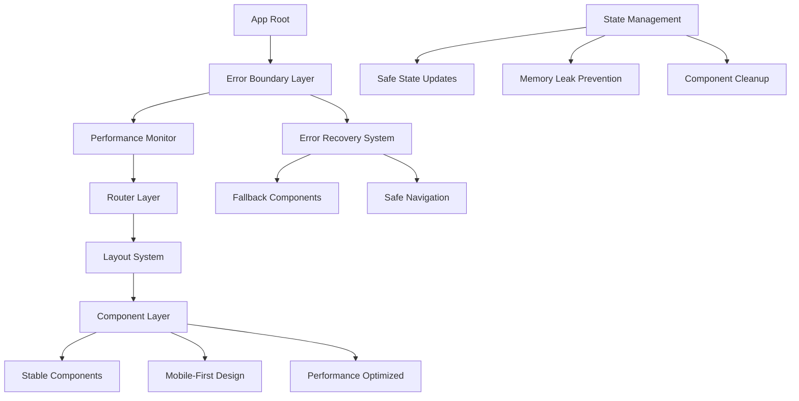
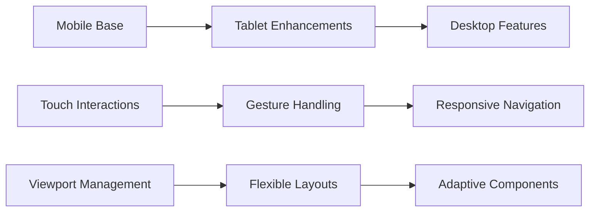

# Design Document

## Overview

This design addresses critical frontend stability issues and mobile responsiveness problems in the TripleCheck application. The current implementation suffers from complex component interactions, inadequate error handling, performance bottlenecks, and poor mobile experience. This design provides a comprehensive solution to create a stable, responsive, and deployable frontend.

## Architecture

### Core Stability Architecture



### Mobile-First Responsive Strategy



## Components and Interfaces

### 1. Enhanced Error Boundary System

**Purpose**: Prevent application crashes and provide graceful error recovery

**Key Features**:
- Multi-level error boundaries (app, route, component)
- Automatic error recovery with retry mechanisms
- User-friendly error messages with actionable suggestions
- Error reporting and monitoring integration

**Implementation Strategy**:
```typescript
interface ErrorBoundaryConfig {
  level: 'app' | 'route' | 'component';
  fallbackComponent?: React.ComponentType;
  maxRetries: number;
  retryDelay: number;
  onError?: (error: Error, errorInfo: ErrorInfo) => void;
}

interface StableComponentProps {
  errorBoundary?: ErrorBoundaryConfig;
  loadingFallback?: React.ComponentType;
  suspenseFallback?: React.ComponentType;
}
```

### 2. Safe Navigation System

**Purpose**: Prevent navigation crashes and provide reliable routing

**Key Features**:
- Navigation timeout protection
- Fallback navigation methods
- State cleanup on route changes
- Loading state management

**Implementation Strategy**:
```typescript
interface SafeNavigationConfig {
  timeout: number;
  fallbackMethod: 'window.location' | 'reload';
  cleanupCallbacks: (() => void)[];
  loadingStates: Map<string, boolean>;
}

interface NavigationGuard {
  canNavigate: (to: string, from: string) => boolean;
  beforeNavigate?: (to: string) => void;
  afterNavigate?: (to: string) => void;
}
```

### 3. Mobile-First Component System

**Purpose**: Ensure all components work perfectly on mobile devices

**Key Features**:
- Touch-friendly interactions
- Responsive breakpoint system
- Mobile-optimized navigation
- Gesture support

**Implementation Strategy**:
```typescript
interface ResponsiveConfig {
  breakpoints: {
    mobile: number;
    tablet: number;
    desktop: number;
  };
  touchTargetSize: number;
  gestureThresholds: {
    swipe: number;
    tap: number;
    longPress: number;
  };
}

interface MobileComponent {
  touchHandlers: TouchEventHandlers;
  responsiveProps: ResponsiveProps;
  accessibilityProps: A11yProps;
}
```

### 4. Performance Optimization Layer

**Purpose**: Prevent performance-related crashes and improve user experience

**Key Features**:
- Component lazy loading with error handling
- Memory leak prevention
- Efficient re-rendering patterns
- Resource cleanup

**Implementation Strategy**:
```typescript
interface PerformanceConfig {
  lazyLoadThreshold: number;
  memoryThreshold: number;
  renderThreshold: number;
  cleanupInterval: number;
}

interface OptimizedComponent {
  memoization: MemoConfig;
  cleanup: CleanupHandlers;
  loadingStrategy: LoadingStrategy;
}
```

### 5. Stable State Management

**Purpose**: Prevent state-related crashes and ensure consistent behavior

**Key Features**:
- Safe state updates with validation
- Automatic cleanup on unmount
- Error boundaries for state operations
- Optimistic updates with rollback

**Implementation Strategy**:
```typescript
interface SafeStateConfig {
  validation: ValidationSchema;
  cleanup: CleanupStrategy;
  errorHandling: ErrorHandlingStrategy;
  persistence: PersistenceConfig;
}

interface StateManager {
  safeUpdate: (updater: StateUpdater) => Promise<void>;
  rollback: () => void;
  cleanup: () => void;
  validate: (state: any) => boolean;
}
```

## Data Models

### Error Tracking Model
```typescript
interface ErrorReport {
  id: string;
  timestamp: Date;
  level: 'app' | 'route' | 'component';
  error: {
    name: string;
    message: string;
    stack?: string;
  };
  context: {
    url: string;
    userAgent: string;
    componentStack?: string;
    props?: Record<string, any>;
  };
  recovery: {
    attempted: boolean;
    successful: boolean;
    retryCount: number;
  };
}
```

### Performance Metrics Model
```typescript
interface PerformanceMetrics {
  componentId: string;
  renderTime: number;
  memoryUsage: number;
  reRenderCount: number;
  errorCount: number;
  recoveryTime?: number;
}
```

### Mobile Interaction Model
```typescript
interface TouchInteraction {
  type: 'tap' | 'swipe' | 'pinch' | 'longPress';
  startPosition: { x: number; y: number };
  endPosition: { x: number; y: number };
  duration: number;
  target: string;
  successful: boolean;
}
```

## Error Handling

### Multi-Level Error Boundaries

1. **Application Level**: Catches critical errors that would crash the entire app
2. **Route Level**: Handles navigation and page-specific errors
3. **Component Level**: Manages individual component failures

### Error Recovery Strategies

1. **Automatic Retry**: For transient errors with exponential backoff
2. **Fallback Components**: Safe alternatives when components fail
3. **Safe Navigation**: Fallback to window.location when React Router fails
4. **State Rollback**: Revert to last known good state

### Error Reporting

1. **Development**: Detailed error information with stack traces
2. **Production**: User-friendly messages with error IDs for support
3. **Monitoring**: Automatic error reporting to monitoring services

## Testing Strategy

### Stability Testing

1. **Error Boundary Testing**: Verify error boundaries catch and handle errors correctly
2. **Navigation Testing**: Test navigation under various failure conditions
3. **State Management Testing**: Verify safe state updates and cleanup
4. **Memory Leak Testing**: Ensure proper component cleanup

### Mobile Testing

1. **Responsive Design Testing**: Test across different screen sizes and orientations
2. **Touch Interaction Testing**: Verify touch gestures work correctly
3. **Performance Testing**: Test performance on mobile devices
4. **Accessibility Testing**: Ensure mobile accessibility compliance

### Cross-Browser Testing

1. **Chrome/Chromium**: Primary testing target
2. **Firefox**: Secondary testing target
3. **Safari**: Mobile Safari focus
4. **Edge**: Windows compatibility

### Performance Testing

1. **Load Testing**: Test component loading under stress
2. **Memory Testing**: Monitor memory usage and cleanup
3. **Render Testing**: Measure render performance
4. **Network Testing**: Test under poor network conditions

## Implementation Phases

### Phase 1: Core Stability (Critical)
- Implement enhanced error boundaries
- Fix navigation crashes
- Add safe state management
- Basic mobile responsiveness

### Phase 2: Mobile Optimization (High Priority)
- Mobile-first component redesign
- Touch interaction improvements
- Responsive navigation system
- Mobile performance optimization

### Phase 3: Performance Enhancement (Medium Priority)
- Advanced lazy loading
- Memory optimization
- Render optimization
- Resource cleanup

### Phase 4: Advanced Features (Low Priority)
- Advanced error recovery
- Performance monitoring
- Advanced mobile features
- Cross-browser optimization

## Technical Considerations

### Browser Compatibility
- Modern browsers (Chrome 90+, Firefox 88+, Safari 14+, Edge 90+)
- Progressive enhancement for older browsers
- Polyfills for critical features

### Performance Targets
- First Contentful Paint: < 1.5s
- Largest Contentful Paint: < 2.5s
- Cumulative Layout Shift: < 0.1
- First Input Delay: < 100ms

### Mobile Targets
- Touch target size: minimum 44px
- Viewport compatibility: 320px - 1920px
- Orientation support: portrait and landscape
- Gesture response time: < 100ms

### Accessibility Requirements
- WCAG 2.1 AA compliance
- Keyboard navigation support
- Screen reader compatibility
- High contrast mode support