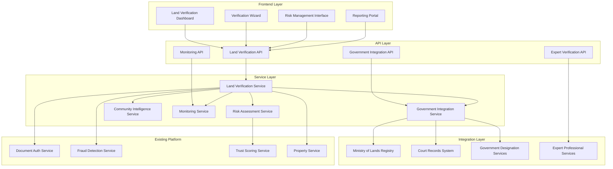
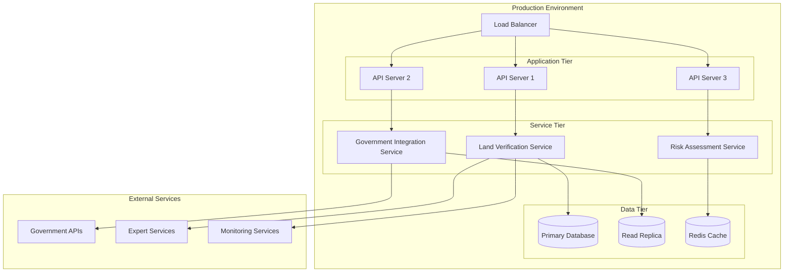

# Kenya Land Verification System - Design Document

## Overview

The Kenya Land Verification System extends the existing property platform with comprehensive land ownership verification capabilities specifically designed for Kenya's complex land tenure environment. The system implements a multi-layered verification approach that combines automated checks with guided manual processes to protect users against land grabbing and ownership fraud.

The design leverages the existing document authentication, fraud detection, and trust scoring infrastructure while adding specialized components for land registry integration, physical verification coordination, community intelligence gathering, and government designation risk assessment.

## Architecture

### High-Level Architecture



### Data Flow Architecture

The system follows a staged verification process where each layer builds upon previous results:

1. **Initial Assessment**: Basic property information validation
2. **Registry Verification**: Official government record checks
3. **Physical Verification**: Ground-truthing coordination
4. **Community Intelligence**: Local knowledge gathering
5. **Risk Assessment**: Comprehensive analysis and scoring
6. **Ongoing Monitoring**: Continuous risk monitoring

## Components and Interfaces

### Core Components

#### 1. Land Verification Service (LVS)

**Purpose**: Central orchestration service for all land verification activities

**Key Methods**:
```typescript
interface LandVerificationService {
  initiateVerification(propertyId: string, userId: string): Promise<VerificationSession>
  executeVerificationLayer(sessionId: string, layer: VerificationLayer): Promise<LayerResult>
  generateRiskAssessment(sessionId: string): Promise<RiskAssessment>
  getVerificationStatus(sessionId: string): Promise<VerificationStatus>
  scheduleMonitoring(propertyId: string, monitoringConfig: MonitoringConfig): Promise<void>
}
```

**Integration Points**:
- Existing Document Authentication Service
- Existing Fraud Detection Service
- Government Integration Service
- Risk Assessment Service

#### 2. Government Integration Service (GIS)

**Purpose**: Handles all interactions with government systems and databases

**Key Methods**:
```typescript
interface GovernmentIntegrationService {
  searchLandRegistry(titleNumber: string, location: string): Promise<RegistryResult>
  checkCourtRecords(propertyId: string, ownerNames: string[]): Promise<CourtRecord[]>
  verifyGovernmentDesignations(coordinates: Coordinates, propertyBounds: Boundary[]): Promise<DesignationRisk[]>
  checkInfrastructurePlans(location: string, radius: number): Promise<InfrastructurePlan[]>
}
```

**External Integrations**:
- Ministry of Lands Registry API
- Court Records Management System
- Kenya National Highways Authority
- Water Resources Authority
- Kenya Forest Service
- National Environment Management Authority

#### 3. Risk Assessment Service (RAS)

**Purpose**: Analyzes all verification results to generate comprehensive risk profiles

**Key Methods**:
```typescript
interface RiskAssessmentService {
  calculateOverallRisk(verificationResults: VerificationResult[]): Promise<RiskProfile>
  identifyRiskFactors(propertyData: PropertyData, verificationResults: VerificationResult[]): Promise<RiskFactor[]>
  generateRecommendations(riskProfile: RiskProfile): Promise<Recommendation[]>
  assessRiskInteractions(riskFactors: RiskFactor[]): Promise<RiskInteraction[]>
}
```

#### 4. Community Intelligence Service (CIS)

**Purpose**: Manages community knowledge gathering and validation processes

**Key Methods**:
```typescript
interface CommunityIntelligenceService {
  generateInterviewTemplates(propertyType: string, location: string): Promise<InterviewTemplate[]>
  recordCommunityFeedback(sessionId: string, feedback: CommunityFeedback): Promise<void>
  analyzeCommunityIntelligence(sessionId: string): Promise<CommunityAnalysis>
  validateCommunityInformation(feedback: CommunityFeedback, officialRecords: OfficialRecord[]): Promise<ValidationResult>
}
```

#### 5. Monitoring Service (MS)

**Purpose**: Provides ongoing monitoring and alert capabilities for verified properties

**Key Methods**:
```typescript
interface MonitoringService {
  setupPropertyMonitoring(propertyId: string, monitoringConfig: MonitoringConfig): Promise<void>
  checkForUpdates(propertyId: string): Promise<PropertyUpdate[]>
  generateAlerts(updates: PropertyUpdate[]): Promise<Alert[]>
  updateRiskAssessment(propertyId: string, newInformation: any): Promise<RiskProfile>
}
```

### Frontend Components

#### 1. Land Verification Dashboard

**Purpose**: Main interface for managing land verification processes

**Key Features**:
- Verification session overview
- Progress tracking across all verification layers
- Risk assessment visualization
- Expert coordination tools
- Document management integration

#### 2. Verification Wizard

**Purpose**: Step-by-step guided interface for conducting verification

**Key Features**:
- Layer-by-layer verification guidance
- Integration with existing document upload
- GPS coordinate validation tools
- Community interview templates
- Expert scheduling interface

#### 3. Risk Management Interface

**Purpose**: Comprehensive risk analysis and decision support

**Key Features**:
- Interactive risk profile visualization
- Risk factor analysis and weighting
- Scenario modeling and "what-if" analysis
- Recommendation engine integration
- Risk tolerance customization

#### 4. Reporting Portal

**Purpose**: Generate and manage verification reports

**Key Features**:
- Comprehensive verification reports
- Executive summaries for different audiences
- Legal documentation support
- Expert report integration
- Ongoing monitoring reports

## Data Models

### Core Data Structures

#### VerificationSession
```typescript
interface VerificationSession {
  id: string
  propertyId: string
  userId: string
  status: 'initiated' | 'in_progress' | 'completed' | 'suspended'
  createdAt: Date
  updatedAt: Date
  completedLayers: VerificationLayer[]
  currentLayer?: VerificationLayer
  riskAssessment?: RiskAssessment
  expertAssignments: ExpertAssignment[]
  monitoringConfig?: MonitoringConfig
}
```

#### VerificationLayer
```typescript
interface VerificationLayer {
  type: 'registry' | 'physical' | 'community' | 'government' | 'legal' | 'expert'
  status: 'pending' | 'in_progress' | 'completed' | 'failed'
  startedAt?: Date
  completedAt?: Date
  results: LayerResult[]
  assignedExperts?: Expert[]
  requiredDocuments: string[]
  estimatedDuration: number
}
```

#### RiskAssessment
```typescript
interface RiskAssessment {
  id: string
  sessionId: string
  overallRiskScore: number // 0-100
  riskLevel: 'low' | 'medium' | 'high' | 'critical'
  confidence: number // 0-1
  riskFactors: RiskFactor[]
  recommendations: Recommendation[]
  riskInteractions: RiskInteraction[]
  assessmentDate: Date
  validUntil: Date
}
```

#### RiskFactor
```typescript
interface RiskFactor {
  id: string
  category: 'ownership' | 'government' | 'legal' | 'physical' | 'community'
  severity: 'low' | 'medium' | 'high' | 'critical'
  confidence: number
  description: string
  evidence: Evidence[]
  impact: string
  likelihood: number
  mitigation?: string[]
}
```

#### GovernmentDesignation
```typescript
interface GovernmentDesignation {
  type: 'riparian' | 'road_reserve' | 'utility_corridor' | 'environmental' | 'mineral_rights'
  authority: string
  designation: string
  restrictions: string[]
  bufferZone?: number
  plannedChanges?: PlannedChange[]
  riskLevel: 'low' | 'medium' | 'high' | 'critical'
  lastVerified: Date
}
```

#### CommunityFeedback
```typescript
interface CommunityFeedback {
  id: string
  sessionId: string
  source: 'local_admin' | 'neighbor' | 'community_leader' | 'resident'
  sourceDetails: {
    name?: string
    position?: string
    contactInfo?: string
    yearsInArea: number
  }
  feedback: {
    ownershipHistory: string
    knownDisputes: string[]
    landUsePatterns: string[]
    recentChanges: string[]
    concerns: string[]
  }
  reliability: number // 0-1
  recordedAt: Date
  verifiedBy?: string
}
```

### Integration Data Models

#### RegistryResult
```typescript
interface RegistryResult {
  titleNumber: string
  currentOwner: OwnerInfo
  ownershipHistory: OwnershipTransfer[]
  legalInstruments: LegalInstrument[]
  surveyDetails: SurveyDetails
  restrictions: PropertyRestriction[]
  lastUpdated: Date
  verificationStatus: 'verified' | 'pending' | 'discrepancy'
}
```

#### CourtRecord
```typescript
interface CourtRecord {
  caseNumber: string
  court: string
  parties: string[]
  caseType: string
  status: 'active' | 'settled' | 'dismissed' | 'withdrawn'
  filingDate: Date
  lastActivity: Date
  summary: string
  relevanceScore: number
  riskImplication: string
}
```

## Error Handling

### Error Categories

1. **Integration Errors**: Government system unavailability, API failures
2. **Data Quality Errors**: Incomplete or inconsistent official records
3. **Verification Errors**: Failed verification steps, expert unavailability
4. **User Errors**: Incomplete information, invalid coordinates
5. **System Errors**: Service failures, database issues

### Error Handling Strategy

```typescript
interface ErrorHandlingStrategy {
  retryPolicy: {
    maxRetries: number
    backoffStrategy: 'exponential' | 'linear'
    retryableErrors: string[]
  }
  fallbackMechanisms: {
    alternativeDataSources: string[]
    manualVerificationTriggers: string[]
    partialResultHandling: boolean
  }
  userCommunication: {
    errorExplanations: boolean
    alternativeActions: boolean
    expertEscalation: boolean
  }
}
```

### Graceful Degradation

When government systems are unavailable:
1. Use cached data with appropriate warnings
2. Escalate to manual verification processes
3. Provide alternative verification methods
4. Queue requests for retry when systems recover

## Testing Strategy

### Unit Testing

- **Service Layer**: Mock external dependencies, test business logic
- **Integration Layer**: Test API contracts and data transformations
- **Risk Assessment**: Test scoring algorithms and recommendation logic
- **Data Models**: Validate data integrity and relationships

### Integration Testing

- **Government APIs**: Test with sandbox environments where available
- **Expert Systems**: Test coordination and communication workflows
- **Existing Platform**: Ensure seamless integration with current features
- **End-to-End Workflows**: Test complete verification processes

### User Acceptance Testing

- **Verification Workflows**: Test with real property scenarios
- **Risk Assessment**: Validate risk calculations with domain experts
- **User Interface**: Test usability with target user groups
- **Expert Tools**: Test coordination interfaces with professional users

### Performance Testing

- **Concurrent Verifications**: Test system under multiple simultaneous verifications
- **Large Dataset Processing**: Test with comprehensive property databases
- **Government API Load**: Test integration resilience under load
- **Report Generation**: Test performance of complex report generation

### Security Testing

- **Data Protection**: Test handling of sensitive property and personal information
- **API Security**: Test authentication and authorization for government integrations
- **Expert Communication**: Test secure communication channels
- **Audit Trails**: Test comprehensive logging and audit capabilities

## Deployment and Scalability

### Deployment Architecture



### Scalability Considerations

1. **Horizontal Scaling**: Services designed for stateless operation
2. **Database Optimization**: Read replicas for government data queries
3. **Caching Strategy**: Redis for frequently accessed verification results
4. **Queue Management**: Async processing for long-running verification tasks
5. **CDN Integration**: Static resources and report caching

### Monitoring and Observability

- **Application Metrics**: Verification completion rates, processing times
- **Integration Health**: Government API availability and response times
- **User Experience**: Verification success rates, user satisfaction scores
- **System Performance**: Resource utilization, error rates, response times
- **Business Metrics**: Risk assessment accuracy, expert utilization rates

This design provides a comprehensive foundation for implementing the Kenya Land Verification System while maintaining integration with existing platform capabilities and ensuring scalability for future growth.