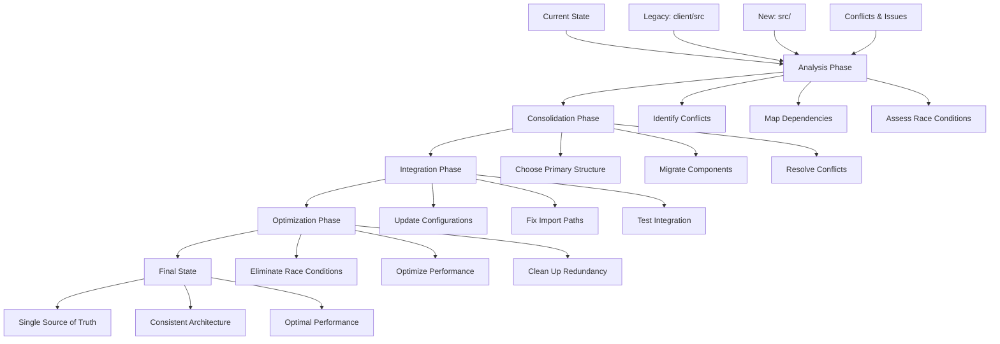

# Migration Completion Design Document

## Overview

This design addresses the incomplete migration from a legacy monolithic structure (`client/src`) to a new domain-driven architecture (`src/`). The current state has created several critical issues:

1. **Dual Entry Points**: `src/main.tsx` imports from non-existent `src/app/App` while the working app is in `client/src/app/App.tsx`
2. **Router Conflicts**: New structure uses `react-router-dom` while legacy uses `wouter`
3. **Path Resolution Issues**: Multiple conflicting path aliases and import strategies
4. **Race Conditions**: Async operations and component lifecycle conflicts
5. **Redundant Code**: Duplicate functionality across both structures

## Architecture

### Migration Strategy Overview



### Primary Architecture Decision

**Decision**: Consolidate to the `src/` domain-driven structure while preserving working functionality from `client/src`.

**Rationale**:
- Domain-driven design provides better scalability
- Clear separation of concerns
- Better testability and maintainability
- Aligns with modern React patterns

## Components and Interfaces

### 1. Entry Point Resolution

#### Current Issue
- `src/main.tsx` imports from non-existent `src/app/App`
- Working app is in `client/src/app/App.tsx`

#### Solution Design
```typescript
// src/main.tsx (Updated)
import React from 'react';
import ReactDOM from 'react-dom/client';
import { App } from './app/App';
import './shared/styles/globals.css';

ReactDOM.createRoot(document.getElementById('root')!).render(
  <React.StrictMode>
    <App />
  </React.StrictMode>
);
```

#### App Component Structure
```typescript
// src/app/App.tsx (New consolidated component)
interface AppProps {}

export function App(): JSX.Element {
  return (
    <Providers>
      <AppRouter />
    </Providers>
  );
}
```

### 2. Router Consolidation

#### Current Issue
- `src/app/router.tsx` uses `react-router-dom`
- `client/src/app/App.tsx` uses `wouter`
- Conflicting routing strategies

#### Solution Design
**Decision**: Use `wouter` as the primary router for consistency with working code.

```typescript
// src/app/router.tsx (Updated to use wouter)
import { Switch, Route } from 'wouter';
import { Suspense } from 'react';
import { LoadingSkeleton } from '../shared/components/ui/LoadingSkeleton';
import { lazyRoutes } from './lazy-routes';

export function AppRouter() {
  return (
    <div className="min-h-screen bg-background">
      <AppLayout>
        <main>
          <Suspense fallback={<LoadingSkeleton />}>
            <Switch>
              {/* Domain-based routing */}
              <Route path="/" component={lazyRoutes.Home} />
              <Route path="/property/:id">
                {(params) => <lazyRoutes.PropertyDetails id={params.id} />}
              </Route>
              {/* Additional routes... */}
              <Route component={lazyRoutes.NotFound} />
            </Switch>
          </Suspense>
        </main>
      </AppLayout>
    </div>
  );
}
```

### 3. Strategic Component Migration Strategy

#### Component Value Assessment
Before migration, each component is assessed for:
- **Strategic Value**: Core business functionality, unique implementations, optimized performance
- **Domain Alignment**: Natural fit within domain-driven structure
- **Redundancy Check**: Avoid duplicating functionality that exists in new structure
- **Legacy Status**: Components that should be preserved in legacy migration folder

#### Strategic Component Mapping
```typescript
// High-value strategic components - migrate to appropriate domains
const strategicComponentMap = {
  // Core business pages with strategic value
  'client/src/pages/home.tsx': 'src/shared/pages/Home.tsx', // Marketing optimized
  'client/src/pages/property.tsx': 'src/property/pages/PropertyDetails.tsx', // Core business logic
  'client/src/pages/dashboard.tsx': 'src/user/pages/Dashboard.tsx', // User experience optimized
  'client/src/pages/compare.tsx': 'src/property/pages/PropertyCompare.tsx', // Unique functionality
  
  // Strategic UI components with business value
  'client/src/components/listing-card.tsx': 'src/property/components/PropertyCard.tsx', // Optimized for conversions
  'client/src/components/trust-score.tsx': 'src/trust/components/TrustScore.tsx', // Core trust algorithm
  'client/src/components/property-search.tsx': 'src/search/components/PropertySearch.tsx', // Search optimization
  'client/src/components/verification-badge.tsx': 'src/trust/components/VerificationBadge.tsx', // Trust UX
  
  // Strategic services and utilities
  'client/src/services/cms.ts': 'src/shared/services/cms.ts', // Content management
  'client/src/hooks/use-stable-auth.ts': 'src/auth/hooks/useStableAuth.ts', // Auth optimization
  'client/src/hooks/use-safe-query.ts': 'src/infrastructure/hooks/useSafeQuery.ts', // Query optimization
  'client/src/utils/system-health.ts': 'src/infrastructure/monitoring/system-health.ts', // Monitoring
  
  // Navigation and layout (strategic UX)
  'client/src/app/applayout.tsx': 'src/shared/components/layout/AppLayout.tsx', // Core layout
  'client/src/components/navigation/*': 'src/shared/components/navigation/', // Navigation system
};

// Legacy preservation - move to legacy-migration folder
const legacyPreservationMap = {
  // Experimental or deprecated features
  'client/src/pages/test-functionality.tsx': 'legacy-migration/reference/test-functionality.tsx',
  'client/src/components/debug/*': 'legacy-migration/reference/debug-components/',
  'client/src/examples/*': 'legacy-migration/reference/examples/',
  
  // Old implementations to keep as reference
  'client/src/components/query-error-boundary.tsx': 'legacy-migration/reference/query-error-boundary.tsx',
  'client/src/components/search-debug.tsx': 'legacy-migration/reference/search-debug.tsx',
};

// Components to remove (redundant with new structure)
const redundantComponents = [
  'client/src/components/error-boundary.tsx', // Exists in src/app/error-boundary.tsx
  'client/src/lib/queryClient.ts', // Replaced by src/infrastructure/cache/query-cache.ts
];
```

## Data Models

### 1. Configuration Models

#### Path Resolution Configuration
```typescript
// Configuration for path resolution
interface PathConfig {
  aliases: Record<string, string>;
  baseUrl: string;
  rootDirs: string[];
}

const pathConfig: PathConfig = {
  aliases: {
    '@': './src',
    '@shared': './src/shared',
    '@property': './src/property',
    '@trust': './src/trust',
    '@user': './src/user',
    '@communication': './src/communication',
    '@analytics': './src/analytics',
    '@infrastructure': './src/infrastructure',
  },
  baseUrl: '.',
  rootDirs: ['src'],
};
```

## Error Handling

### Enhanced Error Boundary
```typescript
interface ErrorBoundaryState {
  hasError: boolean;
  error: Error | null;
  errorInfo: React.ErrorInfo | null;
  retryCount: number;
}

class EnhancedErrorBoundary extends React.Component<
  React.PropsWithChildren<{}>,
  ErrorBoundaryState
> {
  private maxRetries = 3;
  
  constructor(props: React.PropsWithChildren<{}>) {
    super(props);
    this.state = {
      hasError: false,
      error: null,
      errorInfo: null,
      retryCount: 0,
    };
  }

  static getDerivedStateFromError(error: Error): Partial<ErrorBoundaryState> {
    return {
      hasError: true,
      error,
    };
  }

  componentDidCatch(error: Error, errorInfo: React.ErrorInfo) {
    this.setState({
      error,
      errorInfo,
    });
    
    // Log error for monitoring
    console.error('Error Boundary caught an error:', error, errorInfo);
  }

  handleRetry = () => {
    if (this.state.retryCount < this.maxRetries) {
      this.setState(prevState => ({
        hasError: false,
        error: null,
        errorInfo: null,
        retryCount: prevState.retryCount + 1,
      }));
    }
  };

  render() {
    if (this.state.hasError) {
      return (
        <ErrorFallback
          error={this.state.error}
          onRetry={this.handleRetry}
          canRetry={this.state.retryCount < this.maxRetries}
        />
      );
    }

    return this.props.children;
  }
}
```

## Testing Strategy

### Race Condition Testing
```typescript
interface RaceConditionTest {
  name: string;
  scenario: string;
  setup: () => Promise<void>;
  execute: () => Promise<void>;
  verify: () => Promise<boolean>;
  cleanup: () => Promise<void>;
}

const raceConditionTests: RaceConditionTest[] = [
  {
    name: 'Concurrent Route Navigation',
    scenario: 'Multiple rapid route changes',
    setup: async () => {
      // Setup test environment
    },
    execute: async () => {
      // Simulate rapid navigation
      await Promise.all([
        navigate('/property/1'),
        navigate('/property/2'),
        navigate('/dashboard'),
      ]);
    },
    verify: async () => {
      // Verify final state is consistent
      return getCurrentRoute() === '/dashboard';
    },
    cleanup: async () => {
      // Clean up test state
    },
  },
];
```

## Race Condition Resolution

### 1. Request Cancellation Strategy
```typescript
interface RequestManager {
  activeRequests: Map<string, AbortController>;
  
  makeRequest<T>(
    key: string,
    requestFn: (signal: AbortSignal) => Promise<T>
  ): Promise<T>;
  
  cancelRequest(key: string): void;
  cancelAllRequests(): void;
}

class RequestManager implements RequestManager {
  activeRequests = new Map<string, AbortController>();

  async makeRequest<T>(
    key: string,
    requestFn: (signal: AbortSignal) => Promise<T>
  ): Promise<T> {
    // Cancel existing request with same key
    this.cancelRequest(key);
    
    // Create new abort controller
    const controller = new AbortController();
    this.activeRequests.set(key, controller);
    
    try {
      const result = await requestFn(controller.signal);
      this.activeRequests.delete(key);
      return result;
    } catch (error) {
      this.activeRequests.delete(key);
      if (error.name === 'AbortError') {
        throw new Error('Request was cancelled');
      }
      throw error;
    }
  }

  cancelRequest(key: string): void {
    const controller = this.activeRequests.get(key);
    if (controller) {
      controller.abort();
      this.activeRequests.delete(key);
    }
  }

  cancelAllRequests(): void {
    for (const [key, controller] of this.activeRequests) {
      controller.abort();
    }
    this.activeRequests.clear();
  }
}
```

### 2. Safe Effect Hook
```typescript
function useSafeEffect(
  effect: React.EffectCallback,
  deps?: React.DependencyList
): void {
  const isMountedRef = useRef(true);
  
  useEffect(() => {
    return () => {
      isMountedRef.current = false;
    };
  }, []);
  
  useEffect(() => {
    if (!isMountedRef.current) return;
    
    const cleanup = effect();
    
    return () => {
      if (cleanup && typeof cleanup === 'function') {
        cleanup();
      }
    };
  }, deps);
}
```

## Performance Optimization

### Configuration Alignment

#### Unified tsconfig.json
```json
{
  "compilerOptions": {
    "target": "ES2022",
    "lib": ["ES2022", "DOM", "DOM.Iterable"],
    "module": "ESNext",
    "moduleResolution": "bundler",
    "strict": true,
    "jsx": "preserve",
    "jsxImportSource": "react",
    "baseUrl": ".",
    "paths": {
      "@/*": ["./src/*"],
      "@shared/*": ["./src/shared/*"],
      "@property/*": ["./src/property/*"],
      "@trust/*": ["./src/trust/*"],
      "@user/*": ["./src/user/*"],
      "@communication/*": ["./src/communication/*"],
      "@analytics/*": ["./src/analytics/*"],
      "@infrastructure/*": ["./src/infrastructure/*"]
    }
  },
  "include": ["src/**/*"],
  "exclude": ["node_modules", "dist", "client"]
}
```

#### Optimized vite.config.ts
```typescript
export default defineConfig({
  plugins: [react(), runtimeErrorOverlay(), themePlugin()],
  resolve: {
    alias: {
      '@': path.resolve(__dirname, 'src'),
      '@shared': path.resolve(__dirname, 'src/shared'),
      '@property': path.resolve(__dirname, 'src/property'),
      '@trust': path.resolve(__dirname, 'src/trust'),
      '@user': path.resolve(__dirname, 'src/user'),
      '@communication': path.resolve(__dirname, 'src/communication'),
      '@analytics': path.resolve(__dirname, 'src/analytics'),
      '@infrastructure': path.resolve(__dirname, 'src/infrastructure'),
    },
  },
  build: {
    rollupOptions: {
      output: {
        manualChunks: {
          'react-vendor': ['react', 'react-dom'],
          'query-vendor': ['@tanstack/react-query'],
          'ui-vendor': ['framer-motion', 'lucide-react'],
          'property-domain': ['./src/property'],
          'trust-domain': ['./src/trust'],
          'user-domain': ['./src/user'],
          'shared': ['./src/shared'],
        },
      },
    },
  },
});
```

This design provides a comprehensive approach to completing the migration, resolving race conditions, and optimizing the application architecture for maintainability and performance.