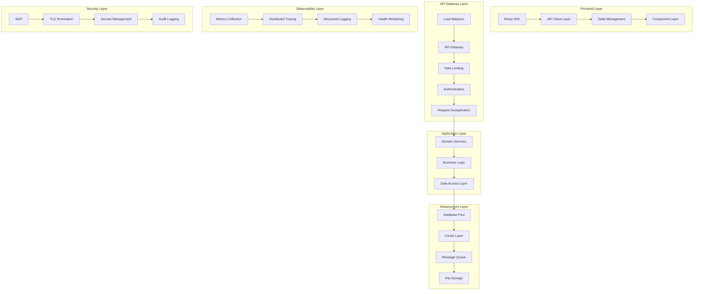

# TripleCheck Production Readiness Design Document

## Overview

This design document outlines the comprehensive transformation of the TripleCheck codebase from its current development state into a production-ready, enterprise-grade system. The design addresses all critical requirements including database infrastructure consolidation, TypeScript error elimination, frontend-backend integration coherence, production-grade resilience patterns, comprehensive observability, enterprise security hardening, centralized configuration management, blockchain integration preparation, performance optimization, deployment infrastructure, operational excellence, and comprehensive testing frameworks.

The transformation follows a systematic approach to eliminate over 1000 TypeScript errors, consolidate fragmented database infrastructure, implement enterprise-grade security and monitoring, and establish a foundation for future blockchain integration while maintaining all existing functionality.

This design specifically addresses the 13 core requirements outlined in the requirements document, ensuring zero-downtime, observable, secure, and horizontally-scalable production readiness while preparing for future blockchain integration capabilities.

## Architecture

### Current State Analysis

The TripleCheck system currently operates as a full-stack TypeScript application with:

**Frontend Stack:**
- React 18 with TypeScript
- Vite for build tooling and development
- TanStack Query for server state management
- Tailwind CSS with Radix UI components
- Domain-driven architecture (property, trust, user, auth, etc.)

**Backend Stack:**
- Node.js with Express.js
- PostgreSQL with Drizzle ORM (currently using Neon/PostgreSQL with instability issues)
- Session-based authentication
- Comprehensive domain services (land verification, fraud detection, document authentication)
- Existing infrastructure components (caching, monitoring, rate limiting)

**Current Challenges:**
- Over 1000 TypeScript errors despite successful builds
- Fragmented database infrastructure with scattered schemas and migrations across multiple locations
- Database instability issues preventing reliable development and testing
- Suboptimal frontend-backend integration causing user experience issues and component isolation
- Missing production-grade resilience patterns (circuit breakers, retry logic, caching strategies)
- Incomplete observability and monitoring coverage
- Security hardening gaps for enterprise-grade deployment
- Performance bottlenecks under load
- Lack of centralized configuration and secrets management
- Missing blockchain integration preparation

### Target Architecture

The production-ready architecture will implement a layered, microservices-ready design with comprehensive observability, security, and performance optimization.



## Architectural Assessment and Gap Analysis

**Design Rationale**: A comprehensive architectural assessment is essential to understand the current state of the TripleCheck system and identify all gaps that must be addressed to achieve production readiness. Without a complete inventory of existing components, their production-readiness status, and systematic gap analysis, it's impossible to create an effective transformation plan or ensure that all critical deficiencies are addressed.

### Current System Inventory

#### Executable Entry Points
```typescript
// /tools/system-auditor.ts
export interface SystemAuditor {
  auditEntryPoints(): Promise<EntryPointInventory>;
  assessProductionReadiness(component: SystemComponent): Promise<ReadinessAssessment>;
  generateGapAnalysis(): Promise<GapAnalysisReport>;
  prioritizeRemediation(gaps: Gap[]): Promise<RemediationPlan>;
}

export interface EntryPointInventory {
  webServers: ServerEndpoint[];
  apiEndpoints: ApiEndpoint[];
  backgroundJobs: BackgroundJob[];
  scheduledTasks: ScheduledTask[];
  webhookHandlers: WebhookHandler[];
  eventListeners: EventListener[];
}

export interface ReadinessAssessment {
  component: string;
  readinessScore: number; // 0-100
  criticalGaps: Gap[];
  recommendations: Recommendation[];
  dependencies: Dependency[];
}
```

#### Production Readiness Checklist
```typescript
// /tools/readiness-checker.ts
export interface ProductionReadinessChecker {
  checkConfigurationManagement(component: SystemComponent): Promise<CheckResult>;
  checkObservabilityInstrumentation(component: SystemComponent): Promise<CheckResult>;
  checkGracefulShutdown(component: SystemComponent): Promise<CheckResult>;
  checkHealthEndpoints(component: SystemComponent): Promise<CheckResult>;
  checkFeatureFlags(component: SystemComponent): Promise<CheckResult>;
  checkCircuitBreakers(component: SystemComponent): Promise<CheckResult>;
  checkInputValidation(component: SystemComponent): Promise<CheckResult>;
  checkRateLimiting(component: SystemComponent): Promise<CheckResult>;
  checkSecretsManagement(component: SystemComponent): Promise<CheckResult>;
  checkMigrationHandling(component: SystemComponent): Promise<CheckResult>;
}

export interface CheckResult {
  passed: boolean;
  score: number;
  issues: Issue[];
  recommendations: string[];
  priority: 'critical' | 'high' | 'medium' | 'low';
}
```

#### Code Quality Assessment
```typescript
// /tools/code-quality-auditor.ts
export interface CodeQualityAuditor {
  scanTodoComments(): Promise<TodoComment[]>;
  scanFixmeAnnotations(): Promise<FixmeAnnotation[]>;
  scanCommentedCode(): Promise<CommentedCodeBlock[]>;
  scanUnreachableCode(): Promise<UnreachableCodePath[]>;
  scanDisabledTests(): Promise<DisabledTest[]>;
  generateQualityReport(): Promise<QualityReport>;
}

export interface QualityReport {
  overallScore: number;
  technicalDebt: TechnicalDebtItem[];
  codeSmells: CodeSmell[];
  securityIssues: SecurityIssue[];
  performanceIssues: PerformanceIssue[];
  maintainabilityIssues: MaintainabilityIssue[];
}
```

#### Dependency Analysis
```typescript
// /tools/dependency-analyzer.ts
export interface DependencyAnalyzer {
  scanOutdatedPackages(): Promise<OutdatedPackage[]>;
  scanSecurityVulnerabilities(): Promise<SecurityVulnerability[]>;
  scanLicenseCompliance(): Promise<LicenseIssue[]>;
  scanMissingPeerDependencies(): Promise<MissingDependency[]>;
  generateDependencyReport(): Promise<DependencyReport>;
}

export interface DependencyReport {
  totalPackages: number;
  outdatedPackages: OutdatedPackage[];
  vulnerabilities: SecurityVulnerability[];
  licenseIssues: LicenseIssue[];
  recommendations: DependencyRecommendation[];
}
```

### Gap Analysis Framework

#### Gap Prioritization Matrix
```typescript
// /tools/gap-prioritizer.ts
export interface GapPrioritizer {
  assessImpact(gap: Gap): ImpactScore;
  assessEffort(gap: Gap): EffortEstimate;
  assessRisk(gap: Gap): RiskScore;
  generatePrioritizationMatrix(): Promise<PrioritizationMatrix>;
  createRemediationRoadmap(gaps: Gap[]): Promise<RemediationRoadmap>;
}

export interface PrioritizationMatrix {
  criticalPath: Gap[];
  quickWins: Gap[];
  majorProjects: Gap[];
  longTermInitiatives: Gap[];
}

export interface RemediationRoadmap {
  phases: RemediationPhase[];
  dependencies: PhaseDependency[];
  milestones: Milestone[];
  riskMitigation: RiskMitigationStrategy[];
}
```

## Components and Interfaces

### 1. Database Infrastructure Consolidation

**Design Rationale**: The current database infrastructure suffers from fragmentation with schemas, migrations, and data generation scripts scattered across multiple locations. This consolidation creates a single source of truth for all database-related operations, improving maintainability and reducing the risk of inconsistencies that currently block development progress.

#### Consolidated Database Architecture

```typescript
// /database/index.ts - Unified database entry point
export interface DatabaseConfig {
  url: string;
  ssl: boolean | 'require';
  poolSize: number;
  connectionTimeout: number;
  idleTimeout: number;
}

export interface DatabaseService {
  initialize(): Promise<DatabaseInitResult>;
  getConnection(): Promise<DatabaseConnection>;
  runMigrations(): Promise<MigrationResult>;
  seedData(scenario: DataScenario): Promise<SeedResult>;
  validateSchema(): Promise<ValidationResult>;
  cleanup(): Promise<void>;
}
```

#### Schema Management System

```typescript
// /database/schemas/index.ts - Centralized schema management
export interface SchemaManager {
  loadSchemas(): Promise<SchemaDefinition[]>;
  validateSchemas(): Promise<ValidationResult>;
  generateMigrations(): Promise<Migration[]>;
  applyMigrations(migrations: Migration[]): Promise<MigrationResult>;
}

// /database/migrations/manager.ts - Migration management
export interface MigrationManager {
  getPendingMigrations(): Promise<Migration[]>;
  runMigration(migration: Migration): Promise<MigrationResult>;
  rollbackMigration(migration: Migration): Promise<RollbackResult>;
  validateMigrationIntegrity(): Promise<ValidationResult>;
}
```

#### Data Generation Framework

```typescript
// /database/seeds/generator.ts - Comprehensive data generation
export interface DataGenerator {
  generateDevelopmentData(): Promise<GenerationResult>;
  generateTestingFixtures(): Promise<GenerationResult>;
  generatePerformanceDataset(volume: DataVolume): Promise<GenerationResult>;
  generateProductionSyntheticData(): Promise<GenerationResult>;
  validateGeneratedData(): Promise<ValidationResult>;
}

export enum DataVolume {
  SMALL = 'small',      // 1K records
  MEDIUM = 'medium',    // 10K records
  LARGE = 'large',      // 100K records
  XLARGE = 'xlarge'     // 1M+ records
}
```

### 2. TypeScript Error Elimination System

**Design Rationale**: The current Vite/Node.js application contains over 1000 TypeScript errors despite building successfully. This technical debt represents a significant risk to production stability, maintainability, and developer productivity. These errors mask potential runtime failures and prevent effective IDE tooling support.

#### Type Safety Framework

```typescript
// /src/types/strict.ts - Strict type definitions
export interface StrictTypeConfig {
  enforceExactOptionalProperties: boolean;
  requireExplicitReturnTypes: boolean;
  disallowAnyTypes: boolean;
  enforceNullChecks: boolean;
}

// /src/utils/type-guards.ts - Comprehensive type guards
export interface TypeGuardCollection {
  isValidUser(value: unknown): value is User;
  isValidProperty(value: unknown): value is Property;
  isValidApiResponse<T>(value: unknown, validator: (v: unknown) => v is T): value is ApiResponse<T>;
  isError(value: unknown): value is Error;
}
```

#### Code Quality Enforcement

```typescript
// /tools/type-checker.ts - Automated type checking
export interface TypeChecker {
  scanForTypeErrors(): Promise<TypeError[]>;
  fixCommonTypeIssues(): Promise<FixResult[]>;
  generateTypeDefinitions(): Promise<TypeDefinition[]>;
  validateTypeCompatibility(): Promise<CompatibilityResult>;
}
```

### 3. Frontend-Backend Integration Layer

#### API Contract System

```typescript
// /src/shared/contracts/api.ts - Type-safe API contracts
export interface ApiContract<TRequest, TResponse> {
  endpoint: string;
  method: HttpMethod;
  requestSchema: ZodSchema<TRequest>;
  responseSchema: ZodSchema<TResponse>;
  errorSchema: ZodSchema<ApiError>;
}

// /src/api/client.ts - Unified API client
export interface ApiClient {
  request<T>(contract: ApiContract<unknown, T>, data?: unknown): Promise<T>;
  upload(endpoint: string, file: File): Promise<UploadResult>;
  download(endpoint: string): Promise<Blob>;
  subscribe(endpoint: string): EventSource;
}
```

#### State Management Integration

```typescript
// /src/state/manager.ts - Unified state management
export interface StateManager {
  syncWithBackend<T>(key: string, fetcher: () => Promise<T>): Promise<T>;
  invalidateCache(pattern: string): Promise<void>;
  optimisticUpdate<T>(key: string, updater: (current: T) => T): Promise<void>;
  rollbackOptimisticUpdate(key: string): Promise<void>;
}
```

### 4. Production-Grade Resilience Layer

#### Circuit Breaker System

```typescript
// /server/infrastructure/resilience/circuit-breaker.ts
export interface CircuitBreaker {
  execute<T>(operation: () => Promise<T>): Promise<T>;
  getState(): CircuitBreakerState;
  reset(): void;
  forceOpen(): void;
  forceClose(): void;
}

export interface CircuitBreakerConfig {
  failureThreshold: number;
  recoveryTimeout: number;
  monitoringPeriod: number;
  halfOpenMaxCalls: number;
}
```

#### Retry Mechanism

```typescript
// /server/infrastructure/resilience/retry.ts
export interface RetryPolicy {
  maxAttempts: number;
  baseDelay: number;
  maxDelay: number;
  backoffMultiplier: number;
  jitterType: JitterType;
  retryableErrors: ErrorType[];
}

export interface RetryExecutor {
  execute<T>(operation: () => Promise<T>, policy: RetryPolicy): Promise<T>;
  executeWithIdempotency<T>(
    operation: () => Promise<T>, 
    idempotencyKey: string, 
    policy: RetryPolicy
  ): Promise<T>;
}
```

#### Caching Strategy

```typescript
// /server/infrastructure/cache/strategy.ts
export interface CacheStrategy {
  get<T>(key: string): Promise<T | null>;
  set<T>(key: string, value: T, ttl?: number): Promise<void>;
  invalidate(pattern: string): Promise<number>;
  warmCache(keys: string[]): Promise<void>;
  preventStampede<T>(key: string, fetcher: () => Promise<T>): Promise<T>;
}

export interface CacheConfig {
  backend: CacheBackend;
  defaultTtl: number;
  maxMemoryUsage: number;
  compressionEnabled: boolean;
  serializationFormat: SerializationFormat;
}
```

### 5. Comprehensive Observability System

#### Structured Logging

```typescript
// /server/infrastructure/observability/logging.ts
export interface StructuredLogger {
  info(message: string, context?: LogContext): void;
  warn(message: string, context?: LogContext): void;
  error(message: string, error?: Error, context?: LogContext): void;
  debug(message: string, context?: LogContext): void;
  audit(event: AuditEvent): void;
}

export interface LogContext {
  traceId?: string;
  spanId?: string;
  userId?: number;
  requestId?: string;
  operation?: string;
  metadata?: Record<string, unknown>;
}
```

#### Metrics Collection

```typescript
// /server/infrastructure/observability/metrics.ts
export interface MetricsCollector {
  counter(name: string, value?: number, tags?: Tags): void;
  gauge(name: string, value: number, tags?: Tags): void;
  histogram(name: string, value: number, tags?: Tags): void;
  timing(name: string, duration: number, tags?: Tags): void;
  increment(name: string, tags?: Tags): void;
  decrement(name: string, tags?: Tags): void;
}

export interface MetricsConfig {
  prefix: string;
  defaultTags: Tags;
  flushInterval: number;
  batchSize: number;
  endpoint: string;
}
```

#### Distributed Tracing

```typescript
// /server/infrastructure/observability/tracing.ts
export interface TracingProvider {
  startSpan(name: string, parentContext?: SpanContext): Span;
  finishSpan(span: Span): void;
  addSpanTag(span: Span, key: string, value: string | number | boolean): void;
  addSpanLog(span: Span, fields: Record<string, unknown>): void;
  injectContext(span: Span, carrier: Record<string, string>): void;
  extractContext(carrier: Record<string, string>): SpanContext | null;
}
```

### 6. Security Hardening Framework

#### Authentication & Authorization

```typescript
// /server/infrastructure/security/auth.ts
export interface AuthenticationService {
  authenticate(credentials: Credentials): Promise<AuthResult>;
  validateToken(token: string): Promise<TokenValidation>;
  refreshToken(refreshToken: string): Promise<TokenPair>;
  revokeToken(token: string): Promise<void>;
  auditAuthEvent(event: AuthEvent): Promise<void>;
}

export interface AuthorizationService {
  authorize(user: User, resource: Resource, action: Action): Promise<boolean>;
  getPermissions(user: User): Promise<Permission[]>;
  checkRole(user: User, requiredRole: Role): boolean;
  auditAuthzEvent(event: AuthzEvent): Promise<void>;
}
```

#### Input Validation & Sanitization

```typescript
// /server/infrastructure/security/validation.ts
export interface InputValidator {
  validateRequest<T>(schema: ZodSchema<T>, input: unknown): ValidationResult<T>;
  sanitizeInput(input: string, options: SanitizationOptions): string;
  detectMaliciousPatterns(input: string): SecurityThreat[];
  rateLimit(identifier: string, limits: RateLimits): Promise<RateLimitResult>;
}
```

### 7. Blockchain Integration Interface

**Design Rationale**: Future blockchain integration is a key strategic requirement for TripleCheck's land verification system. To ensure seamless integration without disrupting existing services, a well-defined blockchain service interface with production-ready stub implementations must be established. This approach allows the system to be blockchain-ready while maintaining full functionality in non-blockchain environments.

#### Blockchain Service Abstraction

```typescript
// /server/blockchain/interface.ts
export interface BlockchainService {
  // Token Operations
  mintToken(recipient: string, amount: bigint, metadata?: TokenMetadata): Promise<TransactionResult>;
  transferToken(from: string, to: string, amount: bigint): Promise<TransactionResult>;
  getBalance(address: string): Promise<bigint>;
  
  // Transaction Management
  getTransactionHistory(address: string, limit?: number): Promise<Transaction[]>;
  getTransactionStatus(txHash: string): Promise<TransactionStatus>;
  estimateGas(operation: BlockchainOperation): Promise<GasEstimate>;
  
  // Smart Contract Interaction
  callContract(address: string, method: string, params: unknown[]): Promise<ContractResult>;
  deployContract(bytecode: string, constructor: unknown[]): Promise<DeploymentResult>;
  
  // Event Monitoring
  subscribeToEvents(filter: EventFilter): Promise<EventSubscription>;
  unsubscribeFromEvents(subscription: EventSubscription): Promise<void>;
  
  // Utility Methods
  isValidAddress(address: string): boolean;
  generateWallet(): Promise<WalletInfo>;
  signMessage(message: string, privateKey: string): Promise<string>;
  verifySignature(message: string, signature: string, address: string): Promise<boolean>;
}

export interface BlockchainConfig {
  enabled: boolean;
  network: 'mainnet' | 'testnet' | 'local';
  rpcUrl: string;
  contractAddresses: Record<string, string>;
  gasLimits: Record<string, number>;
  retryPolicy: RetryPolicy;
}
```

#### Stub Implementation

```typescript
// /server/blockchain/stub.ts
export class NoopBlockchainService implements BlockchainService {
  private config: BlockchainConfig;
  
  constructor(config: BlockchainConfig) {
    this.config = config;
  }
  
  async mintToken(recipient: string, amount: bigint, metadata?: TokenMetadata): Promise<TransactionResult> {
    // Simulate realistic response times
    await new Promise(resolve => setTimeout(resolve, 100 + Math.random() * 200));
    
    return {
      success: true,
      txHash: `mock_tx_${Date.now()}_${Math.random().toString(36).substr(2, 9)}`,
      blockNumber: Math.floor(Math.random() * 1000000),
      gasUsed: BigInt(21000),
      timestamp: new Date().toISOString(),
      confirmations: 1
    };
  }
  
  async getBalance(address: string): Promise<bigint> {
    // Return mock balance based on address hash for consistency
    const hash = address.split('').reduce((a, b) => a + b.charCodeAt(0), 0);
    return BigInt(hash % 10000);
  }
  
  // ... other mock implementations with realistic behavior
}

// Feature flag integration
export class BlockchainServiceFactory {
  static create(config: BlockchainConfig): BlockchainService {
    if (config.enabled && process.env.NODE_ENV === 'production') {
      return new RealBlockchainService(config);
    }
    return new NoopBlockchainService(config);
  }
}
```

### 8. Centralized Configuration and Secrets Management

**Design Rationale**: Centralized configuration and secrets management is critical for production systems to ensure security, maintainability, and operational efficiency. The current system requires a unified approach to configuration management with secure secrets handling, automatic rotation capabilities, and proper separation of concerns between configuration and sensitive data.

#### Configuration Management System

```typescript
// /server/config/manager.ts
export interface ConfigurationManager {
  load<T>(key: string, schema: ZodSchema<T>): Promise<T>;
  reload(key: string): Promise<void>;
  watch(key: string, callback: (newValue: unknown) => void): void;
  validate(): Promise<ValidationResult>;
  getSource(key: string): ConfigSource;
}

export interface ConfigSource {
  type: 'environment' | 'file' | 'vault' | 'consul';
  location: string;
  priority: number;
  lastUpdated: Date;
}

// /server/config/hierarchical.ts
export class HierarchicalConfigManager implements ConfigurationManager {
  private sources: ConfigSource[] = [];
  private cache: Map<string, CachedConfig> = new Map();
  private watchers: Map<string, ConfigWatcher[]> = new Map();
  
  constructor(sources: ConfigSource[]) {
    this.sources = sources.sort((a, b) => b.priority - a.priority);
  }
  
  async load<T>(key: string, schema: ZodSchema<T>): Promise<T> {
    const cached = this.cache.get(key);
    if (cached && !this.isExpired(cached)) {
      return cached.value as T;
    }
    
    const value = await this.resolveFromSources(key);
    const validated = schema.parse(value);
    
    this.cache.set(key, {
      value: validated,
      timestamp: new Date(),
      ttl: this.getTTL(key)
    });
    
    return validated;
  }
  
  private async resolveFromSources(key: string): Promise<unknown> {
    for (const source of this.sources) {
      const value = await this.loadFromSource(source, key);
      if (value !== undefined) {
        return value;
      }
    }
    throw new Error(`Configuration key '${key}' not found in any source`);
  }
}
```

#### Secrets Management System

```typescript
// /server/secrets/manager.ts
export interface SecretsManager {
  getSecret<T>(key: string, schema: ZodSchema<T>): Promise<T>;
  rotateSecret(key: string): Promise<RotationResult>;
  subscribeToRotation(key: string, callback: (newValue: unknown) => void): void;
  auditAccess(key: string, accessor: string): Promise<void>;
}

export interface SecretStore {
  retrieve(key: string): Promise<string | null>;
  store(key: string, value: string, metadata?: SecretMetadata): Promise<void>;
  delete(key: string): Promise<void>;
  list(prefix?: string): Promise<SecretInfo[]>;
}

// /server/secrets/vault-integration.ts
export class VaultSecretsManager implements SecretsManager {
  private vault: VaultClient;
  private cache: SecureCache;
  private rotationScheduler: RotationScheduler;
  
  constructor(config: VaultConfig) {
    this.vault = new VaultClient(config);
    this.cache = new SecureCache(config.cacheConfig);
    this.rotationScheduler = new RotationScheduler(this);
  }
  
  async getSecret<T>(key: string, schema: ZodSchema<T>): Promise<T> {
    await this.auditAccess(key, this.getCurrentUser());
    
    const cached = await this.cache.get(key);
    if (cached && !this.isExpired(cached)) {
      return schema.parse(JSON.parse(cached.value));
    }
    
    const secret = await this.vault.read(key);
    if (!secret) {
      throw new Error(`Secret '${key}' not found`);
    }
    
    const validated = schema.parse(JSON.parse(secret.data));
    await this.cache.set(key, {
      value: JSON.stringify(validated),
      timestamp: new Date(),
      ttl: secret.lease_duration || 3600
    });
    
    return validated;
  }
  
  async rotateSecret(key: string): Promise<RotationResult> {
    const oldSecret = await this.getSecret(key, z.unknown());
    const newSecret = await this.generateNewSecret(key, oldSecret);
    
    // Atomic rotation with rollback capability
    const transaction = await this.vault.beginTransaction();
    try {
      await transaction.write(key, newSecret);
      await this.notifyRotationSubscribers(key, newSecret);
      await transaction.commit();
      
      return {
        success: true,
        rotatedAt: new Date(),
        version: await this.vault.getVersion(key)
      };
    } catch (error) {
      await transaction.rollback();
      throw new RotationError(`Failed to rotate secret '${key}': ${error.message}`);
    }
  }
}
```

#### Configuration Debugging and Validation

```typescript
// /server/config/debugger.ts
export interface ConfigurationDebugger {
  validateConfiguration(): Promise<ValidationReport>;
  traceConfigSource(key: string): Promise<ConfigTrace>;
  detectDrift(): Promise<DriftReport>;
  generateReport(): Promise<ConfigurationReport>;
}

export class ConfigurationValidator implements ConfigurationDebugger {
  async validateConfiguration(): Promise<ValidationReport> {
    const report: ValidationReport = {
      valid: true,
      errors: [],
      warnings: [],
      sources: []
    };
    
    for (const source of this.configManager.getSources()) {
      try {
        const sourceReport = await this.validateSource(source);
        report.sources.push(sourceReport);
        
        if (!sourceReport.valid) {
          report.valid = false;
          report.errors.push(...sourceReport.errors);
        }
        
        report.warnings.push(...sourceReport.warnings);
      } catch (error) {
        report.valid = false;
        report.errors.push({
          source: source.type,
          key: 'validation',
          message: `Failed to validate source: ${error.message}`,
          severity: 'error'
        });
      }
    }
    
    return report;
  }
  
  async traceConfigSource(key: string): Promise<ConfigTrace> {
    const trace: ConfigTrace = {
      key,
      sources: [],
      finalValue: null,
      resolutionPath: []
    };
    
    for (const source of this.configManager.getSources()) {
      const value = await this.loadFromSource(source, key);
      trace.sources.push({
        source: source.type,
        location: source.location,
        value: this.maskSensitiveValue(key, value),
        priority: source.priority,
        found: value !== undefined
      });
      
      if (value !== undefined && trace.finalValue === null) {
        trace.finalValue = this.maskSensitiveValue(key, value);
        trace.resolutionPath.push(source.type);
      }
    }
    
    return trace;
  }
}

## Data Models

### Consolidated Database Schema

The database schema will be reorganized into a single, well-structured directory:

```
/database/
├── schemas/
│   ├── core/           # Core entities (users, properties, reviews)
│   ├── trust/          # Trust and reputation system
│   ├── verification/   # Land verification system
│   ├── fraud/          # Fraud detection system
│   ├── communication/  # Messaging and notifications
│   └── analytics/      # Analytics and reporting
├── migrations/
│   ├── core/
│   ├── incremental/
│   └── rollback/
├── seeds/
│   ├── development/
│   ├── testing/
│   ├── performance/
│   └── production/
└── utils/
    ├── validators/
    ├── generators/
    └── analyzers/
```

### Enhanced Type Definitions

```typescript
// /src/types/api.ts - Comprehensive API types
export interface ApiResponse<T> {
  data: T;
  success: boolean;
  message?: string;
  errors?: ValidationError[];
  metadata?: ResponseMetadata;
}

export interface PaginatedResponse<T> extends ApiResponse<T[]> {
  pagination: {
    page: number;
    limit: number;
    total: number;
    hasNext: boolean;
    hasPrev: boolean;
  };
}

// /src/types/domain.ts - Domain-specific types
export interface Property {
  id: number;
  title: string;
  description: string;
  price: number;
  location: string;
  coordinates?: Coordinates;
  imageUrls: string[];
  verificationStatus: VerificationStatus;
  features: PropertyFeatures;
  ownerId: number;
  createdAt: string;
  updatedAt: string;
}

export interface User {
  id: number;
  username: string;
  email: string;
  role: UserRole;
  trustScore: number;
  isVerifiedAgent: boolean;
  profile: UserProfile;
  createdAt: string;
  updatedAt: string;
}
```

## Error Handling

### Centralized Error Management

```typescript
// /server/infrastructure/errors/manager.ts
export class ErrorManager {
  private static instance: ErrorManager;
  private errorHandlers: Map<string, ErrorHandler> = new Map();
  
  static getInstance(): ErrorManager {
    if (!ErrorManager.instance) {
      ErrorManager.instance = new ErrorManager();
    }
    return ErrorManager.instance;
  }
  
  registerHandler(errorType: string, handler: ErrorHandler): void {
    this.errorHandlers.set(errorType, handler);
  }
  
  async handleError(error: Error, context: ErrorContext): Promise<ErrorResult> {
    const errorType = this.classifyError(error);
    const handler = this.errorHandlers.get(errorType) || this.defaultHandler;
    
    return handler.handle(error, context);
  }
  
  private classifyError(error: Error): string {
    if (error instanceof ValidationError) return 'validation';
    if (error instanceof DatabaseError) return 'database';
    if (error instanceof NetworkError) return 'network';
    if (error instanceof AuthenticationError) return 'authentication';
    if (error instanceof AuthorizationError) return 'authorization';
    return 'unknown';
  }
}
```

### Error Recovery Strategies

```typescript
// /server/infrastructure/errors/recovery.ts
export interface RecoveryStrategy {
  canRecover(error: Error): boolean;
  recover(error: Error, context: ErrorContext): Promise<RecoveryResult>;
}

export class DatabaseRecoveryStrategy implements RecoveryStrategy {
  canRecover(error: Error): boolean {
    return error instanceof DatabaseConnectionError;
  }
  
  async recover(error: Error, context: ErrorContext): Promise<RecoveryResult> {
    // Attempt to reconnect to database
    // Implement exponential backoff
    // Switch to read-only mode if necessary
    return { success: true, action: 'reconnected' };
  }
}
```

## Comprehensive Testing and Validation Framework

**Design Rationale**: Comprehensive testing and validation frameworks are essential for production systems to ensure reliability, correctness, and continuous quality assurance. The current system requires extensive testing coverage including unit tests, integration tests, end-to-end tests, security tests, and performance tests to validate system behavior under all conditions.

### Testing Framework Architecture

```typescript
// /src/test-utils/framework.ts
export interface TestFramework {
  setupTestEnvironment(): Promise<TestEnvironment>;
  teardownTestEnvironment(): Promise<void>;
  createTestData(scenario: TestScenario): Promise<TestData>;
  cleanupTestData(): Promise<void>;
  runTestSuite(suite: TestSuite): Promise<TestResults>;
  validateQualityGates(results: TestResults): Promise<QualityGateResult>;
}

export interface TestEnvironment {
  database: TestDatabase;
  externalServices: MockServiceRegistry;
  configuration: TestConfiguration;
  monitoring: TestMonitoring;
  cleanup: CleanupManager;
}

export interface QualityGateResult {
  passed: boolean;
  coverage: CoverageReport;
  performance: PerformanceReport;
  security: SecurityReport;
  blockers: QualityBlocker[];
}
```

### Rapid Development Environment Setup

```typescript
// /scripts/dev-environment/setup-manager.ts
export interface DevEnvironmentManager {
  provisionEnvironment(): Promise<ProvisionResult>;
  validateSetup(): Promise<ValidationResult>;
  healthCheck(): Promise<HealthStatus>;
  resetEnvironment(): Promise<void>;
  troubleshootIssues(): Promise<TroubleshootingReport>;
}

export interface ProvisionResult {
  success: boolean;
  duration: number;
  services: ServiceStatus[];
  dependencies: DependencyStatus[];
  nextSteps: string[];
}

export interface HealthStatus {
  overall: 'healthy' | 'degraded' | 'unhealthy';
  services: ServiceHealth[];
  dependencies: DependencyHealth[];
  recommendations: string[];
}
```

### Chaos Engineering and Resilience Testing

```typescript
// /src/test-utils/chaos/chaos-engineer.ts
export interface ChaosEngineer {
  simulateNetworkPartition(duration: number): Promise<ChaosExperiment>;
  simulateServiceFailure(service: string, duration: number): Promise<ChaosExperiment>;
  simulateResourceExhaustion(resource: ResourceType, level: number): Promise<ChaosExperiment>;
  simulateInfrastructureFailure(component: string): Promise<ChaosExperiment>;
  validateRecovery(experiment: ChaosExperiment): Promise<RecoveryValidation>;
}

export interface ChaosExperiment {
  id: string;
  type: ChaosType;
  target: string;
  duration: number;
  startTime: Date;
  endTime?: Date;
  status: 'running' | 'completed' | 'failed';
  metrics: ChaosMetrics;
  recovery: RecoveryMetrics;
}

export interface RecoveryValidation {
  recoveryTime: number;
  dataConsistency: boolean;
  serviceAvailability: number;
  userImpact: ImpactAssessment;
  lessonsLearned: string[];
}
```

### Security Testing and Validation

```typescript
// /src/test-utils/security/security-tester.ts
export interface SecurityTester {
  scanSecrets(): Promise<SecretScanResult>;
  checkDependencyVulnerabilities(): Promise<VulnerabilityReport>;
  validateCompliance(standards: ComplianceStandard[]): Promise<ComplianceReport>;
  runPenetrationTests(): Promise<PenetrationTestResult>;
  validateSecurityControls(): Promise<SecurityControlValidation>;
}

export interface SecretScanResult {
  secretsFound: SecretDetection[];
  falsePositives: SecretDetection[];
  recommendations: SecurityRecommendation[];
  riskLevel: 'low' | 'medium' | 'high' | 'critical';
}

export interface VulnerabilityReport {
  totalVulnerabilities: number;
  criticalVulnerabilities: Vulnerability[];
  highVulnerabilities: Vulnerability[];
  mediumVulnerabilities: Vulnerability[];
  lowVulnerabilities: Vulnerability[];
  remediationPlan: RemediationPlan;
}

export interface ComplianceReport {
  standard: ComplianceStandard;
  overallScore: number;
  passedControls: ComplianceControl[];
  failedControls: ComplianceControl[];
  partialControls: ComplianceControl[];
  actionItems: ComplianceActionItem[];
}
```

### Blockchain Integration Testing

```typescript
// /src/test-utils/blockchain/blockchain-tester.ts
export interface BlockchainTester {
  testStubImplementation(): Promise<StubTestResult>;
  testRealImplementation(): Promise<RealImplementationTestResult>;
  validateFeatureFlags(): Promise<FeatureFlagValidation>;
  testErrorHandling(): Promise<ErrorHandlingValidation>;
  validateTransactionFlow(): Promise<TransactionFlowValidation>;
}

export interface StubTestResult {
  functionalityTests: TestResult[];
  performanceTests: PerformanceTestResult[];
  errorHandlingTests: ErrorTestResult[];
  consistencyTests: ConsistencyTestResult[];
}

export interface FeatureFlagValidation {
  flagStates: FeatureFlagState[];
  switchingTests: SwitchingTestResult[];
  fallbackTests: FallbackTestResult[];
  configurationTests: ConfigTestResult[];
}
```

### Continuous Integration Pipeline

```typescript
// /ci/pipeline/ci-orchestrator.ts
export interface CIOrchestrator {
  runLinting(): Promise<LintingResult>;
  runUnitTests(): Promise<UnitTestResult>;
  runIntegrationTests(): Promise<IntegrationTestResult>;
  runE2ETests(): Promise<E2ETestResult>;
  runSecurityScans(): Promise<SecurityScanResult>;
  runLicenseCompliance(): Promise<LicenseComplianceResult>;
  validateQualityGates(): Promise<QualityGateValidation>;
}

export interface QualityGateValidation {
  codeCoverage: CoverageValidation;
  testResults: TestResultValidation;
  securityScans: SecurityValidation;
  performanceTests: PerformanceValidation;
  licenseCompliance: LicenseValidation;
  overallStatus: 'passed' | 'failed' | 'warning';
  blockers: QualityBlocker[];
}
```

### Test Categories and Coverage

1. **Unit Tests**: Individual component testing with 90%+ coverage
   - Component isolation testing
   - Business logic validation
   - Edge case handling
   - Mock integration testing

2. **Integration Tests**: API and database integration testing
   - Database transaction testing
   - External service integration
   - Message queue processing
   - Cache integration testing

3. **End-to-End Tests**: Complete user workflow testing
   - User journey validation
   - Cross-browser compatibility
   - Mobile responsiveness
   - Accessibility compliance

4. **Performance Tests**: Load and stress testing
   - Response time validation
   - Throughput testing
   - Resource utilization monitoring
   - Scalability testing

5. **Security Tests**: Vulnerability and penetration testing
   - Authentication bypass testing
   - Authorization validation
   - Input validation testing
   - Data encryption verification

6. **Chaos Tests**: Resilience testing under failure conditions
   - Network partition simulation
   - Service failure recovery
   - Resource exhaustion handling
   - Infrastructure failure testing

### Test Data Management

```typescript
// /src/test-utils/data-manager.ts
export interface TestDataManager {
  generateTestData(volume: DataVolume): Promise<TestDataSet>;
  seedTestDatabase(data: TestDataSet): Promise<void>;
  cleanupTestData(): Promise<void>;
  createTestFixtures(scenario: string): Promise<TestFixtures>;
  validateDataIntegrity(): Promise<DataIntegrityReport>;
  anonymizeProductionData(): Promise<AnonymizedDataSet>;
}

export interface TestDataSet {
  users: TestUser[];
  properties: TestProperty[];
  transactions: TestTransaction[];
  documents: TestDocument[];
  relationships: DataRelationship[];
  metadata: TestMetadata;
}
```

## Performance Engineering and Cost Controls

**Design Rationale**: Performance optimization and cost control are essential for production systems to ensure efficient resource utilization and sustainable operations. The current system requires comprehensive performance monitoring, optimization strategies, and cost controls to maintain acceptable performance levels while managing operational expenses effectively.

### Performance Monitoring and Profiling

```typescript
// /server/infrastructure/monitoring/performance.ts
export interface PerformanceMonitor {
  trackRequest(request: Request): Promise<RequestMetrics>;
  trackDatabase(query: string): Promise<DatabaseMetrics>;
  trackCache(operation: CacheOperation): Promise<CacheMetrics>;
  trackExternalAPI(service: string, operation: string): Promise<APIMetrics>;
  generateReport(): Promise<PerformanceReport>;
  identifyBottlenecks(): Promise<Bottleneck[]>;
  generateOptimizationRecommendations(): Promise<OptimizationRecommendation[]>;
}

export interface PerformanceReport {
  timeRange: TimeRange;
  requestMetrics: RequestMetrics[];
  databaseMetrics: DatabaseMetrics[];
  cacheMetrics: CacheMetrics[];
  bottlenecks: Bottleneck[];
  recommendations: PerformanceRecommendation[];
  costAnalysis: CostAnalysis;
}

// /server/infrastructure/profiling/continuous-profiler.ts
export interface ContinuousProfiler {
  startProfiling(options: ProfilingOptions): Promise<ProfilingSession>;
  stopProfiling(sessionId: string): Promise<ProfilingResult>;
  generateFlameGraph(sessionId: string): Promise<FlameGraph>;
  analyzeTrends(timeRange: TimeRange): Promise<TrendAnalysis>;
  detectRegressions(): Promise<PerformanceRegression[]>;
}

export interface ProfilingOptions {
  duration: number;
  samplingRate: number;
  includeMemory: boolean;
  includeCPU: boolean;
  includeIO: boolean;
  minimalOverhead: boolean;
}
```

### Database Performance Optimization

```typescript
// /server/infrastructure/database/performance-optimizer.ts
export interface DatabasePerformanceOptimizer {
  optimizeConnectionPool(metrics: DatabaseMetrics): Promise<PoolConfiguration>;
  analyzePreparedStatements(): Promise<StatementAnalysis>;
  optimizeQueries(slowQueries: SlowQuery[]): Promise<QueryOptimization[]>;
  analyzeIndexUsage(): Promise<IndexAnalysis>;
  recommendIndexes(queryPatterns: QueryPattern[]): Promise<IndexRecommendation[]>;
}

export interface PoolConfiguration {
  minConnections: number;
  maxConnections: number;
  acquireTimeout: number;
  idleTimeout: number;
  reapInterval: number;
  createRetryInterval: number;
}

export interface QueryOptimization {
  originalQuery: string;
  optimizedQuery: string;
  expectedImprovement: number;
  riskLevel: 'low' | 'medium' | 'high';
  testingRequired: boolean;
}
```

### Request Coalescing and Caching

```typescript
// /server/infrastructure/optimization/request-coalescer.ts
export interface RequestCoalescer {
  coalesceRequests<T>(key: string, operation: () => Promise<T>): Promise<T>;
  preventStampede<T>(key: string, fetcher: () => Promise<T>, ttl: number): Promise<T>;
  batchRequests<T, R>(requests: T[], batchProcessor: (batch: T[]) => Promise<R[]>): Promise<R[]>;
  scheduleAsyncProcessing<T>(operation: () => Promise<T>, priority: Priority): Promise<void>;
}

// /server/infrastructure/caching/intelligent-cache.ts
export interface IntelligentCache {
  warmCache(keys: string[], priority: Priority): Promise<void>;
  preloadPredictive(userContext: UserContext): Promise<void>;
  invalidateByTags(tags: string[]): Promise<number>;
  optimizeEviction(usagePatterns: UsagePattern[]): Promise<EvictionStrategy>;
  analyzeHitRatio(): Promise<CacheAnalysis>;
}

export interface CacheAnalysis {
  hitRatio: number;
  missRatio: number;
  evictionRate: number;
  memoryUtilization: number;
  recommendations: CacheRecommendation[];
}
```

### Content Delivery and Compression

```typescript
// /server/infrastructure/cdn/content-optimizer.ts
export interface ContentOptimizer {
  compressResponse(content: string, format: CompressionFormat): Promise<CompressedContent>;
  optimizeImages(images: ImageAsset[]): Promise<OptimizedImage[]>;
  generateCacheHeaders(resource: Resource): CacheHeaders;
  invalidateCDN(patterns: string[]): Promise<InvalidationResult>;
  analyzeEdgePerformance(): Promise<EdgeAnalysis>;
}

export interface CompressionFormat {
  algorithm: 'gzip' | 'brotli' | 'deflate';
  level: number;
  threshold: number;
}

export interface CacheHeaders {
  'Cache-Control': string;
  'ETag': string;
  'Last-Modified': string;
  'Vary': string;
}
```

### Pagination and Query Optimization

```typescript
// /server/infrastructure/pagination/cursor-paginator.ts
export interface CursorPaginator<T> {
  paginate(query: Query, cursor?: string, limit?: number): Promise<PaginatedResult<T>>;
  validateComplexity(query: Query): Promise<ComplexityAnalysis>;
  enforceResultBoundaries(query: Query): Promise<BoundedQuery>;
  optimizeForPerformance(query: Query): Promise<OptimizedQuery>;
}

export interface ComplexityAnalysis {
  score: number;
  factors: ComplexityFactor[];
  recommendations: string[];
  estimatedCost: number;
}

export interface PaginatedResult<T> {
  data: T[];
  hasNextPage: boolean;
  hasPreviousPage: boolean;
  nextCursor?: string;
  previousCursor?: string;
  totalCount?: number;
  pageInfo: PageInfo;
}
```

### Cost Monitoring and Controls

```typescript
// /server/infrastructure/cost/cost-monitor.ts
export interface CostMonitor {
  trackResourceUsage(resource: Resource): Promise<UsageMetrics>;
  calculateCosts(timeRange: TimeRange): Promise<CostBreakdown>;
  predictCosts(projections: UsageProjection[]): Promise<CostForecast>;
  identifyOptimizations(): Promise<CostOptimization[]>;
  setAlerts(thresholds: CostThreshold[]): Promise<void>;
}

export interface CostBreakdown {
  compute: number;
  storage: number;
  network: number;
  database: number;
  monitoring: number;
  total: number;
  trends: CostTrend[];
}

export interface CostOptimization {
  category: string;
  description: string;
  potentialSavings: number;
  implementationEffort: 'low' | 'medium' | 'high';
  riskLevel: 'low' | 'medium' | 'high';
  timeline: string;
}
```

### Load Testing and Performance Validation

```typescript
// /server/infrastructure/testing/load-tester.ts
export interface LoadTester {
  runLoadTest(scenario: LoadTestScenario): Promise<LoadTestResult>;
  validatePerformanceTargets(targets: PerformanceTarget[]): Promise<ValidationResult>;
  simulateTrafficPatterns(patterns: TrafficPattern[]): Promise<SimulationResult>;
  stressTest(limits: StressTestLimits): Promise<StressTestResult>;
  generatePerformanceReport(): Promise<PerformanceValidationReport>;
}

export interface PerformanceTarget {
  endpoint: string;
  p95ResponseTime: number;
  p99ResponseTime: number;
  throughput: number;
  errorRate: number;
  concurrentUsers: number;
}

export interface LoadTestResult {
  scenario: LoadTestScenario;
  duration: number;
  totalRequests: number;
  successfulRequests: number;
  failedRequests: number;
  averageResponseTime: number;
  p95ResponseTime: number;
  p99ResponseTime: number;
  throughput: number;
  errorRate: number;
  resourceUtilization: ResourceUtilization;
}

## Security Implementation

### Security Layers

1. **Network Security**:
   - TLS 1.3 encryption
   - WAF protection
   - DDoS mitigation
   - IP whitelisting/blacklisting

2. **Application Security**:
   - Input validation and sanitization
   - SQL injection prevention
   - XSS protection
   - CSRF token validation

3. **Authentication Security**:
   - Multi-factor authentication
   - Session management
   - Password policies
   - Account lockout mechanisms

4. **Data Security**:
   - Encryption at rest (AES-256)
   - Encryption in transit (TLS 1.3)
   - Key management
   - Data classification

### Security Monitoring

```typescript
// /server/infrastructure/security/monitor.ts
export interface SecurityMonitor {
  detectAnomalies(request: Request): Promise<SecurityThreat[]>;
  trackFailedAttempts(identifier: string): Promise<void>;
  auditSecurityEvent(event: SecurityEvent): Promise<void>;
  generateSecurityReport(): Promise<SecurityReport>;
  alertOnThreat(threat: SecurityThreat): Promise<void>;
}
```

## Deployment Architecture

### Container Strategy

```dockerfile
# Multi-stage Dockerfile for optimized production builds
FROM node:18-alpine AS builder
WORKDIR /app
COPY package*.json ./
RUN npm ci --only=production

FROM node:18-alpine AS runtime
RUN addgroup -g 1001 -S nodejs
RUN adduser -S nextjs -u 1001
WORKDIR /app
COPY --from=builder --chown=nextjs:nodejs /app/node_modules ./node_modules
COPY --chown=nextjs:nodejs . .
USER nextjs
EXPOSE 3000
CMD ["npm", "start"]
```

### Kubernetes Deployment

```yaml
# /k8s/deployment.yaml
apiVersion: apps/v1
kind: Deployment
metadata:
  name: triplecheck-api
spec:
  replicas: 3
  selector:
    matchLabels:
      app: triplecheck-api
  template:
    metadata:
      labels:
        app: triplecheck-api
    spec:
      containers:
      - name: api
        image: triplecheck/api:latest
        ports:
        - containerPort: 3000
        env:
        - name: DATABASE_URL
          valueFrom:
            secretKeyRef:
              name: database-secret
              key: url
        resources:
          requests:
            memory: "256Mi"
            cpu: "250m"
          limits:
            memory: "512Mi"
            cpu: "500m"
        livenessProbe:
          httpGet:
            path: /health
            port: 3000
          initialDelaySeconds: 30
          periodSeconds: 10
        readinessProbe:
          httpGet:
            path: /health
            port: 3000
          initialDelaySeconds: 5
          periodSeconds: 5
```

### Infrastructure as Code

```hcl
# /terraform/main.tf
resource "aws_ecs_cluster" "triplecheck" {
  name = "triplecheck-cluster"
  
  setting {
    name  = "containerInsights"
    value = "enabled"
  }
}

resource "aws_ecs_service" "api" {
  name            = "triplecheck-api"
  cluster         = aws_ecs_cluster.triplecheck.id
  task_definition = aws_ecs_task_definition.api.arn
  desired_count   = 3
  
  load_balancer {
    target_group_arn = aws_lb_target_group.api.arn
    container_name   = "api"
    container_port   = 3000
  }
  
  depends_on = [aws_lb_listener.api]
}
```

## Monitoring and Alerting

### Monitoring Stack

1. **Metrics**: Prometheus + Grafana
2. **Logging**: ELK Stack (Elasticsearch, Logstash, Kibana)
3. **Tracing**: Jaeger or Zipkin
4. **APM**: New Relic or DataDog
5. **Uptime**: Pingdom or StatusPage

### Alert Configuration

```yaml
# /monitoring/alerts.yaml
groups:
- name: triplecheck.rules
  rules:
  - alert: HighErrorRate
    expr: rate(http_requests_total{status=~"5.."}[5m]) > 0.1
    for: 5m
    labels:
      severity: critical
    annotations:
      summary: High error rate detected
      
  - alert: DatabaseConnectionFailure
    expr: up{job="database"} == 0
    for: 1m
    labels:
      severity: critical
    annotations:
      summary: Database connection failure
      
  - alert: HighMemoryUsage
    expr: (node_memory_MemTotal_bytes - node_memory_MemAvailable_bytes) / node_memory_MemTotal_bytes > 0.9
    for: 5m
    labels:
      severity: warning
    annotations:
      summary: High memory usage detected
```

## Operational Excellence and Incident Response

**Design Rationale**: Operational excellence is critical for production systems to ensure effective maintenance, rapid incident resolution, and continuous improvement. The current system requires comprehensive operational documentation, incident response procedures, and team enablement processes to achieve enterprise-grade operational capabilities.

### Architecture Decision Records (ADRs)

```typescript
// /docs/architecture/adr-manager.ts
export interface ADRManager {
  createADR(decision: ArchitecturalDecision): Promise<ADRDocument>;
  updateADR(id: string, updates: Partial<ADRDocument>): Promise<ADRDocument>;
  reviewADR(id: string, review: ADRReview): Promise<void>;
  searchADRs(criteria: SearchCriteria): Promise<ADRDocument[]>;
  generateADRReport(): Promise<ADRReport>;
}

export interface ADRDocument {
  id: string;
  title: string;
  status: 'proposed' | 'accepted' | 'deprecated' | 'superseded';
  context: string;
  decision: string;
  consequences: string[];
  alternatives: Alternative[];
  reviewDate: Date;
  stakeholders: string[];
  relatedADRs: string[];
}
```

### Incident Response System

```typescript
// /server/operations/incident-response.ts
export interface IncidentResponseSystem {
  detectIncident(alert: Alert): Promise<IncidentDetection>;
  createIncident(detection: IncidentDetection): Promise<Incident>;
  escalateIncident(incidentId: string, escalationLevel: EscalationLevel): Promise<void>;
  resolveIncident(incidentId: string, resolution: IncidentResolution): Promise<void>;
  generatePostMortem(incidentId: string): Promise<PostMortem>;
}

export interface Incident {
  id: string;
  severity: 'critical' | 'high' | 'medium' | 'low';
  status: 'open' | 'investigating' | 'resolved' | 'closed';
  title: string;
  description: string;
  affectedServices: string[];
  assignedTeam: string;
  timeline: IncidentEvent[];
  impactAssessment: ImpactAssessment;
  communicationPlan: CommunicationPlan;
}

export interface PostMortem {
  incidentId: string;
  summary: string;
  timeline: DetailedTimeline;
  rootCause: RootCauseAnalysis;
  actionItems: ActionItem[];
  lessonsLearned: string[];
  preventionMeasures: PreventionMeasure[];
}
```

### Runbook Management

```typescript
// /docs/operations/runbook-manager.ts
export interface RunbookManager {
  createRunbook(procedure: OperationalProcedure): Promise<Runbook>;
  executeRunbook(runbookId: string, context: ExecutionContext): Promise<ExecutionResult>;
  validateRunbook(runbookId: string): Promise<ValidationResult>;
  updateRunbook(runbookId: string, updates: Partial<Runbook>): Promise<Runbook>;
  searchRunbooks(query: string): Promise<Runbook[]>;
}

export interface Runbook {
  id: string;
  title: string;
  category: 'deployment' | 'troubleshooting' | 'maintenance' | 'emergency';
  steps: RunbookStep[];
  prerequisites: string[];
  estimatedDuration: number;
  riskLevel: 'low' | 'medium' | 'high';
  approvalRequired: boolean;
  lastTested: Date;
  successCriteria: string[];
}

export interface RunbookStep {
  id: string;
  description: string;
  command?: string;
  expectedOutput?: string;
  rollbackStep?: string;
  automatable: boolean;
  riskLevel: 'low' | 'medium' | 'high';
}
```

### Team Onboarding System

```typescript
// /docs/onboarding/onboarding-manager.ts
export interface OnboardingManager {
  createOnboardingPlan(role: TeamRole): Promise<OnboardingPlan>;
  trackProgress(employeeId: string): Promise<OnboardingProgress>;
  validateSetup(employeeId: string): Promise<SetupValidation>;
  generateOnboardingReport(): Promise<OnboardingReport>;
}

export interface OnboardingPlan {
  role: TeamRole;
  phases: OnboardingPhase[];
  estimatedDuration: number;
  prerequisites: string[];
  resources: OnboardingResource[];
  checkpoints: OnboardingCheckpoint[];
}

export interface OnboardingPhase {
  name: string;
  duration: number;
  tasks: OnboardingTask[];
  deliverables: string[];
  mentor: string;
}

export interface OnboardingTask {
  id: string;
  title: string;
  description: string;
  type: 'reading' | 'setup' | 'coding' | 'meeting' | 'training';
  estimatedTime: number;
  resources: string[];
  completionCriteria: string[];
}
```

### Knowledge Management

```typescript
// /docs/knowledge/knowledge-manager.ts
export interface KnowledgeManager {
  createArticle(article: KnowledgeArticle): Promise<string>;
  updateArticle(id: string, updates: Partial<KnowledgeArticle>): Promise<void>;
  searchKnowledge(query: string): Promise<SearchResult[]>;
  generateKnowledgeMap(): Promise<KnowledgeMap>;
  trackUsage(articleId: string, userId: string): Promise<void>;
}

export interface KnowledgeArticle {
  id: string;
  title: string;
  category: string;
  tags: string[];
  content: string;
  author: string;
  lastUpdated: Date;
  reviewDate: Date;
  difficulty: 'beginner' | 'intermediate' | 'advanced';
  estimatedReadTime: number;
  relatedArticles: string[];
}
```

## Migration Strategy

### Phase 1: Foundation (Weeks 1-2)
1. **Architectural Assessment**: Complete system audit and gap analysis
2. **Database Infrastructure Consolidation**: Unified database management
3. **TypeScript Error Elimination**: Zero-error codebase
4. **Basic Observability Setup**: Logging, metrics, and monitoring foundation

### Phase 2: Integration (Weeks 3-4)
1. **Frontend-Backend Integration**: API contracts and state management
2. **Configuration Management**: Centralized configuration system
3. **Secrets Management**: Secure secrets handling and rotation
4. **Development Environment**: Streamlined setup and validation

### Phase 3: Resilience (Weeks 5-6)
1. **Circuit Breaker Implementation**: Failure isolation and recovery
2. **Retry Mechanisms**: Intelligent retry with backoff strategies
3. **Caching Strategy**: Multi-level caching with invalidation
4. **Rate Limiting**: Distributed rate limiting and quotas

### Phase 4: Security (Weeks 7-8)
1. **Security Hardening**: Vulnerability scanning and remediation
2. **Authentication/Authorization**: Enhanced security controls
3. **Input Validation**: Comprehensive validation and sanitization
4. **Compliance Controls**: Audit logging and regulatory compliance

### Phase 5: Performance (Weeks 9-10)
1. **Performance Optimization**: Bottleneck identification and resolution
2. **Load Testing**: Comprehensive performance validation
3. **Cost Optimization**: Resource utilization and cost controls
4. **Blockchain Integration**: Service interface and stub implementation

### Phase 6: Deployment (Weeks 11-12)
1. **Container Optimization**: Production-ready containerization
2. **Infrastructure as Code**: Terraform modules and automation
3. **CI/CD Pipeline Enhancement**: Automated deployment and rollback
4. **Operational Excellence**: Documentation, runbooks, and incident response

## Success Metrics and Acceptance Criteria

### Production Readiness Success Criteria

The TripleCheck system SHALL be considered production-ready when all requirements are met and the following overall acceptance criteria are satisfied:

1. **Zero TypeScript compilation errors** across the entire codebase with strict mode enabled
2. **Sub-200ms p95 response times** under 2× expected production load
3. **99.9% uptime SLA capability** with proper monitoring and alerting
4. **Complete security compliance** with no critical vulnerabilities
5. **Comprehensive documentation** enabling new team member onboarding within one day
6. **Automated deployment capability** with zero-downtime releases and automated rollback
7. **Full observability coverage** with metrics, logs, traces, and alerting for all system components

### Technical Metrics
- **Type Safety**: Zero TypeScript compilation errors with strict mode enabled
- **Performance**: Sub-200ms p95 response times under 2× expected production load
- **Reliability**: 99.9% uptime SLA with proper monitoring and alerting
- **Security**: Zero critical security vulnerabilities with automated scanning
- **Quality**: 90%+ test coverage with comprehensive test suites
- **Observability**: Full metrics, logging, and tracing coverage
- **Deployment**: Automated CI/CD with zero-downtime deployments

### Business Metrics
- **Developer Productivity**: Reduced time-to-market for new features
- **System Reliability**: Decreased incident frequency and faster resolution
- **User Experience**: Improved application performance and responsiveness
- **Operational Efficiency**: Reduced operational costs and manual interventions
- **Scalability**: Ability to handle 2× expected production load
- **Maintainability**: Comprehensive documentation and knowledge transfer capabilities

### Operational Metrics
- **Incident Response**: Mean time to detection (MTTD) < 5 minutes
- **Recovery Time**: Mean time to recovery (MTTR) < 30 minutes
- **Deployment Success**: 99%+ successful deployment rate
- **Rollback Capability**: Automated rollback within 5 minutes
- **Team Onboarding**: New team member productivity within 1 day
- **Knowledge Transfer**: Complete operational documentation and runbooks

## Risk Mitigation

### Technical Risks
1. **Database Migration Failures**: Comprehensive backup and rollback procedures
2. **Performance Degradation**: Gradual rollout with monitoring
3. **Security Vulnerabilities**: Regular security audits and penetration testing
4. **Integration Issues**: Extensive testing in staging environments

### Operational Risks
1. **Deployment Failures**: Blue-green deployment strategy
2. **Data Loss**: Multi-region backups and disaster recovery
3. **Service Outages**: Circuit breakers and graceful degradation
4. **Scaling Issues**: Auto-scaling and load balancing

This design provides a comprehensive roadmap for transforming TripleCheck into a production-ready, enterprise-grade system while maintaining all existing functionality and preparing for future blockchain integration.