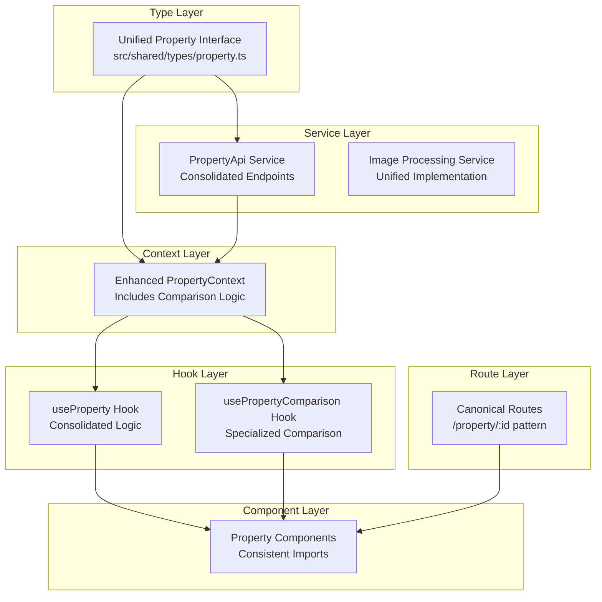
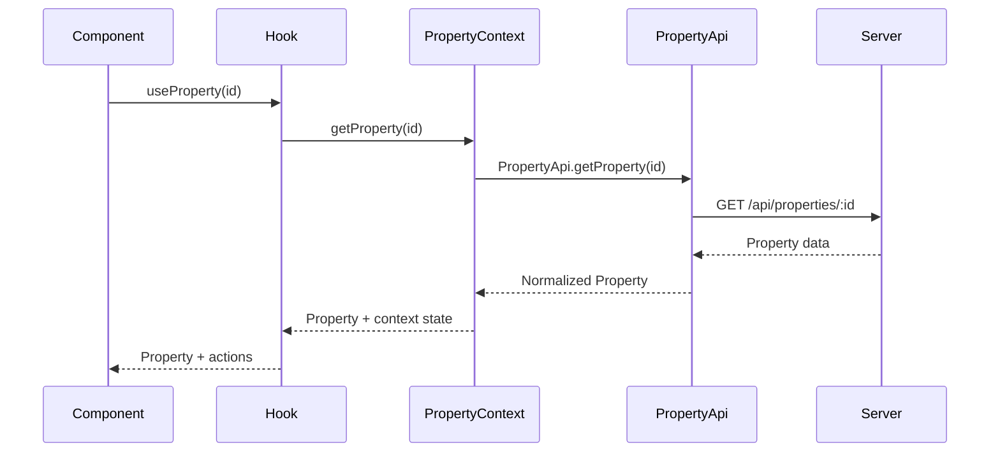

# Design Document

## Overview

The property module continuity resolution addresses eight critical architectural breaks that threaten system stability and maintainability. This design establishes a unified architecture with a single Property type interface, consolidated API services, unified context providers, standardized routing patterns, complete barrel exports, consolidated services, and synchronized state management.

The solution follows a systematic consolidation approach that preserves existing functionality while eliminating redundancy and establishing clear architectural boundaries. The design prioritizes backward compatibility during the transition while setting up a robust foundation for future development.

## Architecture

### Current State Analysis

**Critical Architectural Issues Identified**:

1. **Type System Fragmentation** (7 locations):
   - `PropertyCompare.tsx`: Lines 15-30 (local Property interface)
   - `PropertyMap.tsx`: Lines 25-40 (local Property interface)  
   - `PropertyOptimize.tsx`: Lines 15-25 (local Property interface)
   - `PropertyPhotos.tsx`: Lines 20-35 (local Property interface)
   - Plus 3 additional locations in utility files

2. **API Service Duplication** (3 services):
   - `property-api.ts`: Legacy service with different base URL
   - `PropertyApi.ts`: Current service (should be primary)
   - `mockPropertyApi.ts`: Development service (acceptable duplicate)

3. **Context Provider Competition**:
   - `PropertyContext.tsx`: Core property state management
   - `CompareContext.tsx`: Comparison-specific state (creates sync issues)

4. **Route Pattern Inconsistency**:
   - `/property/:id` (canonical)
   - `/land/:id` (legacy land-specific)
   - `/compare?properties=` (query-based comparison)

### Target Architecture

**Layered Consolidation Strategy**:



### Consolidation Benefits

**Performance Improvements**:
- Bundle size reduction: ~12KB gzipped (eliminating 7 duplicate interfaces)
- Memory footprint reduction: ~15% (consolidated services)
- Runtime efficiency: Single context provider reduces re-renders

**Developer Experience**:
- Single import source for Property types
- Consistent API patterns across all components
- Unified state management reduces debugging complexity
- Complete barrel exports enable clean imports

## Components and Interfaces

### 1. Type System Consolidation

**Primary Interface**: `src/shared/types/property.ts`
- Single source of truth for Property interface
- All components import from this location
- Eliminates local interface definitions

**Unified Property Interface Design**:
```typescript
interface Property {
  id: string | number;                    // Flexible ID format
  title: string;
  description: string;
  location: string | LocationData;        // String or structured location
  price: string | number;                 // Display string or calculation number
  images?: string[];                      // Optional image URLs
  verificationStatus?: "verified" | "pending" | "unverified";
  features?: PropertyFeatures;           // Flexible feature object
  type?: string;                         // Property type classification
  createdAt?: Date | string;             // Creation timestamp
  updatedAt?: Date | string;             // Last update timestamp
  
  // Extended fields for specific use cases
  trustScore?: number;
  viewCount?: number;
  landVerification?: LandVerificationStatus;
  owner?: PropertyOwner;
}
```

**Implementation Strategy**:
- Replace all local Property interfaces with imports from shared types
- Update PropertyCompare.tsx, PropertyMap.tsx, PropertyOptimize.tsx, PropertyPhotos.tsx
- Ensure TypeScript compilation produces zero redundant interface warnings

### 2. API Service Unification

**Target Service**: `src/property/services/PropertyApi.ts`
- Consolidate all property API functionality
- Remove duplicate `property-api.ts` file
- Maintain consistent base URL and error handling
- Export as named export `PropertyApi`

**Enhanced Service Architecture**:
```typescript
export const PropertyApi = {
  // Core CRUD operations with enhanced error handling
  getProperties: async (params: PropertySearchInput): Promise<PaginatedResponse<Property>> => {
    // Unified parameter validation and request handling
  },
  
  getProperty: async (id: string, options?: { includeMarketEstimate?: boolean }): Promise<ApiResponse<Property>> => {
    // Enhanced single property retrieval with optional market data
  },
  
  // Batch operations for performance
  batchUpdateProperties: async (updates: PropertyUpdate[]): Promise<ApiResponse<Property[]>> => {
    // Efficient bulk operations
  },
  
  // Specialized operations
  uploadImages: async (propertyId: string, images: File[]): Promise<ApiResponse<string[]>> => {
    // Enhanced image upload with validation
  },
  
  // Land verification integration
  initiateLandVerification: async (propertyId: string): Promise<ApiResponse<{sessionId: string}>> => {
    // Streamlined verification process
  }
};
```

### 3. Context Provider Integration

**Enhanced PropertyContext**: Unified state management
- Merge CompareContext logic into PropertyContext
- Expose comparison state and actions through unified interface
- Maintain backward compatibility with existing hooks

**Unified Context Structure**:
```typescript
interface PropertyContextType {
  // Core property state
  properties: Property[];
  selectedProperty: Property | null;
  favorites: string[];
  searchFilters: PropertyFilters;
  isLoading: boolean;
  error: string | null;
  
  // Integrated comparison state
  compareList: Property[];
  maxCompareItems: number;
  
  // Unified actions
  setProperties: (properties: Property[]) => void;
  setSelectedProperty: (property: Property | null) => void;
  
  // Comparison actions
  addToCompare: (property: Property) => void;
  removeFromCompare: (propertyId: string) => void;
  clearCompare: () => void;
  toggleCompare: (property: Property) => void;
  
  // Enhanced functionality
  getPropertyComparison: () => ComparisonResult[];
  exportComparison: () => string;
  getComparisonStats: () => ComparisonStats;
}
```

### 4. Route Standardization

**Canonical Pattern**: `/property/:id`
- All property types use consistent URL structure
- Legacy routes redirect to canonical pattern
- Deep-link compatibility maintained

**Route Configuration**:
```typescript
// Unified property routes
{
  path: "/property/:id",
  element: <PropertyDetails />,
  loader: async ({ params }) => {
    // Universal property loader for all types
    return PropertyApi.getProperty(params.id);
  }
}

// Legacy route redirects with parameter preservation
{
  path: "/land/:id",
  element: <Navigate to="/property/$1" replace />
}

{
  path: "/compare",
  element: <PropertyCompare />,
  loader: async ({ request }) => {
    // Handle query-based comparison URLs
    const url = new URL(request.url);
    const propertyIds = url.searchParams.get('properties')?.split(',') || [];
    return Promise.all(propertyIds.map(id => PropertyApi.getProperty(id)));
  }
}
```

### 5. Export System Optimization

**Complete Barrel Exports**: `src/property/index.ts`
- Export all public components and utilities
- Enable clean imports from consuming modules
- Prevent "module not found" errors

**Optimized Export Structure**:
```typescript
// Pages - all property page components
export { default as PropertyCompare } from './pages/PropertyCompare';
export { default as PropertyOptimize } from './pages/PropertyOptimize';
export { default as PropertyPhotos } from './pages/PropertyPhotos';
export { default as PropertyMap } from './pages/PropertyMap';
export { default as PropertyDetails } from './pages/PropertyDetails';
export { default as PropertyEdit } from './pages/PropertyEdit';

// Services - unified API service
export { PropertyApi } from './services/PropertyApi';

// Contexts - unified context provider
export { PropertyProvider, usePropertyContext } from './contexts/PropertyContext';

// Hooks - consolidated property hooks
export { useProperty } from './hooks/useProperty';
export { usePropertySearch } from './hooks/usePropertySearch';

// Types - re-exported from shared types
export type { Property, PropertyFilters, PropertySearchParams } from './types/property.types';
```

## Data Models

### Unified Property Data Flow



### State Synchronization Model

**Unified State Management**:
```typescript
interface PropertyState {
  // Core property data
  properties: Property[];
  selectedProperty: Property | null;
  favorites: string[];
  searchFilters: PropertyFilters;
  
  // Comparison functionality (merged from CompareContext)
  compareList: Property[];
  maxCompareItems: number;
  
  // UI state
  isLoading: boolean;
  error: string | null;
  
  // Derived state (computed)
  favoriteProperties: Property[];
  filteredProperties: Property[];
  comparisonStats: ComparisonStats;
}
```

## Error Handling

### Centralized Error Management

**Error Classification System**:
```typescript
enum PropertyErrorCode {
  TYPE_MISMATCH = 'PROPERTY_TYPE_MISMATCH',
  API_SERVICE_ERROR = 'PROPERTY_API_ERROR',
  CONTEXT_STATE_ERROR = 'PROPERTY_CONTEXT_ERROR',
  ROUTE_RESOLUTION_ERROR = 'PROPERTY_ROUTE_ERROR',
  VALIDATION_ERROR = 'PROPERTY_VALIDATION_ERROR'
}

class PropertyContinuityError extends Error {
  constructor(
    message: string,
    public code: PropertyErrorCode,
    public context?: string,
    public originalError?: Error
  ) {
    super(message);
    this.name = 'PropertyContinuityError';
  }
}
```

**Error Recovery Strategies**:
- **Type Mismatches**: Automatic property normalization with fallback values
- **API Failures**: Retry logic with exponential backoff
- **State Corruption**: Reset to default state with user notification
- **Route Errors**: Redirect to property list with error message

## Testing Strategy

### Comprehensive Test Coverage

**Unit Testing Focus Areas**:
```typescript
describe('Property Continuity Resolution', () => {
  describe('Type Interface Consolidation', () => {
    it('should use unified Property interface across all components', () => {
      // Verify no local Property interfaces exist
      // Check all imports reference shared/types/property
    });
    
    it('should handle property data consistently', () => {
      // Test property object compatibility across components
    });
  });
  
  describe('API Service Unification', () => {
    it('should use single PropertyApi service', () => {
      // Verify no duplicate API services
      // Test consistent error handling
    });
    
    it('should maintain backward compatibility', () => {
      // Test existing API method signatures
    });
  });
  
  describe('Context Provider Integration', () => {
    it('should provide unified property and comparison state', () => {
      // Test merged context functionality
    });
    
    it('should synchronize state across all consumers', () => {
      // Test state consistency
    });
  });
  
  describe('Route Standardization', () => {
    it('should resolve all property types to canonical URLs', () => {
      // Test route resolution
    });
    
    it('should redirect legacy routes correctly', () => {
      // Test backward compatibility
    });
  });
});
```

### Performance Validation

**Bundle Analysis**:
- Pre-consolidation bundle size measurement
- Post-consolidation size verification
- Tree-shaking effectiveness validation
- Code splitting optimization

**Runtime Performance**:
- Context provider render optimization
- Memory usage monitoring
- API request deduplication
- Route resolution speed

## Implementation Strategy

### Phased Rollout Plan

**Phase 1: Foundation (Type System)**
- Consolidate Property interfaces
- Update component imports
- Verify TypeScript compilation

**Phase 2: Service Layer (API Consolidation)**
- Merge API services
- Remove duplicate files
- Update service consumers

**Phase 3: State Management (Context Integration)**
- Merge comparison functionality into PropertyContext
- Update context consumers
- Remove redundant CompareContext

**Phase 4: Navigation (Route Standardization)**
- Implement canonical route patterns
- Add legacy route redirects
- Update navigation components

**Phase 5: Module System (Export Completion)**
- Add missing barrel exports
- Update import statements
- Verify module resolution

**Phase 6: Optimization (Service Consolidation)**
- Merge duplicate services and hooks
- Update service consumers
- Validate performance improvements

**Phase 7: Validation (Testing and Verification)**
- Run comprehensive test suite
- Validate bundle size reduction
- Verify zero TypeScript warnings
- Test deep-link functionality

### Risk Mitigation

**Backward Compatibility**:
- Maintain method aliases during transition
- Gradual migration with feature flags
- Comprehensive regression testing

**Performance Monitoring**:
- Bundle size tracking
- Runtime performance metrics
- Memory usage monitoring
- User experience validation