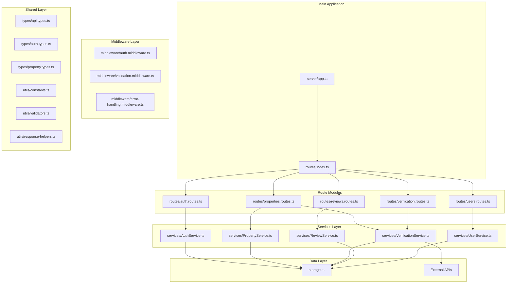

# Design Document

## Overview

This design document outlines the refactoring of the monolithic `server/routes.ts` file into a modular, domain-driven architecture. The current 1,000+ line file will be decomposed into focused modules organized by domain (authentication, properties, reviews, users, verification) with shared services, middleware, and type definitions.

The refactored architecture will follow the principles of separation of concerns, single responsibility, and dependency injection to create a maintainable, testable, and scalable codebase.

## Architecture

### High-Level Architecture



### Directory Structure

```
server/
├── routes/
│   ├── index.ts                 # Main route coordinator
│   ├── auth.routes.ts           # Authentication routes
│   ├── properties.routes.ts     # Property management routes
│   ├── reviews.routes.ts        # Review management routes
│   ├── users.routes.ts          # User management routes
│   └── verification.routes.ts   # Verification and fraud detection routes
├── services/
│   ├── AuthService.ts           # Authentication business logic
│   ├── PropertyService.ts       # Property business logic
│   ├── VerificationService.ts   # Verification and fraud detection logic
│   ├── ReviewService.ts         # Review business logic
│   └── UserService.ts           # User management business logic
├── middleware/
│   ├── auth.middleware.ts       # Authentication middleware
│   ├── validation.middleware.ts # Request validation middleware (existing)
│   └── error-handling.middleware.ts # Centralized error handling
├── types/
│   ├── api.types.ts             # Common API types
│   ├── auth.types.ts            # Authentication-specific types
│   ├── property.types.ts        # Property-specific types
│   ├── verification.types.ts    # Verification-specific types
│   └── user.types.ts            # User-specific types
├── utils/
│   ├── constants.ts             # Application constants
│   ├── validators.ts            # Validation utilities
│   ├── response-helpers.ts      # API response helpers
│   └── error-messages.ts        # Centralized error messages
└── storage.ts                   # Existing storage layer (unchanged)
```

## Components and Interfaces

### 1. Route Modules

Each route module will be implemented as a class that encapsulates related endpoints and their dependencies.

#### Base Route Interface

```typescript
interface IRouteModule {
  getRouter(): Router;
  initialize(): Promise<void>;
}
```

#### Route Module Implementation Pattern

```typescript
export class AuthRoutes implements IRouteModule {
  constructor(
    private authService: AuthService,
    private userService: UserService
  ) {}

  getRouter(): Router {
    const router = Router();
    
    router.post('/register', 
      validateRequest(UserValidationSchemas.register),
      this.register.bind(this)
    );
    
    router.post('/login',
      validateRequest(UserValidationSchemas.login),
      this.login.bind(this)
    );
    
    router.post('/logout',
      requireAuth,
      this.logout.bind(this)
    );
    
    router.get('/me',
      requireAuth,
      this.getCurrentUser.bind(this)
    );
    
    return router;
  }

  async initialize(): Promise<void> {
    // Any initialization logic
  }

  private async register(req: ValidatedRequest, res: Response): Promise<void> {
    // Route handler implementation
  }
}
```

### 2. Service Layer

Services will encapsulate business logic and provide a clean interface for route handlers.

#### Service Interface Pattern

```typescript
interface IAuthService {
  register(userData: RegisterRequest): Promise<AuthResult>;
  login(credentials: LoginRequest): Promise<AuthResult>;
  validateSession(sessionId: string): Promise<User | null>;
  hashPassword(password: string): Promise<string>;
  validateCredentials(username: string, password: string): Promise<User | null>;
}

export class AuthService implements IAuthService {
  constructor(
    private storage: IStorage,
    private logger: Logger
  ) {}

  async register(userData: RegisterRequest): Promise<AuthResult> {
    // Business logic implementation
  }
}
```

### 3. Middleware Organization

#### Authentication Middleware

```typescript
export interface AuthenticatedRequest extends Request {
  user?: User;
  session?: CustomSession;
}

export const requireAuth = async (
  req: AuthenticatedRequest,
  res: Response,
  next: NextFunction
): Promise<void> => {
  // Authentication logic
};

export const requireRole = (roles: UserRole[]) => {
  return async (req: AuthenticatedRequest, res: Response, next: NextFunction): Promise<void> => {
    // Role-based authorization logic
  };
};
```

#### Error Handling Middleware

```typescript
export class ErrorHandler {
  static handleDatabaseError(error: unknown, res: Response, defaultMessage: string): void {
    // Centralized database error handling
  }

  static handleValidationError(error: ValidationError, res: Response): void {
    // Centralized validation error handling
  }

  static handleGenericError(error: unknown, res: Response): void {
    // Generic error handling
  }
}
```

### 4. Type Definitions

#### API Types

```typescript
export interface ApiResponse<T = any> {
  success: boolean;
  data?: T;
  message?: string;
  errors?: ValidationError[];
  metadata?: ApiMetadata;
}

export interface ApiMetadata {
  totalCount?: number;
  page?: number;
  limit?: number;
  filters?: SearchFilters;
  verificationStatus?: string;
  riskLevel?: string;
  fraudDetectionPerformed?: boolean;
  requiresManualReview?: boolean;
}

export interface PaginationParams {
  page: number;
  limit: number;
  sortBy?: string;
  sortOrder?: 'asc' | 'desc';
}
```

#### Domain-Specific Types

```typescript
// auth.types.ts
export interface LoginRequest {
  username: string;
  password: string;
}

export interface RegisterRequest {
  username: string;
  email: string;
  password: string;
  firstName: string;
  lastName: string;
}

export interface AuthResult {
  user: Omit<User, 'password'>;
  token?: string;
  expiresAt?: Date;
}

// property.types.ts
export interface PropertySearchFilters {
  location?: string;
  priceMin?: number;
  priceMax?: number;
  propertyType?: string;
  bedrooms?: number;
  bathrooms?: number;
  verified?: boolean;
}

export interface PropertyCreateRequest {
  title: string;
  description: string;
  location: string;
  price: number;
  features?: PropertyFeatures;
  imageUrls?: string[];
}

// verification.types.ts
export interface VerificationResult {
  documentAuthenticity: "verified" | "suspicious" | "pending";
  ownershipVerified: boolean;
  riskScore: number;
  verifiedAt: string;
  error?: string;
  overallScore: number;
  verificationTimestamp: string;
  fraudDetection?: FraudDetectionResult;
}

export interface FraudDetectionResult {
  isSuspicious: boolean;
  suspiciousScore: number;
  overallScore: number;
  verificationTimestamp: string;
  imageAnalysis?: ImageAnalysis;
  descriptionAnalysis?: DescriptionAnalysis;
  aiModel?: string;
}
```

## Data Models

The existing data models from the shared schema will be reused without modification. The refactoring will add type safety and better organization around these existing models:

- `User` - User account information
- `Property` - Property listings and details
- `Review` - Property reviews and ratings
- `InsertUser`, `InsertProperty`, `InsertReview` - Input types for creation

Additional derived types will be created for API responses and service interfaces:

```typescript
export type UserWithoutPassword = Omit<User, 'password'>;
export type PropertyWithReviews = Property & { reviews: Review[] };
export type PropertySummary = Pick<Property, 'id' | 'title' | 'location' | 'price' | 'verificationStatus'>;
```

## Error Handling

### Centralized Error Handling Strategy

```typescript
export class ApiError extends Error {
  constructor(
    public statusCode: number,
    public message: string,
    public code?: string,
    public details?: any
  ) {
    super(message);
    this.name = 'ApiError';
  }
}

export class ErrorHandler {
  static handleError(error: unknown, res: Response): void {
    if (error instanceof ApiError) {
      res.status(error.statusCode).json({
        success: false,
        message: error.message,
        code: error.code,
        details: error.details
      });
      return;
    }

    if (error instanceof z.ZodError) {
      res.status(400).json({
        success: false,
        message: 'Validation failed',
        errors: error.errors
      });
      return;
    }

    // Handle database errors
    if (error instanceof Error && error.message.includes('constraint')) {
      res.status(409).json({
        success: false,
        message: 'Data conflict occurred'
      });
      return;
    }

    // Generic error
    res.status(500).json({
      success: false,
      message: 'Internal server error'
    });
  }
}
```

### Error Response Format

All API responses will follow a consistent format:

```typescript
interface ErrorResponse {
  success: false;
  message: string;
  code?: string;
  errors?: ValidationError[];
  correlationId?: string;
}

interface SuccessResponse<T> {
  success: true;
  data: T;
  message?: string;
  metadata?: ApiMetadata;
}
```

## Testing Strategy

### Unit Testing Approach

Each component will be independently testable:

1. **Service Tests**: Mock storage layer, test business logic
2. **Route Tests**: Mock services, test HTTP handling
3. **Middleware Tests**: Test authentication, validation, error handling
4. **Integration Tests**: Test complete request flows

### Test Structure Example

```typescript
describe('AuthService', () => {
  let authService: AuthService;
  let mockStorage: jest.Mocked<IStorage>;

  beforeEach(() => {
    mockStorage = createMockStorage();
    authService = new AuthService(mockStorage, mockLogger);
  });

  describe('register', () => {
    it('should create user with hashed password', async () => {
      // Test implementation
    });

    it('should throw error if username exists', async () => {
      // Test implementation
    });
  });
});

describe('AuthRoutes', () => {
  let app: Express;
  let mockAuthService: jest.Mocked<AuthService>;

  beforeEach(() => {
    mockAuthService = createMockAuthService();
    const authRoutes = new AuthRoutes(mockAuthService, mockUserService);
    app = express();
    app.use('/auth', authRoutes.getRouter());
  });

  describe('POST /register', () => {
    it('should return 201 on successful registration', async () => {
      // Test implementation
    });
  });
});
```

## Migration Strategy

### Phase 1: Extract Types and Constants
1. Create type definition files
2. Extract constants and error messages
3. Update imports in existing routes.ts

### Phase 2: Create Service Layer
1. Implement AuthService
2. Implement PropertyService
3. Implement VerificationService
4. Implement ReviewService
5. Implement UserService

### Phase 3: Create Route Modules
1. Extract authentication routes
2. Extract property routes
3. Extract review routes
4. Extract user routes
5. Extract verification routes

### Phase 4: Update Main Routes File
1. Convert to coordinator pattern
2. Register all route modules
3. Remove old monolithic code

### Phase 5: Testing and Validation
1. Add comprehensive tests
2. Validate API compatibility
3. Performance testing
4. Security validation

## Backward Compatibility

The refactoring will maintain complete backward compatibility:

- All existing API endpoints will remain unchanged
- Response formats will be identical
- Authentication mechanisms will work the same way
- File upload functionality will be preserved
- All existing middleware will continue to function

## Performance Considerations

### Optimizations

1. **Lazy Loading**: Services will be instantiated only when needed
2. **Caching**: Existing caching mechanisms will be preserved and enhanced
3. **Connection Pooling**: Database connections will be managed efficiently
4. **Memory Management**: Proper cleanup of resources and event listeners

### Monitoring

1. **Request Tracing**: Add correlation IDs for request tracking
2. **Performance Metrics**: Monitor response times per route module
3. **Error Tracking**: Centralized error logging and monitoring
4. **Resource Usage**: Monitor memory and CPU usage per service

## Security Enhancements

### Authentication Security
- Enhanced session management
- Improved password hashing with configurable rounds
- Rate limiting on authentication endpoints
- Session timeout management

### Input Validation
- Comprehensive input sanitization
- XSS prevention
- SQL injection protection
- File upload security

### API Security
- Request correlation IDs for audit trails
- Enhanced error messages that don't leak sensitive information
- Proper HTTP status codes
- Security headers middleware

## Scalability Considerations

### Horizontal Scaling
- Stateless service design
- Database connection pooling
- Caching strategies
- Load balancer compatibility

### Vertical Scaling
- Efficient memory usage
- Optimized database queries
- Minimal CPU overhead
- Proper resource cleanup

### Future Extensions
- Easy addition of new domains
- Plugin architecture for middleware
- Configurable service dependencies
- API versioning support