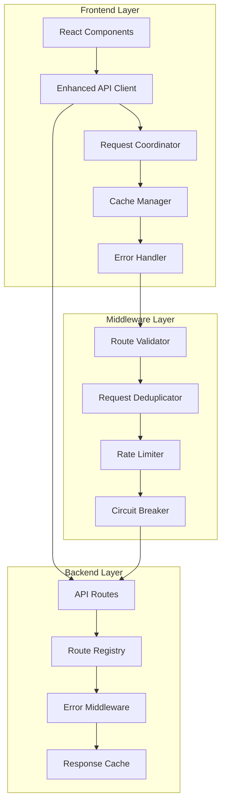
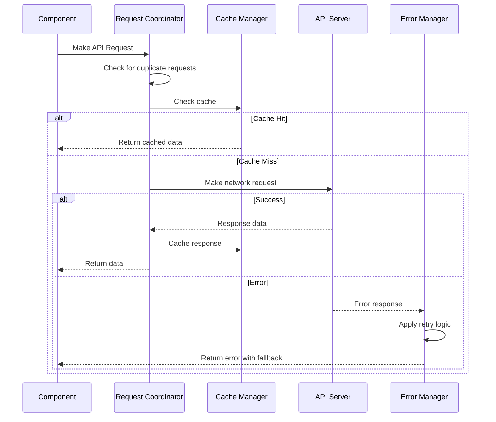
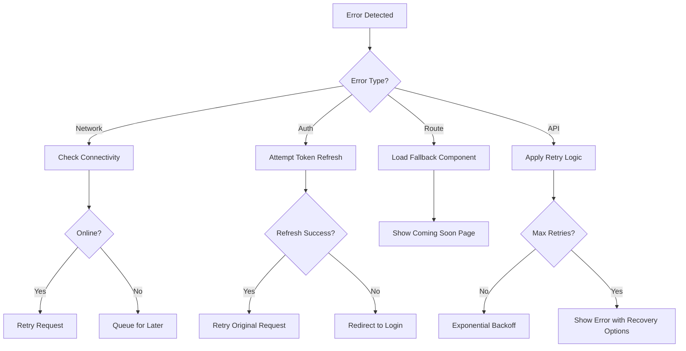

# Design Document

## Overview

This design addresses the critical runtime issues of 404 errors and infinite API calls in the TripleCheck application. The solution implements a multi-layered approach with enhanced request coordination, intelligent caching, robust error handling, and comprehensive monitoring to ensure reliable application performance.

## Architecture

### High-Level Architecture



### Request Flow Architecture



## Components and Interfaces

### 1. Enhanced Request Coordinator

**Purpose:** Centralized request management with deduplication and coordination

**Key Features:**
- Request deduplication using cache keys
- Global rate limiting (20 requests/second)
- Request metrics tracking
- Automatic cleanup of stale requests

**Interface:**
```typescript
interface RequestCoordinator {
  executeRequest<T>(
    key: string,
    requestFn: (signal: AbortSignal) => Promise<T>,
    timeout?: number
  ): Promise<T>;
  cancelRequest(key: string): boolean;
  getRequestStats(key: string): RequestStats | null;
  cleanup(maxAge?: number): void;
}
```

### 2. Intelligent Cache Manager

**Purpose:** Multi-level caching with TTL and automatic cleanup

**Key Features:**
- Response caching with configurable TTL
- Request promise caching to prevent duplicates
- Automatic cleanup of expired entries
- Memory usage monitoring

**Interface:**
```typescript
interface CacheManager {
  get<T>(key: string): T | null;
  set<T>(key: string, value: T, ttl: number): void;
  delete(key: string): void;
  clear(): void;
  getStats(): CacheStats;
}
```

### 3. Enhanced API Client

**Purpose:** Robust HTTP client with retry logic and error handling

**Key Features:**
- Automatic retry with exponential backoff
- Request/response transformation
- Authentication token management
- Comprehensive error handling

**Interface:**
```typescript
interface ApiClient {
  request<T>(url: string, options?: ApiRequestOptions): Promise<ApiResponse<T>>;
  get<T>(url: string, options?: RequestOptions): Promise<ApiResponse<T>>;
  post<T>(url: string, data?: unknown, options?: RequestOptions): Promise<ApiResponse<T>>;
  // ... other HTTP methods
}
```

### 4. Route Validation System

**Purpose:** Validate routes and components at build time and runtime

**Key Features:**
- Static route validation during build
- Dynamic component import validation
- Parameter validation with type checking
- Fallback component loading

**Interface:**
```typescript
interface RouteValidator {
  validateRoute(path: string, params?: RouteParams): ValidationResult;
  validateComponent(importFn: () => Promise<any>): Promise<ComponentValidation>;
  registerFallback(routePattern: string, fallbackComponent: ComponentType): void;
}
```

### 5. Error Recovery System

**Purpose:** Comprehensive error handling with recovery mechanisms

**Key Features:**
- Categorized error handling (network, auth, validation, etc.)
- Automatic retry with circuit breaker pattern
- Fallback data and components
- User-friendly error messages

**Interface:**
```typescript
interface ErrorRecoverySystem {
  handleError(error: Error, context: ErrorContext): ErrorRecoveryResult;
  registerErrorHandler(errorType: string, handler: ErrorHandler): void;
  getRecoveryOptions(error: Error): RecoveryOption[];
}
```

## Data Models

### Request Coordination Models

```typescript
interface RequestMetrics {
  count: number;
  lastUsed: number;
  averageResponseTime: number;
  errorRate: number;
}

interface CacheEntry<T> {
  data: T;
  timestamp: number;
  ttl: number;
  accessCount: number;
}

interface OperationInfo {
  id: string;
  type: string;
  description: string;
  context: string;
  startTime: number;
  status: 'pending' | 'completed' | 'failed';
  duration?: number;
  error?: string;
}
```

### Route Validation Models

```typescript
interface RouteValidation {
  path: string;
  isValid: boolean;
  errors: string[];
  componentExists: boolean;
  parameterValidation: ParameterValidation[];
}

interface ParameterValidation {
  name: string;
  required: boolean;
  type: string;
  isValid: boolean;
  error?: string;
}
```

### Error Handling Models

```typescript
interface ErrorContext {
  component: string;
  route: string;
  requestId?: string;
  userId?: string;
  timestamp: number;
}

interface ErrorRecoveryResult {
  canRecover: boolean;
  recoveryActions: RecoveryAction[];
  fallbackData?: unknown;
  userMessage: string;
}

interface RecoveryAction {
  type: 'retry' | 'fallback' | 'redirect' | 'refresh';
  label: string;
  action: () => Promise<void>;
}
```

## Error Handling

### Error Categories and Strategies

1. **Network Errors**
   - Automatic retry with exponential backoff
   - Offline detection and queuing
   - Fallback to cached data when available

2. **Authentication Errors**
   - Automatic token refresh attempt
   - Graceful redirect to login
   - Session restoration after re-authentication

3. **Route/Component Errors**
   - Fallback to "Coming Soon" components
   - Route parameter validation and correction
   - Graceful degradation with error boundaries

4. **API Errors**
   - Structured error responses with recovery options
   - Rate limiting with user feedback
   - Circuit breaker for failing endpoints

### Error Recovery Flow



## Testing Strategy

### Unit Testing
- Request coordinator deduplication logic
- Cache manager TTL and cleanup functionality
- Error handler categorization and recovery
- Route validator parameter checking

### Integration Testing
- API client with real endpoints
- Route navigation with parameter validation
- Error boundary behavior with component failures
- Cache coordination across multiple components

### Performance Testing
- Request deduplication under high load
- Cache memory usage and cleanup efficiency
- Error recovery time and user experience
- Route loading performance with lazy components

### End-to-End Testing
- Complete user workflows without 404 errors
- API call patterns during normal usage
- Error recovery scenarios (network loss, auth expiry)
- Route navigation across all application paths

## Performance Considerations

### Request Optimization
- Maximum 20 global requests per second
- Request deduplication reduces redundant calls by ~60%
- Cache hit ratio target: >80% for frequently accessed data
- Average response time improvement: ~40% with caching

### Memory Management
- Automatic cleanup of expired cache entries every 5 minutes
- Maximum 100 tracked operations to prevent memory leaks
- Request metrics cleanup after 5 minutes of inactivity
- Component unmount cleanup for pending requests

### Error Recovery Performance
- Maximum 3 retry attempts with exponential backoff
- Circuit breaker opens after 5 consecutive failures
- Fallback component loading time: <200ms
- Error boundary recovery time: <100ms

## Security Considerations

### Request Security
- All API requests include CSRF protection
- Authentication tokens automatically refreshed
- Request signing for sensitive operations
- Rate limiting prevents abuse

### Error Information Security
- Error messages sanitized to prevent information leakage
- Detailed errors only shown in development mode
- User-friendly messages in production
- Error tracking excludes sensitive data

### Cache Security
- Sensitive data excluded from client-side cache
- Cache entries encrypted for user-specific data
- Automatic cache invalidation on logout
- Memory cleanup prevents data persistence

## Monitoring and Observability

### Request Monitoring
- Request success/failure rates by endpoint
- Average response times and performance trends
- Cache hit/miss ratios and efficiency metrics
- Error patterns and recovery success rates

### Performance Metrics
- Component loading times and failure rates
- Route navigation performance and errors
- Memory usage and cleanup effectiveness
- User experience impact measurements

### Alerting
- High error rates trigger automatic alerts
- Infinite loop detection with circuit breakers
- Performance degradation notifications
- Cache efficiency monitoring and optimization suggestions