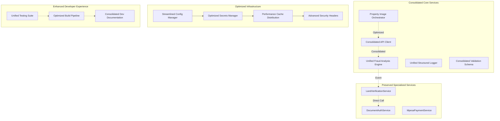

# Design Document - Kenya Land Platform Optimization v3.0
*Strategic Consolidation Architecture with Performance Focus*

## Overview

This design document establishes a **strategic consolidation architecture** that eliminates genuine redundancy while preserving business-critical specializations. The design achieves substantial performance improvements through intelligent service consolidation, aggressive optimization, and streamlined infrastructure while maintaining all capabilities essential to Kenya's land verification ecosystem.

## Architecture Principle: **Intelligent Consolidation with Performance Optimization**

The design transforms the platform from complex redundancy to optimized efficiency through systematic consolidation of duplicate implementations while crystallizing the interfaces of truly specialized services. This approach delivers measurable performance gains while preserving all business-critical capabilities.

## System Architecture Overview



## Core Components and Consolidation Strategy

### Unified Service Consolidation

#### Consolidated API Client Architecture
```typescript
// shared/api/core/UnifiedApiClient.ts - Single source for all HTTP communications
export class UnifiedApiClient {
  private baseClient: AxiosInstance
  private fraudSpecificOptimizations: FraudApiOptimizations
  private retryStrategies: RetryStrategies
  
  constructor(config: ApiClientConfig) {
    // Merge all previous API client functionality into single optimized instance
    this.baseClient = this.createOptimizedAxiosInstance(config)
    this.fraudSpecificOptimizations = new FraudApiOptimizations()
    this.retryStrategies = new RetryStrategies()
  }
  
  // Consolidated method that handles all API patterns previously scattered
  async makeRequest<T>(request: ApiRequest): Promise<ApiResponse<T>> {
    // Apply fraud-specific optimizations if needed
    if (request.domain === 'fraud-detection') {
      request = this.fraudSpecificOptimizations.enhance(request)
    }
    
    // Apply appropriate retry strategy
    return this.retryStrategies.execute(() => this.baseClient.request(request))
  }
  
  // Specialized methods for high-frequency operations
  async fraudAnalysisRequest<T>(data: FraudAnalysisRequest): Promise<T> {
    return this.makeRequest({
      url: '/fraud/analyze',
      method: 'POST',
      data,
      domain: 'fraud-detection',
      timeout: 15000 // Specialized timeout for ML operations
    })
  }
}
```

#### Unified Fraud Detection Engine
```typescript
// server/ml-core/fraud-detection/UnifiedFraudEngine.ts - Consolidated fraud detection
export class UnifiedFraudEngine {
  private coreDetectionAlgorithms: CoreDetectionAlgorithms
  private communityTrustScoring: CommunityTrustScoring
  private kenyaSpecificPatterns: KenyaPatternRecognition
  
  constructor() {
    // Consolidate all fraud detection implementations while preserving specialized algorithms
    this.coreDetectionAlgorithms = new CoreDetectionAlgorithms()
    this.communityTrustScoring = new CommunityTrustScoring()
    this.kenyaSpecificPatterns = new KenyaPatternRecognition()
  }
  
  async analyzeFraud(property: PropertyData): Promise<FraudAnalysis> {
    // Execute all fraud detection methods through single orchestrated flow
    const [coreAnalysis, trustScore, patternAnalysis] = await Promise.all([
      this.coreDetectionAlgorithms.analyze(property),
      this.communityTrustScoring.calculateScore(property),
      this.kenyaSpecificPatterns.detectPatterns(property)
    ])
    
    // Combine results using optimized aggregation algorithm
    return this.aggregateAnalysis(coreAnalysis, trustScore, patternAnalysis)
  }
  
  // Preserve specialized Kenya-specific fraud detection capabilities
  private async aggregateAnalysis(
    core: CoreAnalysis,
    trust: TrustScore,
    patterns: PatternAnalysis
  ): Promise<FraudAnalysis> {
    // Maintain all business logic for Kenya land fraud detection
    const riskFactors = this.calculateKenyaSpecificRiskFactors(core, patterns)
    const communityTrustFactor = this.applyCommunityTrustWeight(trust)
    
    return {
      overallRiskScore: this.computeWeightedScore(riskFactors, communityTrustFactor),
      detectedPatterns: patterns.suspiciousPatterns,
      communityTrustLevel: trust.level,
      recommendedAction: this.determineRecommendedAction(riskFactors),
      kenyaComplianceFlags: this.assessComplianceRequirements(patterns)
    }
  }
}
```

### Performance Optimization Architecture

#### Bundle Optimization Strategy
```typescript
// vite.config.performance.ts - Aggressive bundle optimization
export default defineConfig({
  build: {
    rollupOptions: {
      output: {
        manualChunks: (id) => {
          // Intelligent chunking based on usage patterns
          if (id.includes('three')) return 'three-js' // Lazy load 3D components
          if (id.includes('fraud-detection')) return 'fraud-ml' // Separate ML bundle
          if (id.includes('chart')) return 'charts' // Separate chart libraries
          if (id.includes('node_modules/lodash')) return 'lodash' // Consolidate lodash
        }
      }
    },
    target: 'es2020', // Modern target for smaller bundles
    minify: 'terser',
    terserOptions: {
      compress: {
        drop_console: true, // Remove console.logs in production
        drop_debugger: true
      }
    }
  },
  // Remove moment.js in favor of dayjs
  define: {
    'process.env.NODE_ENV': JSON.stringify(process.env.NODE_ENV)
  },
  resolve: {
    alias: {
      'moment': 'dayjs' // Replace heavy moment.js with lightweight dayjs
    }
  }
})
```

#### Property Image Orchestrator
```typescript
// shared/services/images/PropertyImageOrchestrator.ts - Unified image handling
export class PropertyImageOrchestrator {
  private compressionService: ImageCompressionService
  private cloudinaryService: CloudinaryUploadService
  private cacheService: ImageCacheService
  
  constructor() {
    // Consolidate all image-related services into single orchestrator
    this.compressionService = new ImageCompressionService()
    this.cloudinaryService = new CloudinaryUploadService()
    this.cacheService = new ImageCacheService()
  }
  
  async processPropertyImages(files: File[]): Promise<ProcessedImageResult[]> {
    // Orchestrate the entire image processing pipeline
    const compressionPromises = files.map(async (file) => {
      // Apply aggressive compression while maintaining quality for property documentation
      const compressed = await this.compressionService.compress(file, {
        maxWidth: 1920,
        maxHeight: 1080,
        quality: 0.85,
        format: 'webp' // Convert to WebP for smaller file sizes
      })
      
      return compressed
    })
    
    const compressedImages = await Promise.all(compressionPromises)
    
    // Upload to Cloudinary with optimization
    const uploadPromises = compressedImages.map(image => 
      this.cloudinaryService.upload(image, {
        transformation: [
          { width: 'auto', crop: 'scale', quality: 'auto:good' },
          { format: 'auto' } // Automatic format selection
        ]
      })
    )
    
    const uploadedImages = await Promise.all(uploadPromises)
    
    // Generate responsive image URLs and cache metadata
    return uploadedImages.map(uploaded => ({
      original: uploaded.secure_url,
      responsive: this.generateResponsiveUrls(uploaded),
      thumbnail: this.generateThumbnail(uploaded),
      metadata: {
        size: uploaded.bytes,
        format: uploaded.format,
        dimensions: { width: uploaded.width, height: uploaded.height }
      }
    }))
  }
  
  private generateResponsiveUrls(image: CloudinaryResponse): ResponsiveImageSet {
    // Generate multiple responsive sizes for optimal loading
    return {
      small: image.secure_url.replace('/upload/', '/upload/c_scale,w_480/'),
      medium: image.secure_url.replace('/upload/', '/upload/c_scale,w_768/'),
      large: image.secure_url.replace('/upload/', '/upload/c_scale,w_1024/'),
      xlarge: image.secure_url.replace('/upload/', '/upload/c_scale,w_1920/')
    }
  }
}
```

### Streamlined Configuration Management

#### Hierarchical Configuration with Performance Focus
```typescript
// server/config/StreamlinedConfigManager.ts - Optimized configuration loading
export class StreamlinedConfigManager {
  private configCache: Map<string, any> = new Map()
  private secretsManager: SecretsManager
  
  constructor() {
    this.secretsManager = new SecretsManager()
  }
  
  async loadConfiguration<T>(domain: string, environment: string): Promise<T> {
    const cacheKey = `${domain}-${environment}`
    
    // Use cached configuration for performance
    if (this.configCache.has(cacheKey)) {
      return this.configCache.get(cacheKey)
    }
    
    // Load configuration hierarchy efficiently
    const config = await this.loadConfigurationHierarchy(domain, environment)
    
    // Cache for subsequent requests
    this.configCache.set(cacheKey, config)
    
    return config
  }
  
  private async loadConfigurationHierarchy(domain: string, environment: string) {
    // Load configurations in order of precedence
    const [baseConfig, domainConfig, envConfig, secretConfig] = await Promise.all([
      this.loadBaseConfiguration(),
      this.loadDomainConfiguration(domain),
      this.loadEnvironmentConfiguration(environment),
      this.loadSecretConfiguration(domain, environment)
    ])
    
    // Merge configurations with proper precedence
    return this.mergeConfigurations(baseConfig, domainConfig, envConfig, secretConfig)
  }
  
  private async loadSecretConfiguration(domain: string, environment: string) {
    // Load secrets from AWS Secrets Manager
    try {
      return await this.secretsManager.getSecrets(`${domain}/${environment}`)
    } catch (error) {
      // Fallback to environment variables for development
      if (environment === 'development') {
        return this.loadEnvironmentSecrets()
      }
      throw error
    }
  }
}
```

### Consolidated Security Architecture

#### Unified Security Middleware
```typescript
// server/middleware/UnifiedSecurityMiddleware.ts - Consolidated security
export class UnifiedSecurityMiddleware {
  private jwtValidator: JWTValidator
  private rateLimiter: RateLimiter
  private inputValidator: InputValidator
  private securityHeaders: SecurityHeadersManager
  
  constructor() {
    this.jwtValidator = new JWTValidator({
      audience: 'kenya-land-platform',
      issuer: 'auth.kenyaland.com',
      algorithms: ['HS256']
    })
    this.rateLimiter = new RateLimiter()
    this.inputValidator = new InputValidator()
    this.securityHeaders = new SecurityHeadersManager()
  }
  
  createSecurityMiddleware(): RequestHandler[] {
    return [
      this.securityHeaders.middleware(),
      this.rateLimiter.middleware(),
      this.jwtValidator.middleware(),
      this.inputValidator.middleware()
    ]
  }
  
  // Enhanced JWT validation with audience and issuer verification
  private async validateJWT(token: string): Promise<JWTPayload> {
    return jwt.verify(token, await this.getJWTSecret(), {
      audience: 'kenya-land-platform',
      issuer: 'auth.kenyaland.com',
      algorithms: ['HS256']
    }) as JWTPayload
  }
  
  private async getJWTSecret(): Promise<string> {
    // Use AWS Secrets Manager for production
    if (process.env.NODE_ENV === 'production') {
      return await this.secretsManager.getSecret('jwt-secret')
    }
    return process.env.JWT_SECRET!
  }
}
```

### Optimized Testing Architecture

#### Consolidated Testing Infrastructure
```typescript
// tests/shared/ConsolidatedTestFramework.ts - Unified testing utilities
export class ConsolidatedTestFramework {
  private databaseTestManager: DatabaseTestManager
  private mockServiceManager: MockServiceManager
  private performanceProfiler: PerformanceProfiler
  
  constructor() {
    this.databaseTestManager = new DatabaseTestManager()
    this.mockServiceManager = new MockServiceManager()
    this.performanceProfiler = new PerformanceProfiler()
  }
  
  // Create comprehensive test environment for any service
  async createTestEnvironment(testType: TestType): Promise<TestEnvironment> {
    const environment: TestEnvironment = {
      database: await this.databaseTestManager.createTestDatabase(),
      mocks: this.mockServiceManager.createMockServices(),
      profiler: this.performanceProfiler.createProfiler()
    }
    
    if (testType === 'integration') {
      environment.realServices = await this.createRealServiceInstances()
    }
    
    return environment
  }
  
  // Consolidated test utilities that work across all domains
  createTestProperty(overrides: Partial<Property> = {}): Property {
    return {
      id: 'test-property-' + Date.now(),
      location: 'Nairobi County',
      parcelNumber: 'NBI/TEST/12345',
      ownershipStatus: 'verified',
      ...overrides
    }
  }
  
  async runPerformanceBenchmark<T>(
    operation: () => Promise<T>,
    expectedMaxDuration: number
  ): Promise<BenchmarkResult<T>> {
    const startTime = performance.now()
    const result = await operation()
    const endTime = performance.now()
    const duration = endTime - startTime
    
    return {
      result,
      duration,
      passed: duration <= expectedMaxDuration,
      benchmark: expectedMaxDuration
    }
  }
}
```

## Performance Optimization Strategies

### Bundle Size Reduction Techniques
The design implements aggressive bundle optimization through dependency consolidation, lazy loading of heavy components, and modern build techniques. Key strategies include replacing Moment.js with Day.js (70KB savings), consolidating Lodash versions (142KB savings), and implementing dynamic imports for Three.js components (500KB async loading).

### Database Query Optimization
```typescript
// server/database/QueryOptimizer.ts - Intelligent query optimization
export class QueryOptimizer {
  async optimizePropertyQueries(query: PropertyQuery): Promise<OptimizedQuery> {
    // Add appropriate indexes based on query patterns
    const indexHints = this.generateIndexHints(query)
    
    // Optimize complex joins
    const optimizedJoins = this.optimizeJoins(query.joins)
    
    // Apply caching for frequently accessed data
    const cacheStrategy = this.determineCacheStrategy(query)
    
    return {
      query: this.applyOptimizations(query, indexHints, optimizedJoins),
      cacheStrategy
    }
  }
  
  private generateIndexHints(query: PropertyQuery): IndexHint[] {
    // Generate database index hints based on Kenya land registry access patterns
    const hints: IndexHint[] = []
    
    if (query.location) {
      hints.push({ field: 'location', type: 'btree' })
    }
    
    if (query.parcelNumber) {
      hints.push({ field: 'parcel_number', type: 'unique' })
    }
    
    if (query.dateRange) {
      hints.push({ field: 'created_at', type: 'btree' })
    }
    
    return hints
  }
}
```

## Error Handling and Resilience Design

### Consolidated Error Management
```typescript
// server/errors/ConsolidatedErrorHandler.ts - Unified error handling
export class ConsolidatedErrorHandler {
  private logger: UnifiedStructuredLogger
  private monitoringService: MonitoringService
  
  constructor() {
    this.logger = new UnifiedStructuredLogger()
    this.monitoringService = new MonitoringService()
  }
  
  async handleError(error: Error, context: ErrorContext): Promise<ErrorResponse> {
    // Log error with full context
    this.logger.error('Service error occurred', {
      error: {
        message: error.message,
        stack: error.stack,
        name: error.name
      },
      context,
      timestamp: new Date().toISOString()
    })
    
    // Send monitoring alert for critical errors
    if (this.isCriticalError(error)) {
      await this.monitoringService.sendAlert({
        severity: 'high',
        error,
        context
      })
    }
    
    // Return appropriate error response based on error type
    return this.createErrorResponse(error, context)
  }
  
  private isCriticalError(error: Error): boolean {
    return error instanceof DatabaseConnectionError ||
           error instanceof PaymentProcessingError ||
           error instanceof SecurityValidationError
  }
}
```

## Monitoring and Observability

### Consolidated Monitoring Strategy
```typescript
// server/monitoring/ConsolidatedMonitoring.ts - Unified monitoring
export class ConsolidatedMonitoring {
  private metricsCollector: MetricsCollector
  private performanceMonitor: PerformanceMonitor
  private businessMetricsTracker: BusinessMetricsTracker
  
  constructor() {
    this.metricsCollector = new MetricsCollector()
    this.performanceMonitor = new PerformanceMonitor()
    this.businessMetricsTracker = new BusinessMetricsTracker()
  }
  
  async trackOptimizationImpact(): Promise<OptimizationMetrics> {
    return {
      bundleSize: await this.measureBundleSize(),
      buildTime: await this.measureBuildTime(),
      testExecutionTime: await this.measureTestExecutionTime(),
      securityScore: await this.measureSecurityScore(),
      businessProcessHealth: await this.measureBusinessProcessHealth()
    }
  }
  
  private async measureBusinessProcessHealth(): Promise<BusinessProcessHealth> {
    // Monitor critical Kenya land verification processes
    return {
      landVerificationSuccessRate: await this.businessMetricsTracker.getSuccessRate('land-verification'),
      fraudDetectionAccuracy: await this.businessMetricsTracker.getAccuracy('fraud-detection'),
      documentAuthenticationSpeed: await this.businessMetricsTracker.getAverageProcessingTime('document-authentication'),
      mpesaPaymentSuccessRate: await this.businessMetricsTracker.getSuccessRate('mpesa-payments'),
      overallSystemHealth: await this.calculateOverallSystemHealth()
    }
  }
  
  private async calculateOverallSystemHealth(): Promise<number> {
    // Calculate weighted health score across all business processes
    const weights = {
      landVerification: 0.4,
      fraudDetection: 0.3,
      documentAuth: 0.2,
      payments: 0.1
    }
    
    const healthScores = await Promise.all([
      this.businessMetricsTracker.getHealthScore('land-verification'),
      this.businessMetricsTracker.getHealthScore('fraud-detection'),
      this.businessMetricsTracker.getHealthScore('document-authentication'),
      this.businessMetricsTracker.getHealthScore('mpesa-payments')
    ])
    
    return healthScores.reduce((total, score, index) => {
      const weight = Object.values(weights)[index]
      return total + (score * weight)
    }, 0)
  }
}
```

## Security Implementation Details

### Advanced Security Headers Configuration
```typescript
// server/security/AdvancedSecurityHeaders.ts - Comprehensive security headers
export class AdvancedSecurityHeaders {
  getSecurityHeaders(): SecurityHeadersConfig {
    return {
      'Content-Security-Policy': this.buildCSPHeader(),
      'Strict-Transport-Security': 'max-age=31536000; includeSubDomains; preload',
      'X-Content-Type-Options': 'nosniff',
      'X-Frame-Options': 'DENY',
      'X-XSS-Protection': '1; mode=block',
      'Referrer-Policy': 'strict-origin-when-cross-origin',
      'Permissions-Policy': this.buildPermissionsPolicy(),
      'Cross-Origin-Embedder-Policy': 'require-corp',
      'Cross-Origin-Opener-Policy': 'same-origin',
      'Cross-Origin-Resource-Policy': 'cross-origin'
    }
  }
  
  private buildCSPHeader(): string {
    // Kenya-specific CSP policy for land platform
    return [
      "default-src 'self'",
      "script-src 'self' 'unsafe-inline' https://api.cloudinary.com",
      "style-src 'self' 'unsafe-inline' https://fonts.googleapis.com",
      "img-src 'self' data: https://*.cloudinary.com",
      "connect-src 'self' https://api.kenyaland.com wss://api.kenyaland.com",
      "font-src 'self' https://fonts.gstatic.com",
      "media-src 'self' https://*.cloudinary.com",
      "object-src 'none'",
      "base-uri 'self'",
      "form-action 'self'",
      "frame-ancestors 'none'"
    ].join('; ')
  }
  
  private buildPermissionsPolicy(): string {
    return [
      'camera=self',
      'microphone=()',
      'geolocation=self', // Required for property location services
      'notifications=self',
      'payment=self', // Required for M-Pesa integration
      'usb=()',
      'accelerometer=()',
      'gyroscope=()'
    ].join(', ')
  }
}
```

### Secrets Management Integration
```typescript
// server/security/SecretsManager.ts - AWS Secrets Manager integration
export class SecretsManager {
  private secretsClient: AWS.SecretsManager
  private cache: Map<string, { value: string; expires: number }> = new Map()
  
  constructor() {
    this.secretsClient = new AWS.SecretsManager({
      region: process.env.AWS_REGION || 'us-east-1'
    })
  }
  
  async getSecret(secretName: string): Promise<string> {
    // Check cache first for performance
    const cached = this.cache.get(secretName)
    if (cached && cached.expires > Date.now()) {
      return cached.value
    }
    
    try {
      const result = await this.secretsClient.getSecretValue({
        SecretId: secretName
      }).promise()
      
      const secretValue = result.SecretString!
      
      // Cache secret for 5 minutes
      this.cache.set(secretName, {
        value: secretValue,
        expires: Date.now() + (5 * 60 * 1000)
      })
      
      return secretValue
    } catch (error) {
      // Fallback to environment variables in development
      if (process.env.NODE_ENV === 'development') {
        const envValue = process.env[secretName.toUpperCase().replace(/[-/]/g, '_')]
        if (envValue) {
          return envValue
        }
      }
      
      throw new Error(`Failed to retrieve secret: ${secretName}`)
    }
  }
  
  async getSecrets(secretPath: string): Promise<Record<string, string>> {
    // Get all secrets under a path (e.g., "kenyaland/production")
    const secretValue = await this.getSecret(secretPath)
    return JSON.parse(secretValue)
  }
}
```

## Developer Experience Enhancements

### Optimized Build Pipeline
```typescript
// scripts/OptimizedBuildPipeline.ts - Fast, efficient builds
export class OptimizedBuildPipeline {
  private buildCache: BuildCache
  private parallelProcessor: ParallelProcessor
  
  constructor() {
    this.buildCache = new BuildCache()
    this.parallelProcessor = new ParallelProcessor()
  }
  
  async executeBuild(buildType: BuildType): Promise<BuildResult> {
    const startTime = performance.now()
    
    // Check cache for unchanged files
    const cacheResult = await this.buildCache.checkCache(buildType)
    if (cacheResult.canSkip) {
      return cacheResult.cachedResult
    }
    
    // Execute parallel build tasks
    const buildTasks = this.createBuildTasks(buildType)
    const results = await this.parallelProcessor.executeInParallel(buildTasks)
    
    // Combine results and update cache
    const finalResult = this.combineResults(results)
    await this.buildCache.updateCache(buildType, finalResult)
    
    const buildTime = performance.now() - startTime
    
    return {
      ...finalResult,
      buildTime,
      cacheHitRate: cacheResult.hitRate
    }
  }
  
  private createBuildTasks(buildType: BuildType): BuildTask[] {
    const tasks: BuildTask[] = [
      { name: 'typescript-check', executor: this.executeTypeScriptCheck },
      { name: 'vite-build', executor: this.executeViteBuild },
      { name: 'asset-optimization', executor: this.executeAssetOptimization }
    ]
    
    if (buildType === 'production') {
      tasks.push(
        { name: 'bundle-analysis', executor: this.executeBundleAnalysis },
        { name: 'security-scan', executor: this.executeSecurityScan }
      )
    }
    
    return tasks
  }
}
```

### Consolidated Development Scripts
```json
{
  "scripts": {
    "dev": "vite --host",
    "dev:performance": "vite --host --mode development-performance",
    "dev:security": "vite --host --mode development-security",
    
    "build": "npm run build:clean && npm run build:compile && npm run build:optimize",
    "build:clean": "rimraf dist",
    "build:compile": "tsc && vite build",
    "build:optimize": "npm run build:analyze && npm run build:compress",
    "build:analyze": "npx vite-bundle-analyzer dist/stats.json",
    "build:compress": "gzip -9 dist/**/*.{js,css,html}",
    
    "test": "npm run test:unit && npm run test:integration && npm run test:e2e",
    "test:unit": "vitest run --coverage",
    "test:integration": "vitest run tests/integration",
    "test:e2e": "playwright test",
    "test:performance": "vitest run tests/performance",
    "test:security": "npm audit && npm run test:security:scan",
    "test:security:scan": "snyk test",
    
    "deploy": "npm run deploy:staging",
    "deploy:staging": "npm run build && npm run deploy:staging:upload",
    "deploy:production": "npm run build && npm run deploy:production:upload",
    "deploy:staging:upload": "aws s3 sync dist/ s3://kenyaland-staging",
    "deploy:production:upload": "aws s3 sync dist/ s3://kenyaland-production",
    
    "db": "npm run db:generate && npm run db:migrate",
    "db:generate": "drizzle-kit generate:pg",
    "db:migrate": "drizzle-kit push:pg",
    "db:reset": "npm run db:drop && npm run db:migrate && npm run db:seed",
    "db:seed": "tsx scripts/seed-database.ts",
    
    "lint": "npm run lint:ts && npm run lint:style",
    "lint:ts": "eslint 'src/**/*.{ts,tsx}' 'server/**/*.ts'",
    "lint:style": "prettier --check 'src/**/*.{ts,tsx}' 'server/**/*.ts'",
    "lint:fix": "npm run lint:ts -- --fix && npm run lint:style -- --write",
    
    "monitor": "npm run monitor:performance && npm run monitor:security",
    "monitor:performance": "lighthouse-ci --config lighthouse.config.js",
    "monitor:security": "npm audit && snyk monitor"
  }
}
```

## Data Models and Interfaces

### Consolidated Service Interfaces
```typescript
// shared/interfaces/ConsolidatedServiceInterfaces.ts - Unified service contracts
export interface ConsolidatedFraudDetectionService {
  // Core fraud detection capabilities
  analyzeFraud(property: PropertyData): Promise<FraudAnalysis>
  calculateRiskScore(factors: RiskFactors): Promise<RiskScore>
  
  // Community trust integration
  calculateCommunityTrustScore(property: PropertyData): Promise<CommunityTrustScore>
  
  // Kenya-specific pattern detection
  detectKenyaSpecificPatterns(transactions: Transaction[]): Promise<KenyaPatternAnalysis>
  
  // Events published by consolidated service
  events: {
    'fraud.analysis.completed': Event<FraudAnalysisCompleted>
    'community.trust.calculated': Event<CommunityTrustCalculated>
    'kenya.patterns.detected': Event<KenyaPatternsDetected>
  }
}

export interface OptimizedPropertyService {
  // Core property operations with performance optimization
  createProperty(property: CreatePropertyRequest): Promise<Property>
  updateProperty(id: string, updates: UpdatePropertyRequest): Promise<Property>
  getProperty(id: string, options?: GetPropertyOptions): Promise<Property>
  searchProperties(criteria: SearchCriteria): Promise<SearchResults<Property>>
  
  // Optimized image handling
  uploadPropertyImages(propertyId: string, images: File[]): Promise<ProcessedImageResult[]>
  
  // Performance-optimized data retrieval
  getPropertiesWithCache(ids: string[]): Promise<Property[]>
  invalidatePropertyCache(id: string): Promise<void>
}
```

### Performance Monitoring Models
```typescript
// shared/models/PerformanceModels.ts - Performance tracking data structures
export interface OptimizationMetrics {
  bundleSize: {
    current: number
    previous: number
    reduction: number
    target: number
  }
  
  buildTime: {
    current: number
    previous: number
    improvement: number
    target: number
  }
  
  testExecution: {
    unitTests: number
    integrationTests: number
    e2eTests: number
    totalImprovement: number
  }
  
  securityScore: {
    current: string
    previous: string
    vulnerabilities: number
    target: string
  }
  
  lighthouseScores: {
    performance: number
    accessibility: number
    bestPractices: number
    seo: number
    overall: number
  }
}

export interface BusinessProcessMetrics {
  landVerification: {
    successRate: number
    averageProcessingTime: number
    errorRate: number
  }
  
  fraudDetection: {
    accuracy: number
    falsePositiveRate: number
    processingSpeed: number
  }
  
  documentAuthentication: {
    successRate: number
    averageValidationTime: number
    errorTypes: Record<string, number>
  }
  
  paymentProcessing: {
    mpesaSuccessRate: number
    averageTransactionTime: number
    failureReasons: Record<string, number>
  }
}
```

---

This design document establishes a comprehensive consolidation strategy that delivers measurable performance improvements while preserving all business-critical capabilities of the Kenya Land Platform. The architecture systematically eliminates redundancy while maintaining specialized functionality essential to Kenya's land verification processes.