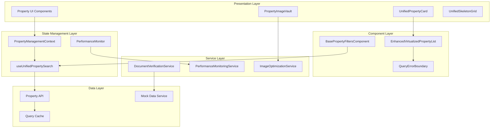
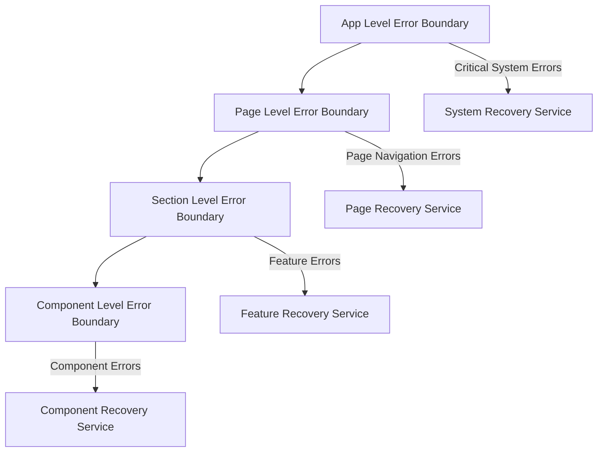

# Design Document

## Overview

The System Integration Optimization design addresses critical architectural gaps in the property management system by creating a unified, performant, and maintainable architecture. The current system shows evidence of component fragmentation, with multiple filter implementations, separate property card variants, and missing integration between key components like PropertyMap and property listing systems.

This design establishes a comprehensive integration strategy that consolidates redundant components, introduces performance monitoring throughout the system, and creates unified interfaces that work seamlessly across all property types (residential, commercial, land). The architecture prioritizes component reusability, performance optimization, and developer experience while maintaining backward compatibility during the transition.

## Architecture

### High-Level System Architecture



### Component Integration Flow

The integration follows a dependency-aware approach where foundational components are established first, followed by integration components, and finally advanced features:

1. **Foundation Phase**: PropertyManagementContext, QueryErrorBoundary, UnifiedPropertyCard
2. **Integration Phase**: PropertyImageVault integration, BasePropertyFiltersComponent, EnhancedVirtualizedPropertyList
3. **Advanced Phase**: Performance monitoring, document verification, skeleton optimization

## Components and Interfaces

### 1. PropertyManagementContext

**Purpose**: Unified state management replacing PropertyContext and CompareContext

```typescript
interface PropertyManagementContextValue {
  // Selection state
  selectedProperties: string[];
  comparisonProperties: string[];
  selectionMode: 'single' | 'comparison' | 'bulk';
  
  // Document verification state
  verificationStatus: Record<string, DocumentVerificationStatus>;
  
  // Performance monitoring state
  performanceMetrics: PerformanceMetrics;
  
  // Actions
  selectProperty: (id: string) => void;
  addToComparison: (id: string) => void;
  clearSelection: () => void;
  updateVerificationStatus: (id: string, status: DocumentVerificationStatus) => void;
  trackPerformance: (metric: PerformanceMetric) => void;
}
```

**Key Features**:
- Context splitting to prevent unnecessary re-renders
- React.memo integration for performance optimization
- Backward compatibility layer for existing PropertyContext usage
- Performance monitoring integration

### 2. UnifiedPropertyCard

**Purpose**: Single component replacing PropertyCard and AdaptivePropertyCard

```typescript
interface UnifiedPropertyCardProps {
  property: NormalizedProperty;
  viewMode: 'grid' | 'list' | 'detailed' | 'comparison';
  size: 'small' | 'medium' | 'large';
  propertyType: 'residential' | 'commercial' | 'land';
  showImageVault?: boolean;
  onSelect?: (property: NormalizedProperty) => void;
  onCompare?: (property: NormalizedProperty) => void;
  className?: string;
}
```

**Adaptive Behavior**:
- Grid mode: Compact card with essential information
- List mode: Horizontal layout with detailed information
- Detailed mode: Full property information with image gallery
- Comparison mode: Standardized layout for side-by-side comparison

### 3. PropertyImageVault Integration

**Purpose**: Unified image management across all property displays

```typescript
interface PropertyImageVaultProps {
  propertyId: string;
  images: PropertyImage[];
  context: 'card' | 'detail' | 'upload' | 'gallery';
  performanceTracking?: boolean;
  onImageOptimization?: (recommendations: OptimizationRecommendation[]) => void;
  onUpload?: (files: File[]) => Promise<void>;
  onError?: (error: ImageError) => void;
}
```

**Integration Points**:
- PropertyCard: Embedded image display with lazy loading
- PropertyDetails: Full gallery with management capabilities
- Property wizard: Upload and management interface
- Performance monitoring: Automatic optimization tracking

### 4. BasePropertyFiltersComponent

**Purpose**: Foundation for all property-specific filters

```typescript
interface BasePropertyFiltersProps<T extends BasePropertyFilters> {
  filters: T;
  onChange: (filters: T) => void;
  onReset: () => void;
  debounceMs?: number;
  cacheKey?: string;
  errors?: Record<string, string>;
}
```

**Extension Pattern**:
```typescript
// ResidentialFilters extends BasePropertyFiltersComponent
const ResidentialFilters = (props: BasePropertyFiltersProps<ResidentialFilters>) => (
  <BasePropertyFiltersComponent {...props}>
    <BedroomFilter />
    <BathroomFilter />
    <AmenitiesFilter />
  </BasePropertyFiltersComponent>
);
```

### 5. EnhancedVirtualizedPropertyList

**Purpose**: High-performance rendering for large property datasets

```typescript
interface EnhancedVirtualizedPropertyListProps {
  properties: NormalizedProperty[];
  cardComponent: ComponentType<UnifiedPropertyCardProps>;
  itemHeight: number | ((index: number) => number);
  threshold?: number; // Auto-activate at 100 items
  performanceMonitoring?: boolean;
  onPerformanceAlert?: (metrics: PerformanceMetrics) => void;
}
```

**Performance Features**:
- Automatic activation when item count exceeds threshold
- Dynamic item height calculation
- Memory usage monitoring
- Render performance tracking
- Integration with UnifiedPropertyCard

### 6. useUnifiedPropertySearch Hook

**Purpose**: Consolidated search functionality replacing usePropertySearch and useProperties

```typescript
interface UseUnifiedPropertySearchOptions {
  propertyType?: PropertyTypeKey;
  debounceMs?: number;
  cacheTime?: number;
  staleTime?: number;
}

interface UseUnifiedPropertySearchReturn<T> {
  data: PropertySearchResult<T>;
  isLoading: boolean;
  error: Error | null;
  search: (filters: BasePropertyFilters) => void;
  clearCache: () => void;
  refetch: () => void;
}
```

## Data Models

### Performance Monitoring Models

```typescript
interface PerformanceMetrics {
  renderTime: number;
  memoryUsage: number;
  imageLoadTime: number;
  searchResponseTime: number;
  errorRate: number;
  userInteractionLatency: number;
}

interface PerformanceAlert {
  type: 'render' | 'memory' | 'network' | 'error';
  severity: 'warning' | 'critical';
  message: string;
  metrics: PerformanceMetrics;
  timestamp: Date;
}
```

### Document Verification Models

```typescript
interface DocumentVerificationStatus {
  status: 'pending' | 'verified' | 'failed' | 'expired';
  verifiedAt?: Date;
  expiresAt?: Date;
  documents: VerifiedDocument[];
  confidence: number;
  issues: VerificationIssue[];
}

interface VerificationIssue {
  type: 'authenticity' | 'completeness' | 'compliance';
  severity: 'low' | 'medium' | 'high';
  description: string;
  resolution?: string;
}
```

### Image Optimization Models

```typescript
interface ImageOptimizationRecommendation {
  imageId: string;
  currentSize: number;
  recommendedSize: number;
  format: 'webp' | 'avif' | 'jpeg';
  quality: number;
  estimatedSavings: number;
  loadTimeImprovement: number;
}
```

## Error Handling

### Hierarchical Error Boundary System



**Error Containment Strategy**:
- **App Level**: System-wide failures, authentication errors, critical API failures
- **Page Level**: Route-specific errors, page load failures, navigation issues
- **Section Level**: Feature-specific errors, data loading failures, user action errors
- **Component Level**: Individual component failures, render errors, prop validation errors

**Recovery Mechanisms**:
- Automatic retry with exponential backoff
- Cached data fallback
- User work preservation
- Contextual error messaging
- Progressive degradation

### Error Recovery Services

```typescript
interface ErrorRecoveryService {
  handleError: (error: Error, context: ErrorContext) => RecoveryAction;
  preserveUserWork: (context: UserWorkContext) => void;
  attemptRecovery: (action: RecoveryAction) => Promise<boolean>;
  logError: (error: Error, context: ErrorContext) => void;
}

interface RecoveryAction {
  type: 'retry' | 'fallback' | 'redirect' | 'refresh';
  payload?: unknown;
  userMessage: string;
  technicalDetails?: string;
}
```

## Testing Strategy

### Component Testing Approach

**Unit Testing**:
- Individual component functionality
- Hook behavior and state management
- Utility function correctness
- Error boundary behavior

**Integration Testing**:
- Component interaction patterns
- Context provider behavior
- Search and filter integration
- Performance monitoring accuracy

**Performance Testing**:
- Render performance benchmarks
- Memory usage validation
- Image loading optimization
- Virtualization efficiency

### Mock Data Integration

**Development Environment**:
- Comprehensive test scenarios including edge cases
- Performance stress testing with large datasets
- Error condition simulation
- Document verification workflow testing

**Test Scenarios**:
```typescript
interface MockDataScenarios {
  standardProperties: PropertyTestData[];
  largeDatasets: PropertyTestData[]; // 1000+ items
  errorConditions: ErrorTestData[];
  performanceStress: PerformanceTestData[];
  documentVerification: DocumentTestData[];
}
```

### Automated Quality Gates

**Performance Budgets**:
- Page load time: < 2 seconds
- Component render time: < 16ms (60fps)
- Memory usage: < 100MB for 1000+ properties
- Image load time: < 3 seconds with optimization

**Quality Metrics**:
- Component reusability: > 95%
- Code duplication reduction: > 80%
- Error boundary coverage: 100%
- Performance regression detection: Automated alerts

## Implementation Phases

### Phase 1: Foundation Architecture (Weeks 1-3)

**Priority Components**:
1. PropertyManagementContext - Central state management
2. QueryErrorBoundary system - Error handling foundation
3. UnifiedPropertyCard - Component consolidation

**Success Criteria**:
- Context migration completed without breaking changes
- Error boundaries catching and recovering from failures
- Single property card component handling all view modes

### Phase 2: Integration and Optimization (Weeks 4-6)

**Integration Components**:
1. PropertyImageVault integration across all property displays
2. BasePropertyFiltersComponent with unified search
3. EnhancedVirtualizedPropertyList for performance

**Success Criteria**:
- Image management consistent across all contexts
- Filter behavior unified with < 300ms debouncing
- Virtualization active for datasets > 100 items

### Phase 3: Advanced Features and Monitoring (Weeks 7-9)

**Advanced Features**:
1. Comprehensive performance monitoring
2. Document verification workflow integration
3. Skeleton loading optimization

**Success Criteria**:
- Performance metrics tracked across all major components
- Document verification integrated into property workflows
- Loading states consistent with minimal layout shift

## Migration Strategy

### Backward Compatibility

**Context Migration**:
- Gradual migration from PropertyContext/CompareContext
- Compatibility layer during transition period
- Automated migration tools for component updates

**Component Migration**:
- Feature flag system for gradual rollout
- A/B testing for performance validation
- Rollback mechanisms for critical issues

**Data Migration**:
- Seamless transition between mock and real data
- Cache invalidation strategies
- State preservation during updates

This design provides a comprehensive roadmap for transforming the property management system into a unified, performant, and maintainable architecture while ensuring smooth migration and minimal disruption to existing functionality.