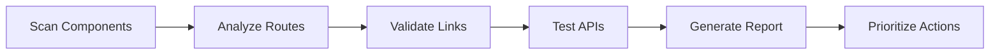

# Enhanced UI Audit and Discovery System

The Enhanced UI Audit System is a comprehensive, plugin-based tool for automatically discovering and analyzing frontend-backend connectivity issues, accessibility problems, performance bottlenecks, and security vulnerabilities in React applications.

## 🎯 Purpose

This system addresses multiple critical aspects of modern web applications:

- **Frontend-Backend Connectivity**: Identifies broken buttons, missing API endpoints, disconnected forms, and routing problems
- **Accessibility Compliance**: WCAG 2.1 analysis with A, AA, and AAA level checking
- **Performance Optimization**: Component render times, bundle analysis, and memory usage tracking
- **Security Vulnerability Detection**: XSS, CSRF, injection attacks, and insecure data handling
- **Automated Remediation**: Actionable fixes with implementation roadmaps
- **Continuous Monitoring**: CI/CD integration and watch mode for development

## 🚀 Quick Start

### Complete Audit (All Areas)
```bash
npm run audit:ui
```

### Quick Audit (Critical Issues Only)
```bash
npm run audit:ui:quick
```

### Focused Audits (Specific Areas)
```bash
npm run audit:ui:accessibility    # WCAG compliance only
npm run audit:ui:performance      # Performance analysis only
npm run audit:ui:security         # Security vulnerabilities only
npm run audit:ui:connectivity     # Frontend-backend connectivity only
```

### Multiple Output Formats
```bash
npm run audit:ui:json            # JSON report
npm run audit:ui:markdown        # Markdown report
npm run audit:ui:html            # Interactive HTML report
npm run audit:ui:all-formats     # All formats
```

### Development & CI/CD
```bash
npm run audit:ui:watch           # Watch mode for development
npm run audit:ui:ci              # Optimized for CI/CD pipelines
npm run audit:ui:verbose         # Detailed logging
```

## 📊 What It Analyzes

### 🔗 Frontend-Backend Connectivity
- **🔴 Critical**: Broken API endpoints, missing components, authentication failures
- **🟡 High**: Missing routes, disconnected forms, broken navigation
- **🟢 Medium**: Performance issues, UX improvements, error handling

### ♿ Accessibility (WCAG 2.1)
- **🔴 Critical**: Missing ARIA labels, keyboard traps, critical contrast failures
- **🟡 High**: Focus management, semantic HTML, form accessibility
- **🟢 Medium**: Color contrast improvements, enhanced screen reader support

### ⚡ Performance Analysis
- **🔴 Critical**: Render times >16ms, memory leaks, blocking operations
- **🟡 High**: Bundle size >50KB, slow API calls >2s, excessive re-renders
- **🟢 Medium**: Optimization opportunities, caching improvements

### 🔒 Security Vulnerabilities
- **🔴 Critical**: XSS vulnerabilities, command injection, data exposure
- **🟡 High**: CSRF missing, authentication bypass, insecure transport
- **🟢 Medium**: Input validation, dependency vulnerabilities, logging issues

## 🏗️ Architecture

### Core Components

1. **UIAuditSystem**: Main orchestrator that coordinates all audit activities
2. **RouteAnalyzer**: Analyzes React Router configuration and finds missing routes
3. **LinkValidator**: Tests all navigation links and API endpoints
4. **AuditReporter**: Generates comprehensive reports with recommendations

### Data Flow



## 📋 Report Structure

### Summary Statistics
- Total interactive elements found
- Working vs broken elements
- Critical issues requiring immediate attention
- Estimated time to fix all issues

### Prioritized Actions
Each issue includes:
- **Priority Level**: Critical, High, Medium, Low
- **Category**: Backend, Frontend, Routing, Error Handling
- **Estimated Hours**: Time required to fix
- **User Impact**: How it affects users
- **Business Value**: Importance to business goals

### Implementation Plan
- **Phase 1**: Critical fixes (broken APIs, missing components)
- **Phase 2**: High priority features (missing routes, forms)
- **Phase 3**: Performance and polish (optimization, UX)

### Risk Assessment
- Overall risk level
- Specific risks and mitigation strategies
- Resource requirements

## 🔧 Configuration

### Customizing the Audit

You can customize what the audit system looks for by modifying the configuration:

```typescript
// src/infrastructure/audit/config.ts
export const auditConfig = {
  // Directories to scan for components
  componentDirectories: [
    'src/auth/components',
    'src/property/components',
    // Add your directories here
  ],
  
  // API endpoints to test
  apiEndpoints: [
    '/api/users',
    '/api/properties',
    // Add your endpoints here
  ],
  
  // Routes to validate
  routes: [
    '/',
    '/dashboard',
    // Add your routes here
  ],
  
  // Priority weights
  priorityWeights: {
    critical: 10,
    high: 5,
    medium: 2,
    low: 1
  }
};
```

### Adding Custom Checks

You can extend the audit system with custom checks:

```typescript
// src/infrastructure/audit/custom-checks.ts
import { UIElement } from './UIAuditSystem';

export class CustomAuditChecks {
  async checkCustomElement(element: UIElement): Promise<boolean> {
    // Your custom validation logic here
    return true;
  }
}
```

## 📈 Integration with CI/CD

### GitHub Actions Example

```yaml
name: UI Audit
on: [push, pull_request]

jobs:
  audit:
    runs-on: ubuntu-latest
    steps:
      - uses: actions/checkout@v3
      - uses: actions/setup-node@v3
        with:
          node-version: '20'
      - run: npm install
      - run: npm run audit:ui:quick
      - name: Upload audit report
        uses: actions/upload-artifact@v3
        with:
          name: ui-audit-report
          path: audit-report.json
```

### Pre-commit Hook

```bash
# .husky/pre-commit
#!/bin/sh
npm run audit:ui:quick
if [ $? -ne 0 ]; then
  echo "❌ UI Audit found critical issues. Please fix before committing."
  exit 1
fi
```

## 🛠️ Development

### Running Tests

```bash
# Test the audit system itself
npm test src/infrastructure/audit

# Test with coverage
npm run test:coverage -- src/infrastructure/audit
```

### Adding New Analyzers

1. Create a new analyzer class:
```typescript
// src/infrastructure/audit/MyAnalyzer.ts
export class MyAnalyzer {
  async analyze(): Promise<AnalysisResult[]> {
    // Your analysis logic
  }
}
```

2. Register it in the main system:
```typescript
// src/infrastructure/audit/UIAuditSystem.ts
import { MyAnalyzer } from './MyAnalyzer';

// Add to the audit process
const myAnalyzer = new MyAnalyzer();
const results = await myAnalyzer.analyze();
```

### Debugging

Enable verbose logging:
```bash
DEBUG=audit:* npm run audit:ui
```

Or use the verbose flag:
```bash
npm run audit:ui -- --verbose
```

## 📚 Examples

### Example Report Output

```
🔍 UI AUDIT RESULTS
==================================================

📊 SUMMARY:
   Total Elements: 127
   Working: 89 ✅
   Broken: 23 ❌
   Missing: 15 ⚠️
   Critical Issues: 8 🔴
   Estimated Fix Time: 42 hours ⏱️

🎯 TOP PRIORITY ACTIONS:

   1. Fix Broken API Endpoints (CRITICAL)
      📝 5 API endpoints are not working, blocking core functionality
      ⏱️  30 hours
      🎯 Impact: high

   2. Implement Missing Routes (HIGH)
      📝 7 routes are referenced but not implemented
      ⏱️  21 hours
      🎯 Impact: medium

   3. Connect Disconnected UI Elements (HIGH)
      📝 15 UI elements have no working event handlers
      ⏱️  30 hours
      🎯 Impact: high
```

### Example Issues Found

**Broken Button Example:**
```typescript
// Found in: src/user/pages/Dashboard.tsx:471
<Button onClick={() => handleNavigate("/notifications")}>
  <Bell className="w-4 h-4 mr-2" />
  Notifications
</Button>

// Issue: Route "/notifications" not found
// Fix: Add route definition and create NotificationsPage component
```

**Missing API Example:**
```typescript
// Found in: src/user/hooks/useUser.ts:117
const response = await fetch(`/api/users/${userId}/notifications`);

// Issue: API endpoint returns 404
// Fix: Implement GET /api/users/:id/notifications endpoint
```

## 🤝 Contributing

1. Fork the repository
2. Create a feature branch: `git checkout -b feature/new-analyzer`
3. Make your changes
4. Add tests: `npm test`
5. Run the audit: `npm run audit:ui`
6. Submit a pull request

## 📄 License

This project is licensed under the MIT License - see the LICENSE file for details.

## 🆘 Support

- **Documentation**: Check this README and inline code comments
- **Issues**: Report bugs and request features on GitHub
- **Discussions**: Join the community discussions for help and ideas

## 🔮 Roadmap

- [ ] **Visual Regression Testing**: Detect UI changes that break functionality
- [ ] **Performance Monitoring**: Track API response times and page load speeds
- [ ] **Accessibility Auditing**: Comprehensive WCAG compliance checking
- [ ] **Mobile Testing**: Specific checks for mobile responsiveness
- [ ] **Integration Testing**: End-to-end workflow validation
- [ ] **Real User Monitoring**: Track actual user interactions and failures

---

**Made with ❤️ for better frontend-backend connectivity**