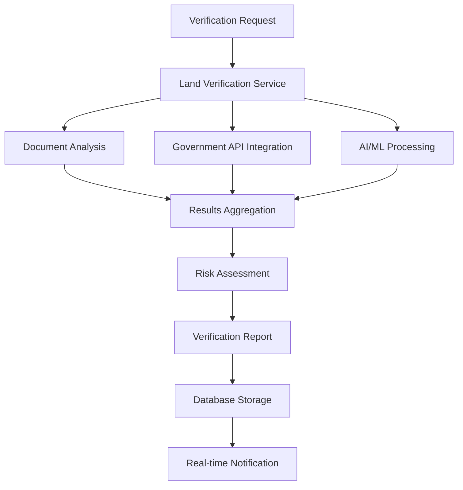
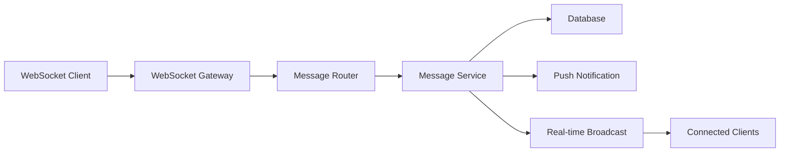

# API Integration Architecture Guide

## 🏗️ System Design Overview

The African Property Trust platform employs a microservices-oriented architecture with a unified API gateway pattern. This guide provides comprehensive documentation for API integration, error handling, and data flow management.

## 📐 Core Architecture Principles

### 1. **Layered Architecture Pattern**
```
┌─────────────────────────────────────────┐
│           Presentation Layer            │
│  (React Components, UI State Management)│
├─────────────────────────────────────────┤
│            Service Layer                │
│   (Business Logic, API Orchestration)  │
├─────────────────────────────────────────┤
│           Integration Layer             │
│  (External APIs, Data Transformation)  │
├─────────────────────────────────────────┤
│             Data Layer                  │
│    (Database, Cache, File Storage)     │
└─────────────────────────────────────────┘
```

### 2. **API Gateway Pattern**
All client requests flow through a centralized API gateway that provides:
- Authentication & Authorization
- Rate Limiting & Throttling
- Request/Response Transformation
- Circuit Breaking & Fallback
- Monitoring & Analytics

## 🔄 Data Flow Architecture

### Primary Data Flows

#### 1. Property Management Flow


#### 2. Land Verification Flow


#### 3. Real-time Communication Flow


## 🛠️ API Integration Implementation

### 1. **Centralized API Client**

```typescript
// src/shared/services/api-client-enhanced.ts
import axios, { AxiosInstance, AxiosRequestConfig, AxiosResponse } from 'axios';
import { CircuitBreaker } from './circuit-breaker';
import { RateLimiter } from './rate-limiter';
import { CacheManager } from './cache-manager';

export interface ApiClientConfig {
  baseURL: string;
  timeout: number;
  retryAttempts: number;
  circuitBreakerOptions: CircuitBreakerOptions;
  rateLimitOptions: RateLimitOptions;
  cacheOptions: CacheOptions;
}

export class EnhancedApiClient {
  private client: AxiosInstance;
  private circuitBreaker: CircuitBreaker;
  private rateLimiter: RateLimiter;
  private cache: CacheManager;

  constructor(config: ApiClientConfig) {
    this.client = axios.create({
      baseURL: config.baseURL,
      timeout: config.timeout,
    });

    this.circuitBreaker = new CircuitBreaker(config.circuitBreakerOptions);
    this.rateLimiter = new RateLimiter(config.rateLimitOptions);
    this.cache = new CacheManager(config.cacheOptions);

    this.setupInterceptors();
  }

  private setupInterceptors(): void {
    // Request interceptor
    this.client.interceptors.request.use(
      async (config) => {
        // Rate limiting check
        await this.rateLimiter.checkLimit(config.url || '');
        
        // Add authentication headers
        const token = await this.getAuthToken();
        if (token) {
          config.headers.Authorization = `Bearer ${token}`;
        }

        // Add request ID for tracing
        config.headers['X-Request-ID'] = this.generateRequestId();
        
        return config;
      },
      (error) => Promise.reject(error)
    );

    // Response interceptor
    this.client.interceptors.response.use(
      (response) => {
        // Cache successful responses
        this.cache.set(response.config.url || '', response.data);
        return response;
      },
      async (error) => {
        // Handle different error types
        return this.handleApiError(error);
      }
    );
  }

  async get<T>(url: string, config?: AxiosRequestConfig): Promise<T> {
    // Check cache first
    const cached = await this.cache.get(url);
    if (cached) {
      return cached;
    }

    // Execute with circuit breaker
    return this.circuitBreaker.execute(async () => {
      const response = await this.client.get<T>(url, config);
      return response.data;
    });
  }

  async post<T>(url: string, data?: any, config?: AxiosRequestConfig): Promise<T> {
    return this.circuitBreaker.execute(async () => {
      const response = await this.client.post<T>(url, data, config);
      // Invalidate related cache entries
      await this.cache.invalidatePattern(url);
      return response.data;
    });
  }

  private async handleApiError(error: any): Promise<never> {
    const errorInfo = {
      status: error.response?.status,
      message: error.response?.data?.message || error.message,
      url: error.config?.url,
      requestId: error.config?.headers['X-Request-ID'],
    };

    // Log error for monitoring
    console.error('API Error:', errorInfo);

    // Transform error for consistent handling
    throw new ApiError(errorInfo);
  }
}
```

### 2. **Circuit Breaker Implementation**

```typescript
// src/shared/services/circuit-breaker.ts
export interface CircuitBreakerOptions {
  failureThreshold: number;
  recoveryTimeout: number;
  monitoringPeriod: number;
}

export enum CircuitState {
  CLOSED = 'CLOSED',
  OPEN = 'OPEN',
  HALF_OPEN = 'HALF_OPEN'
}

export class CircuitBreaker {
  private state: CircuitState = CircuitState.CLOSED;
  private failureCount = 0;
  private lastFailureTime = 0;
  private successCount = 0;

  constructor(private options: CircuitBreakerOptions) {}

  async execute<T>(operation: () => Promise<T>): Promise<T> {
    if (this.state === CircuitState.OPEN) {
      if (this.shouldAttemptReset()) {
        this.state = CircuitState.HALF_OPEN;
      } else {
        throw new Error('Circuit breaker is OPEN');
      }
    }

    try {
      const result = await operation();
      this.onSuccess();
      return result;
    } catch (error) {
      this.onFailure();
      throw error;
    }
  }

  private onSuccess(): void {
    this.failureCount = 0;
    if (this.state === CircuitState.HALF_OPEN) {
      this.successCount++;
      if (this.successCount >= 3) {
        this.state = CircuitState.CLOSED;
        this.successCount = 0;
      }
    }
  }

  private onFailure(): void {
    this.failureCount++;
    this.lastFailureTime = Date.now();
    
    if (this.failureCount >= this.options.failureThreshold) {
      this.state = CircuitState.OPEN;
    }
  }

  private shouldAttemptReset(): boolean {
    return Date.now() - this.lastFailureTime >= this.options.recoveryTimeout;
  }
}
```

### 3. **Rate Limiting System**

```typescript
// src/shared/services/rate-limiter.ts
export interface RateLimitOptions {
  windowMs: number;
  maxRequests: number;
  keyGenerator?: (url: string) => string;
}

export class RateLimiter {
  private requests = new Map<string, number[]>();

  constructor(private options: RateLimitOptions) {}

  async checkLimit(url: string): Promise<void> {
    const key = this.options.keyGenerator ? this.options.keyGenerator(url) : url;
    const now = Date.now();
    const windowStart = now - this.options.windowMs;

    // Get existing requests for this key
    let requestTimes = this.requests.get(key) || [];
    
    // Remove old requests outside the window
    requestTimes = requestTimes.filter(time => time > windowStart);
    
    // Check if limit exceeded
    if (requestTimes.length >= this.options.maxRequests) {
      const oldestRequest = Math.min(...requestTimes);
      const waitTime = oldestRequest + this.options.windowMs - now;
      throw new RateLimitError(`Rate limit exceeded. Try again in ${waitTime}ms`);
    }

    // Add current request
    requestTimes.push(now);
    this.requests.set(key, requestTimes);
  }
}
```

## 🔐 Security Implementation

### 1. **Authentication & Authorization**

```typescript
// src/shared/services/auth-service-enhanced.ts
export class AuthService {
  private tokenManager: TokenManager;
  private permissionManager: PermissionManager;

  constructor() {
    this.tokenManager = new TokenManager();
    this.permissionManager = new PermissionManager();
  }

  async authenticate(credentials: LoginCredentials): Promise<AuthResult> {
    try {
      // Validate credentials
      const validation = await this.validateCredentials(credentials);
      if (!validation.isValid) {
        throw new AuthenticationError(validation.message);
      }

      // Generate tokens
      const tokens = await this.tokenManager.generateTokens(validation.user);
      
      // Set up session
      await this.setupUserSession(validation.user, tokens);

      return {
        user: validation.user,
        accessToken: tokens.accessToken,
        refreshToken: tokens.refreshToken,
        permissions: await this.permissionManager.getUserPermissions(validation.user.id)
      };
    } catch (error) {
      // Log authentication attempt
      await this.auditLogger.logAuthAttempt({
        email: credentials.email,
        success: false,
        error: error.message,
        timestamp: new Date(),
        ipAddress: credentials.ipAddress
      });
      throw error;
    }
  }

  async authorize(token: string, requiredPermission: string): Promise<boolean> {
    try {
      // Validate token
      const payload = await this.tokenManager.validateToken(token);
      
      // Check permissions
      const hasPermission = await this.permissionManager.checkPermission(
        payload.userId,
        requiredPermission
      );

      return hasPermission;
    } catch (error) {
      return false;
    }
  }
}
```

### 2. **Input Validation System**

```typescript
// src/shared/services/validation-service.ts
import { z } from 'zod';

export class ValidationService {
  private schemas = new Map<string, z.ZodSchema>();

  constructor() {
    this.registerSchemas();
  }

  private registerSchemas(): void {
    // Property validation schema
    this.schemas.set('property', z.object({
      title: z.string().min(1).max(200),
      description: z.string().min(10).max(2000),
      price: z.number().positive(),
      location: z.object({
        lat: z.number().min(-90).max(90),
        lng: z.number().min(-180).max(180),
        address: z.string().min(5).max(500)
      }),
      propertyType: z.enum(['residential', 'commercial', 'land']),
      images: z.array(z.string().url()).max(20)
    }));

    // User registration schema
    this.schemas.set('user-registration', z.object({
      email: z.string().email(),
      password: z.string().min(8).regex(/^(?=.*[a-z])(?=.*[A-Z])(?=.*\d)/),
      firstName: z.string().min(1).max(50),
      lastName: z.string().min(1).max(50),
      phone: z.string().regex(/^\+254[0-9]{9}$/)
    }));
  }

  validate<T>(schemaName: string, data: unknown): ValidationResult<T> {
    const schema = this.schemas.get(schemaName);
    if (!schema) {
      throw new Error(`Schema '${schemaName}' not found`);
    }

    try {
      const validatedData = schema.parse(data) as T;
      return {
        isValid: true,
        data: validatedData,
        errors: []
      };
    } catch (error) {
      if (error instanceof z.ZodError) {
        return {
          isValid: false,
          data: null,
          errors: error.errors.map(err => ({
            field: err.path.join('.'),
            message: err.message,
            code: err.code
          }))
        };
      }
      throw error;
    }
  }

  sanitizeInput(input: string): string {
    // Remove potentially dangerous characters
    return input
      .replace(/<script\b[^<]*(?:(?!<\/script>)<[^<]*)*<\/script>/gi, '')
      .replace(/javascript:/gi, '')
      .replace(/on\w+\s*=/gi, '')
      .trim();
  }
}
```

## 📊 Monitoring & Analytics

### 1. **Performance Monitoring**

```typescript
// src/shared/services/performance-monitor.ts
export class PerformanceMonitor {
  private metrics = new Map<string, PerformanceMetric[]>();

  trackApiCall(endpoint: string, duration: number, status: number): void {
    const metric: PerformanceMetric = {
      endpoint,
      duration,
      status,
      timestamp: Date.now()
    };

    const existing = this.metrics.get(endpoint) || [];
    existing.push(metric);
    
    // Keep only last 1000 metrics per endpoint
    if (existing.length > 1000) {
      existing.shift();
    }
    
    this.metrics.set(endpoint, existing);

    // Alert on performance issues
    this.checkPerformanceThresholds(endpoint, existing);
  }

  getMetrics(endpoint: string): PerformanceStats {
    const metrics = this.metrics.get(endpoint) || [];
    const durations = metrics.map(m => m.duration);
    
    return {
      count: metrics.length,
      averageResponseTime: this.average(durations),
      p95ResponseTime: this.percentile(durations, 95),
      p99ResponseTime: this.percentile(durations, 99),
      errorRate: metrics.filter(m => m.status >= 400).length / metrics.length,
      successRate: metrics.filter(m => m.status < 400).length / metrics.length
    };
  }

  private checkPerformanceThresholds(endpoint: string, metrics: PerformanceMetric[]): void {
    const recentMetrics = metrics.slice(-10); // Last 10 requests
    const avgDuration = this.average(recentMetrics.map(m => m.duration));
    
    if (avgDuration > 2000) { // 2 second threshold
      this.alertService.sendAlert({
        type: 'PERFORMANCE_DEGRADATION',
        endpoint,
        averageResponseTime: avgDuration,
        threshold: 2000
      });
    }
  }
}
```

## 🚀 Implementation Roadmap

### Phase 1: Core Infrastructure (Week 1-2)
1. **Enhanced API Client**: Implement centralized API client with circuit breaker
2. **Rate Limiting**: Complete rate limiting system implementation
3. **Error Handling**: Standardize error handling across all services
4. **Validation**: Implement comprehensive input validation

### Phase 2: Security & Monitoring (Week 3-4)
1. **Authentication**: Enhance authentication and authorization system
2. **Audit Trail**: Implement comprehensive audit logging
3. **Performance Monitoring**: Add detailed performance tracking
4. **Security Hardening**: Complete security vulnerability assessment

### Phase 3: Advanced Features (Week 5-6)
1. **Real-time Features**: Complete WebSocket implementation
2. **Caching Strategy**: Implement intelligent caching system
3. **Analytics**: Add comprehensive analytics and reporting
4. **Mobile Optimization**: Complete PWA features

## 📋 Testing Strategy

### 1. **API Integration Tests**
```typescript
// tests/integration/api-integration.test.ts
describe('API Integration', () => {
  test('should handle rate limiting gracefully', async () => {
    const client = new EnhancedApiClient(testConfig);
    
    // Make requests up to the limit
    const promises = Array(10).fill(0).map(() => 
      client.get('/api/properties')
    );
    
    const results = await Promise.allSettled(promises);
    
    // Some should succeed, some should be rate limited
    expect(results.some(r => r.status === 'fulfilled')).toBe(true);
    expect(results.some(r => 
      r.status === 'rejected' && 
      r.reason instanceof RateLimitError
    )).toBe(true);
  });

  test('should recover from circuit breaker open state', async () => {
    const client = new EnhancedApiClient({
      ...testConfig,
      circuitBreakerOptions: {
        failureThreshold: 3,
        recoveryTimeout: 1000,
        monitoringPeriod: 5000
      }
    });

    // Trigger circuit breaker
    await expect(client.get('/api/failing-endpoint')).rejects.toThrow();
    
    // Wait for recovery timeout
    await new Promise(resolve => setTimeout(resolve, 1100));
    
    // Should attempt request again
    await expect(client.get('/api/properties')).resolves.toBeDefined();
  });
});
```

This comprehensive API integration guide provides the foundation for building a robust, scalable, and secure property management platform. Each component is designed to work together seamlessly while maintaining clear separation of concerns and high testability.