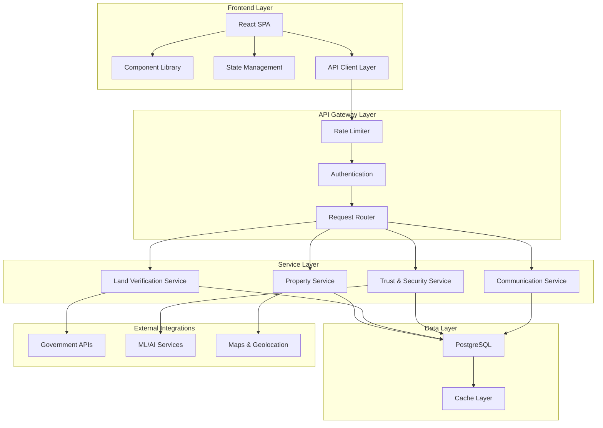
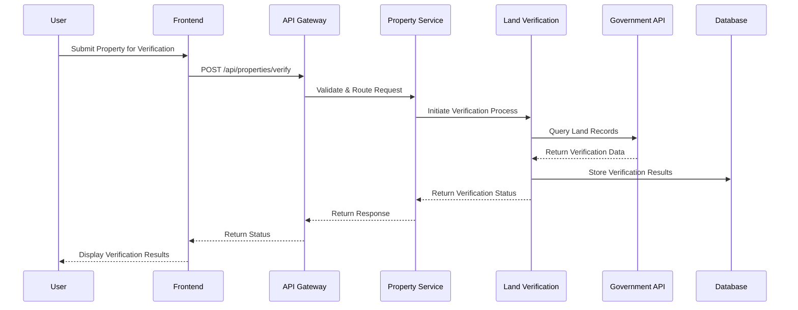
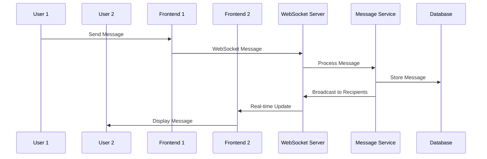

# Comprehensive Gap Analysis & Resolution Guide

## Executive Summary

The African Property Trust platform is a sophisticated land verification and property management system with a well-architected codebase. However, several critical gaps exist that impact production readiness, API integration robustness, and system scalability.

## 🎯 Critical Gaps Identified

### 1. **API Integration Architecture Gaps**

#### **Problem**: Inconsistent API Error Handling
- **Impact**: High - Affects user experience and system reliability
- **Current State**: Mixed error handling patterns across services
- **Gap**: No centralized error taxonomy or recovery strategies

#### **Problem**: Missing Circuit Breaker Implementation
- **Impact**: Medium - System vulnerable to cascade failures
- **Current State**: Basic circuit breaker exists but incomplete coverage
- **Gap**: Not implemented across all external service integrations

#### **Problem**: Incomplete Rate Limiting Strategy
- **Impact**: High - System vulnerable to abuse and overload
- **Current State**: TODO comments indicate incomplete implementation
- **Gap**: Missing adaptive rate limiting and quota management

### 2. **Data Flow Architecture Gaps**

#### **Problem**: Inconsistent State Management
- **Impact**: Medium - Potential data synchronization issues
- **Current State**: Multiple state management patterns coexist
- **Gap**: No unified state management strategy for complex workflows

#### **Problem**: Missing Real-time Data Synchronization
- **Impact**: Medium - Users may see stale data
- **Current State**: WebSocket infrastructure exists but incomplete
- **Gap**: Real-time updates not implemented for all critical data flows

### 3. **Security & Compliance Gaps**

#### **Problem**: Incomplete Input Validation
- **Impact**: High - Security vulnerability
- **Current State**: Basic validation exists
- **Gap**: Missing comprehensive validation for all API endpoints

#### **Problem**: Missing Audit Trail Implementation
- **Impact**: High - Compliance and debugging issues
- **Current State**: Basic logging exists
- **Gap**: No comprehensive audit trail for sensitive operations

### 4. **Performance & Scalability Gaps**

#### **Problem**: Suboptimal Database Query Patterns
- **Impact**: Medium - Performance degradation under load
- **Current State**: Basic optimization exists
- **Gap**: Missing query optimization for complex land verification workflows

#### **Problem**: Incomplete Caching Strategy
- **Impact**: Medium - Unnecessary API calls and slow responses
- **Current State**: Basic caching implemented
- **Gap**: Missing intelligent cache invalidation and warming strategies

## 🏗️ System Architecture Overview

## 📊 Data Flow Diagrams

### Property Verification Data Flow

### Real-time Communication Flow

## 🔧 Implementation Priorities

### **Priority 1: Critical Security & Stability**
1. Complete API rate limiting implementation
2. Implement comprehensive input validation
3. Add circuit breaker coverage for all external services
4. Implement audit trail system

### **Priority 2: Performance & User Experience**
1. Optimize database queries for land verification
2. Implement intelligent caching strategies
3. Complete real-time data synchronization
4. Add performance monitoring and alerting

### **Priority 3: Feature Completeness**
1. Complete mobile PWA features
2. Implement advanced search capabilities
3. Add comprehensive analytics
4. Enhance accessibility compliance

## 📋 Gap Resolution Roadmap

### Phase 1: Foundation (Weeks 1-2)
- [ ] Implement centralized error handling
- [ ] Complete rate limiting system
- [ ] Add comprehensive input validation
- [ ] Implement audit trail system

### Phase 2: Integration (Weeks 3-4)
- [ ] Complete circuit breaker implementation
- [ ] Optimize database queries
- [ ] Implement intelligent caching
- [ ] Add performance monitoring

### Phase 3: Enhancement (Weeks 5-6)
- [ ] Complete real-time features
- [ ] Add advanced analytics
- [ ] Implement PWA features
- [ ] Enhance mobile experience

## 🎯 Success Metrics

### Technical Metrics
- API response time < 200ms (95th percentile)
- System uptime > 99.9%
- Error rate < 0.1%
- Cache hit ratio > 80%

### Business Metrics
- User engagement increase by 25%
- Property verification completion rate > 90%
- Customer satisfaction score > 4.5/5
- Support ticket reduction by 40%

## 📚 Next Steps

1. **Review and Prioritize**: Team review of gap analysis and priority alignment
2. **Resource Allocation**: Assign development resources to priority items
3. **Implementation Planning**: Detailed sprint planning for each phase
4. **Monitoring Setup**: Implement metrics and monitoring for success tracking
5. **Quality Assurance**: Establish testing and validation procedures

This analysis provides the foundation for systematic gap resolution and system enhancement. Each identified gap includes specific implementation guidance in the following sections.