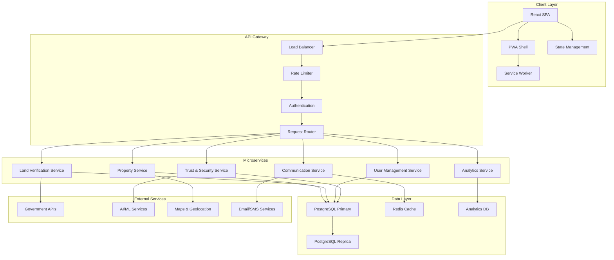
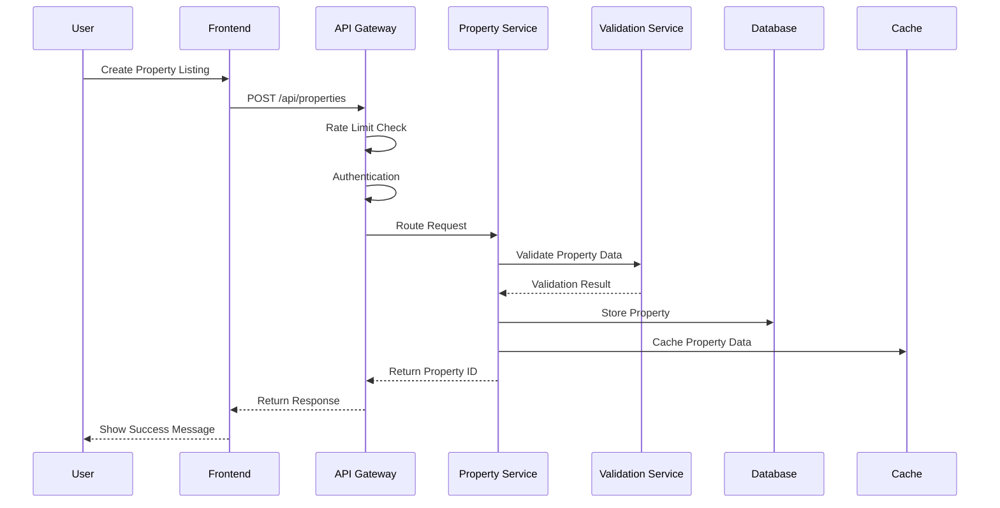
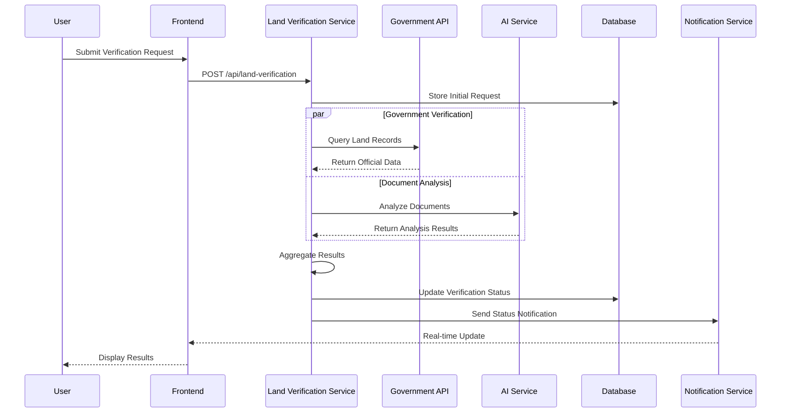
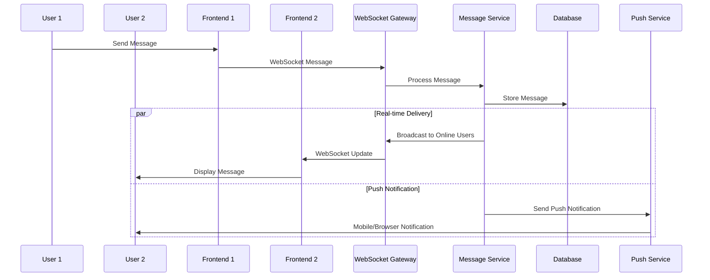
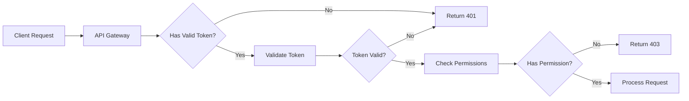
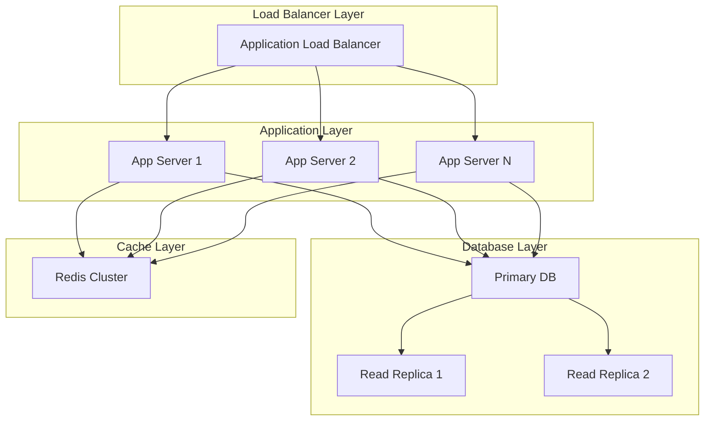
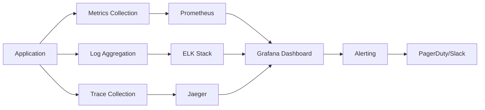
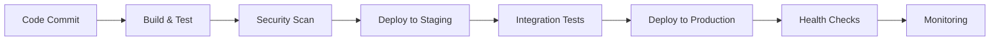

# System Design Documentation
## African Property Trust Platform

### 🏗️ Architecture Overview

The African Property Trust platform is built on a modern, scalable architecture designed to handle land verification, property management, and real-time communication across Kenya and Africa.

## 📐 High-Level Architecture



## 🔄 Data Flow Architecture

### 1. Property Management Flow



### 2. Land Verification Workflow



### 3. Real-time Communication Flow



## 🏛️ Service Architecture

### Core Services

#### 1. Property Service
**Responsibility**: Property CRUD operations, search, and management

```typescript
interface PropertyService {
  // Core CRUD operations
  createProperty(data: PropertyData): Promise<Property>;
  getProperty(id: string): Promise<Property>;
  updateProperty(id: string, data: Partial<PropertyData>): Promise<Property>;
  deleteProperty(id: string): Promise<void>;
  
  // Search and filtering
  searchProperties(criteria: SearchCriteria): Promise<PropertySearchResult>;
  getPropertiesByLocation(bounds: GeoBounds): Promise<Property[]>;
  
  // Advanced features
  compareProperties(ids: string[]): Promise<PropertyComparison>;
  getFeaturedProperties(): Promise<Property[]>;
  getPropertyAnalytics(id: string): Promise<PropertyAnalytics>;
}
```

#### 2. Land Verification Service
**Responsibility**: Land ownership verification and document authentication

```typescript
interface LandVerificationService {
  // Verification workflow
  initiateVerification(request: VerificationRequest): Promise<VerificationSession>;
  getVerificationStatus(sessionId: string): Promise<VerificationStatus>;
  submitDocuments(sessionId: string, documents: Document[]): Promise<void>;
  
  // Government integration
  queryGovernmentRecords(landNumber: string): Promise<GovernmentRecord>;
  validateTitleDeed(titleDeed: TitleDeedData): Promise<ValidationResult>;
  
  // AI/ML integration
  analyzeDocuments(documents: Document[]): Promise<DocumentAnalysis>;
  detectFraud(data: VerificationData): Promise<FraudAssessment>;
}
```

#### 3. User Management Service
**Responsibility**: User authentication, authorization, and profile management

```typescript
interface UserManagementService {
  // Authentication
  authenticate(credentials: LoginCredentials): Promise<AuthResult>;
  refreshToken(refreshToken: string): Promise<TokenPair>;
  logout(userId: string): Promise<void>;
  
  // User management
  createUser(userData: UserRegistrationData): Promise<User>;
  getUserProfile(userId: string): Promise<UserProfile>;
  updateUserProfile(userId: string, updates: Partial<UserProfile>): Promise<UserProfile>;
  
  // Authorization
  checkPermission(userId: string, resource: string, action: string): Promise<boolean>;
  getUserRoles(userId: string): Promise<Role[]>;
}
```

#### 4. Communication Service
**Responsibility**: Real-time messaging, notifications, and communication

```typescript
interface CommunicationService {
  // Messaging
  sendMessage(from: string, to: string, message: MessageData): Promise<Message>;
  getConversation(userId1: string, userId2: string): Promise<Conversation>;
  markAsRead(messageId: string, userId: string): Promise<void>;
  
  // Notifications
  sendNotification(userId: string, notification: NotificationData): Promise<void>;
  getUserNotifications(userId: string): Promise<Notification[]>;
  markNotificationAsRead(notificationId: string): Promise<void>;
  
  // Real-time features
  subscribeToUpdates(userId: string, callback: UpdateCallback): Promise<Subscription>;
  broadcastToUsers(userIds: string[], data: BroadcastData): Promise<void>;
}
```

## 🗄️ Data Architecture

### Database Design

#### Core Entities

```sql
-- Users table
CREATE TABLE users (
    id UUID PRIMARY KEY DEFAULT gen_random_uuid(),
    email VARCHAR(255) UNIQUE NOT NULL,
    password_hash VARCHAR(255) NOT NULL,
    first_name VARCHAR(100) NOT NULL,
    last_name VARCHAR(100) NOT NULL,
    phone VARCHAR(20),
    national_id VARCHAR(20),
    email_verified BOOLEAN DEFAULT FALSE,
    phone_verified BOOLEAN DEFAULT FALSE,
    created_at TIMESTAMP DEFAULT NOW(),
    updated_at TIMESTAMP DEFAULT NOW(),
    last_login TIMESTAMP,
    status VARCHAR(20) DEFAULT 'active'
);

-- Properties table
CREATE TABLE properties (
    id UUID PRIMARY KEY DEFAULT gen_random_uuid(),
    owner_id UUID REFERENCES users(id),
    title VARCHAR(200) NOT NULL,
    description TEXT,
    property_type VARCHAR(50) NOT NULL,
    price DECIMAL(15,2),
    currency VARCHAR(3) DEFAULT 'KES',
    location JSONB NOT NULL,
    features JSONB,
    images TEXT[],
    documents JSONB,
    verification_status VARCHAR(50) DEFAULT 'pending',
    status VARCHAR(20) DEFAULT 'active',
    created_at TIMESTAMP DEFAULT NOW(),
    updated_at TIMESTAMP DEFAULT NOW(),
    
    -- Indexes for performance
    INDEX idx_properties_location USING GIN (location),
    INDEX idx_properties_type (property_type),
    INDEX idx_properties_price (price),
    INDEX idx_properties_status (status),
    INDEX idx_properties_owner (owner_id)
);

-- Land verification table
CREATE TABLE land_verifications (
    id UUID PRIMARY KEY DEFAULT gen_random_uuid(),
    property_id UUID REFERENCES properties(id),
    land_number VARCHAR(100) NOT NULL,
    title_deed_number VARCHAR(100),
    owner_name VARCHAR(200),
    owner_national_id VARCHAR(20),
    verification_documents JSONB,
    government_records JSONB,
    ai_analysis JSONB,
    verification_result JSONB,
    status VARCHAR(50) DEFAULT 'pending',
    created_at TIMESTAMP DEFAULT NOW(),
    updated_at TIMESTAMP DEFAULT NOW(),
    completed_at TIMESTAMP,
    
    INDEX idx_land_verifications_property (property_id),
    INDEX idx_land_verifications_land_number (land_number),
    INDEX idx_land_verifications_status (status)
);

-- Messages table
CREATE TABLE messages (
    id UUID PRIMARY KEY DEFAULT gen_random_uuid(),
    conversation_id UUID NOT NULL,
    sender_id UUID REFERENCES users(id),
    recipient_id UUID REFERENCES users(id),
    content TEXT NOT NULL,
    message_type VARCHAR(50) DEFAULT 'text',
    attachments JSONB,
    read_at TIMESTAMP,
    created_at TIMESTAMP DEFAULT NOW(),
    
    INDEX idx_messages_conversation (conversation_id),
    INDEX idx_messages_sender (sender_id),
    INDEX idx_messages_recipient (recipient_id),
    INDEX idx_messages_created (created_at)
);
```

### Caching Strategy

#### Redis Cache Layers

```typescript
interface CacheStrategy {
  // User session cache (TTL: 24 hours)
  userSessions: {
    key: `session:${userId}`;
    data: UserSession;
    ttl: 86400;
  };
  
  // Property search cache (TTL: 5 minutes)
  propertySearch: {
    key: `search:${hashOf(searchCriteria)}`;
    data: PropertySearchResult;
    ttl: 300;
  };
  
  // Property details cache (TTL: 1 hour)
  propertyDetails: {
    key: `property:${propertyId}`;
    data: Property;
    ttl: 3600;
  };
  
  // Verification status cache (TTL: 30 seconds)
  verificationStatus: {
    key: `verification:${sessionId}`;
    data: VerificationStatus;
    ttl: 30;
  };
  
  // API rate limiting (TTL: 1 hour)
  rateLimiting: {
    key: `rate:${userId}:${endpoint}`;
    data: RequestCount;
    ttl: 3600;
  };
}
```

## 🔐 Security Architecture

### Authentication & Authorization



### Security Layers

1. **Transport Security**: HTTPS/TLS 1.3
2. **API Gateway Security**: Rate limiting, DDoS protection
3. **Authentication**: JWT with refresh tokens
4. **Authorization**: Role-based access control (RBAC)
5. **Input Validation**: Comprehensive validation and sanitization
6. **Data Protection**: Encryption at rest and in transit
7. **Audit Logging**: Complete audit trail for sensitive operations

## 📊 Performance Architecture

### Performance Optimization Strategies

#### 1. Frontend Performance

```typescript
interface FrontendOptimization {
  // Code splitting by route
  routeBasedSplitting: {
    implementation: 'React.lazy() + Suspense';
    benefit: 'Reduced initial bundle size';
  };
  
  // Component-level optimization
  componentOptimization: {
    memoization: 'React.memo for expensive components';
    virtualization: 'React Window for large lists';
    imageOptimization: 'WebP format + lazy loading';
  };
  
  // State management optimization
  stateOptimization: {
    selector: 'Reselect for computed values';
    normalization: 'Normalized state structure';
    persistence: 'Selective state persistence';
  };
}
```

#### 2. Backend Performance

```typescript
interface BackendOptimization {
  // Database optimization
  databaseOptimization: {
    indexing: 'Strategic indexes on query columns';
    connectionPooling: 'Connection pool with circuit breaker';
    queryOptimization: 'Query analysis and optimization';
  };
  
  // Caching strategy
  cachingStrategy: {
    applicationCache: 'Redis for session and API responses';
    databaseCache: 'Query result caching';
    cdnCache: 'Static asset caching';
  };
  
  // API optimization
  apiOptimization: {
    compression: 'Gzip/Brotli compression';
    pagination: 'Cursor-based pagination';
    fieldSelection: 'GraphQL-style field selection';
  };
}
```

## 🔄 Integration Architecture

### External Service Integration

#### Government API Integration

```typescript
interface GovernmentAPIIntegration {
  // Ministry of Lands API
  landsAPI: {
    endpoint: 'https://lands.go.ke/api/v1';
    authentication: 'API Key + OAuth 2.0';
    rateLimit: '100 requests/minute';
    circuitBreaker: {
      failureThreshold: 5;
      recoveryTimeout: 30000;
    };
  };
  
  // National Registration Bureau
  nrbAPI: {
    endpoint: 'https://nrb.go.ke/api/v1';
    authentication: 'Mutual TLS';
    rateLimit: '50 requests/minute';
  };
}
```

#### AI/ML Service Integration

```typescript
interface AIMLIntegration {
  // Document analysis
  documentAnalysis: {
    provider: 'Google Cloud Document AI';
    capabilities: ['OCR', 'Form parsing', 'Fraud detection'];
    fallback: 'AWS Textract';
  };
  
  // Fraud detection
  fraudDetection: {
    provider: 'Custom ML model';
    features: ['Document authenticity', 'Pattern recognition'];
    accuracy: '94.5%';
  };
}
```

## 📈 Scalability Architecture

### Horizontal Scaling Strategy



### Auto-scaling Configuration

```typescript
interface AutoScalingConfig {
  // Application servers
  applicationServers: {
    minInstances: 2;
    maxInstances: 20;
    targetCPU: 70;
    targetMemory: 80;
    scaleUpCooldown: 300; // 5 minutes
    scaleDownCooldown: 600; // 10 minutes
  };
  
  // Database read replicas
  readReplicas: {
    minReplicas: 1;
    maxReplicas: 5;
    targetConnections: 80;
    lagThreshold: 1000; // 1 second
  };
  
  // Cache cluster
  cacheCluster: {
    minNodes: 3;
    maxNodes: 12;
    targetMemoryUsage: 75;
    targetCPU: 70;
  };
}
```

## 🔍 Monitoring Architecture

### Observability Stack



### Key Metrics

```typescript
interface MonitoringMetrics {
  // Application metrics
  application: {
    requestRate: 'requests/second';
    responseTime: 'p50, p95, p99 latency';
    errorRate: 'percentage of failed requests';
    activeUsers: 'concurrent active users';
  };
  
  // Infrastructure metrics
  infrastructure: {
    cpuUsage: 'percentage CPU utilization';
    memoryUsage: 'percentage memory utilization';
    diskUsage: 'percentage disk utilization';
    networkIO: 'bytes in/out per second';
  };
  
  // Business metrics
  business: {
    propertyListings: 'new listings per day';
    verificationRequests: 'verification requests per day';
    userRegistrations: 'new users per day';
    conversionRate: 'percentage of successful verifications';
  };
}
```

## 🚀 Deployment Architecture

### CI/CD Pipeline



### Environment Configuration

```typescript
interface DeploymentEnvironments {
  development: {
    infrastructure: 'Local Docker containers';
    database: 'PostgreSQL local instance';
    cache: 'Redis local instance';
    externalAPIs: 'Mock services';
  };
  
  staging: {
    infrastructure: 'Kubernetes cluster (2 nodes)';
    database: 'Managed PostgreSQL (small instance)';
    cache: 'Managed Redis (small instance)';
    externalAPIs: 'Sandbox environments';
  };
  
  production: {
    infrastructure: 'Kubernetes cluster (auto-scaling)';
    database: 'Managed PostgreSQL (HA setup)';
    cache: 'Redis cluster (3 nodes)';
    externalAPIs: 'Production endpoints';
    cdn: 'CloudFlare';
    monitoring: 'Full observability stack';
  };
}
```

This comprehensive system design provides the foundation for a robust, scalable, and secure property management platform that can handle the unique requirements of the African property market while maintaining high performance and reliability.