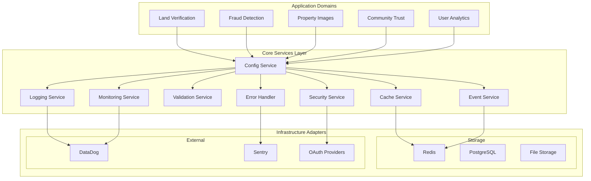

# Cross-Cutting Concerns Consolidation Design Document

## Executive Summary

This design document outlines the architectural approach for consolidating 74+ duplicate cross-cutting files into a unified, production-grade core system. Rather than blindly deleting duplicates, we will analyze implementations, extract best practices, and create a robust foundation that eliminates sprawl while enhancing system reliability.

## Current State Analysis

### Problem Statement

Our codebase suffers from significant technical debt through uncontrolled sprawl of cross-cutting concerns. The audit reveals 74 duplicate files across 10 major categories, creating maintenance nightmares, inconsistent behavior, and increased bug surface area. Teams have independently implemented similar solutions without coordination, leading to feature inconsistencies and deployment risks.

### Key Challenges Identified

The sprawl manifests in several critical ways that demand immediate attention. Configuration management appears in 12 different locations with varying schema validation approaches, making environment-specific deployments unreliable. Nine separate logger implementations create inconsistent log formatting and missing correlation between services. Eight cache implementations use different eviction strategies and connection patterns, leading to cache stampedes and memory leaks. Fourteen testing utilities duplicate setup logic, making test maintenance expensive and flaky.

### Architectural Vision

We will establish a unified core architecture that provides consistent, well-tested implementations of cross-cutting concerns. This core system will serve as the single source of truth for configuration, logging, caching, validation, error handling, security, and monitoring capabilities across all application domains.

## High-Level System Architecture



## Detailed Component Specifications

### Configuration Service Architecture

The Configuration Service will serve as the centralized authority for all application settings, implementing a layered approach that ensures type safety and environment-specific behavior.

```typescript
interface ConfigService {
  // Core configuration management
  get<T>(key: string): Promise<T>;
  set<T>(key: string, value: T): Promise<void>;
  watch<T>(key: string, callback: (value: T) => void): UnsubscribeFunction;
  
  // Schema validation and transformation
  validate<T>(schema: ZodSchema<T>, config: unknown): Result<T, ValidationError>;
  transform<T>(transformer: ConfigTransformer<T>): ConfigService;
  
  // Environment and hot-reload capabilities
  getEnvironment(): Environment;
  enableHotReload(patterns: string[]): void;
  createSnapshot(): ConfigSnapshot;
}

interface ConfigServiceImpl extends ConfigService {
  private schema: Map<string, ZodSchema>;
  private cache: LRUCache<string, any>;
  private watchers: Map<string, Set<Function>>;
  private fileWatcher: FSWatcher;
}
```

The implementation will consolidate the best features from existing config files while adding production-grade capabilities like schema validation, hot reloading, and environment-specific defaults. Configuration will be loaded hierarchically from environment variables, configuration files, and remote sources with proper precedence rules.

### Unified Logging Architecture

The Logging Service replaces nine separate logger implementations with a structured, context-aware system that supports distributed tracing and intelligent log aggregation.

```typescript
interface LoggingService {
  // Structured logging with context
  info(message: string, context?: LogContext): void;
  warn(message: string, context?: LogContext): void;
  error(error: Error, context?: LogContext): void;
  debug(message: string, context?: LogContext): void;
  
  // Context management
  createChildLogger(context: LogContext): Logger;
  withCorrelationId(correlationId: string): Logger;
  withRequestContext(request: Request): Logger;
  
  // Transport and formatting
  addTransport(transport: LogTransport): void;
  setFormatter(formatter: LogFormatter): void;
  configureRedaction(rules: RedactionRule[]): void;
}
```

This unified approach eliminates inconsistent log formats while adding crucial production features like correlation ID tracking, automatic PII redaction, and integration with monitoring systems. The service will support multiple transports for different environments while maintaining consistent structured output.

### Advanced Cache Management

The Cache Service consolidates eight different cache implementations into a multi-tier architecture that handles everything from in-memory LRU caches to distributed Redis clusters with intelligent failover.

```typescript
interface CacheService {
  // Multi-tier cache operations
  get<T>(key: string): Promise<T | null>;
  set<T>(key: string, value: T, ttl?: number): Promise<void>;
  delete(key: string): Promise<boolean>;
  clear(pattern?: string): Promise<number>;
  
  // Advanced cache patterns
  getOrSet<T>(key: string, factory: () => Promise<T>, ttl?: number): Promise<T>;
  mget(keys: string[]): Promise<Map<string, any>>;
  mset(entries: Map<string, any>, ttl?: number): Promise<void>;
  
  // Cache warming and invalidation
  warmCache(keys: string[]): Promise<void>;
  invalidatePattern(pattern: string): Promise<void>;
  addEvictionListener(callback: EvictionCallback): void;
}
```

The implementation provides L1 (memory) and L2 (Redis) tiers with automatic promotion and demotion based on access patterns. Circuit breakers prevent cascade failures when Redis is unavailable, and intelligent serialization reduces memory overhead.

### Comprehensive Validation Framework

The Validation Service unifies seven separate validation implementations into a schema-driven system that provides consistent error messaging and transformation capabilities across all domains.

```typescript
interface ValidationService {
  // Schema registration and validation
  registerSchema<T>(name: string, schema: ZodSchema<T>): void;
  validate<T>(schemaName: string, data: unknown): Result<T, ValidationError[]>;
  validatePartial<T>(schemaName: string, data: Partial<unknown>): Result<Partial<T>, ValidationError[]>;
  
  // Middleware and transformation
  createMiddleware(schemaName: string): ExpressMiddleware;
  transform<T>(data: unknown, transformer: DataTransformer<T>): T;
  sanitize(data: unknown, rules: SanitizationRule[]): unknown;
  
  // Custom validation rules
  addCustomValidator(name: string, validator: CustomValidator): void;
  composeValidators(...validators: Validator[]): CompositeValidator;
}
```

This approach eliminates validation inconsistencies while providing powerful features like custom rule composition, automatic sanitization, and consistent error formatting that works seamlessly with API responses.

## Data Models and Integration Points

### Configuration Data Model

Configuration data will follow a hierarchical structure that supports environment-specific overrides and schema evolution without breaking existing deployments.

```typescript
interface ConfigurationSchema {
  environment: 'development' | 'staging' | 'production';
  database: DatabaseConfig;
  cache: CacheConfig;
  logging: LoggingConfig;
  security: SecurityConfig;
  monitoring: MonitoringConfig;
  features: FeatureFlags;
}

interface DatabaseConfig {
  host: string;
  port: number;
  database: string;
  pool: PoolConfig;
  ssl: SSLConfig;
}
```

### Event-Driven Integration

Core services will communicate through a type-safe event system that ensures loose coupling while maintaining data consistency across service boundaries.

```typescript
interface CoreServiceEvent {
  type: 'config.updated' | 'cache.evicted' | 'validation.failed' | 'error.occurred';
  source: string;
  correlationId: string;
  timestamp: Date;
  payload: unknown;
}
```

## Error Handling Strategy

### Hierarchical Error Management

The error handling system implements a three-tier approach that ensures consistent error responses while preserving diagnostic information for debugging and monitoring.

**Tier 1: Error Classification** - All errors inherit from a base CoreError class that includes correlation IDs, contextual information, and severity levels. Domain-specific errors extend this base to provide specialized handling for business logic failures.

**Tier 2: Recovery Strategies** - The system implements automatic retry with exponential backoff for transient failures, circuit breaker patterns for external service dependencies, and graceful degradation when non-critical services are unavailable.

**Tier 3: Reporting and Alerting** - Critical errors trigger immediate alerts while maintaining detailed error context for troubleshooting. Error rates and patterns are monitored to identify systemic issues before they impact users.

```typescript
interface ErrorRecoveryStrategy {
  canHandle(error: Error): boolean;
  recover(error: Error, context: ErrorContext): Promise<RecoveryResult>;
  shouldRetry(error: Error, attemptCount: number): boolean;
  getBackoffDelay(attemptCount: number): number;
}
```

## Testing Strategy

### Multi-Level Testing Approach

The testing strategy ensures that core services are thoroughly validated while providing utilities that make domain-specific testing more reliable and maintainable.

**Unit Testing** focuses on individual service methods with comprehensive mocking of external dependencies. Each core service will achieve 95% code coverage with particular attention to error conditions and edge cases.

**Integration Testing** validates service interactions using controlled test environments that mirror production configuration. These tests ensure that services work correctly together while maintaining acceptable performance characteristics.

**Performance Testing** establishes baseline metrics for all core services and validates that performance remains stable as the system scales. Load testing focuses on cache efficiency, database connection pooling, and error handling under stress.

```typescript
interface TestingFramework {
  createMockLogger(): MockLogger;
  createMockCache(): MockCache;
  createTestDatabase(): TestDatabase;
  setupIntegrationTest(services: CoreService[]): TestEnvironment;
  measurePerformance<T>(operation: () => Promise<T>): PerformanceMetrics;
}
```

## Implementation Phases

### Phase 1: Foundation Services (Weeks 1-3)

The initial phase establishes core infrastructure services that other components depend upon. This includes the Configuration Service with schema validation, basic Logging Service with structured output, and Error Handling framework with recovery strategies. Success criteria include all existing configuration files successfully migrated to the new system, consistent log formatting across all services, and proper error correlation tracking.

### Phase 2: Data and Validation (Weeks 4-6)

Phase two introduces the Cache Service with multi-tier architecture and the Validation Service with schema registry. This phase also implements the Event Service for inter-service communication. Success criteria include elimination of cache inconsistencies, unified validation across all API endpoints, and reliable event delivery between services.

### Phase 3: Security and Monitoring (Weeks 7-9)

The final implementation phase adds Security Service with authentication and authorization, comprehensive Monitoring Service with health checks and metrics, and Storage Service with multi-provider support. Success criteria include centralized security policy enforcement, comprehensive system observability, and reliable file operations across all storage backends.

### Migration Strategy

The migration approach ensures zero-downtime transitions while maintaining backward compatibility throughout the process.

**Parallel Implementation** - New core services are implemented alongside existing systems, allowing gradual migration without service disruption. Feature flags control which implementation is used, enabling quick rollback if issues arise.

**Incremental Service Migration** - Domain services migrate one at a time, starting with the least critical to minimize risk. Each migration is validated through comprehensive testing before proceeding to the next service.

**Backward Compatibility** - Existing APIs maintain their current interfaces while internally delegating to core services. This approach allows applications to continue functioning while benefiting from improved reliability and consistency.

**Data Migration** - Configuration and cached data migrate through parallel write systems that ensure data consistency during the transition period. Validation ensures that migrated data maintains the same semantics as the original implementation.

The migration timeline spans nine weeks with built-in checkpoints for validation and rollback. Each phase includes comprehensive testing and monitoring to ensure system stability throughout the transition process. Success metrics include reduced incident rates, improved system performance, and decreased development time for new features that use cross-cutting concerns.