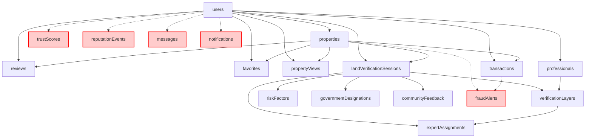
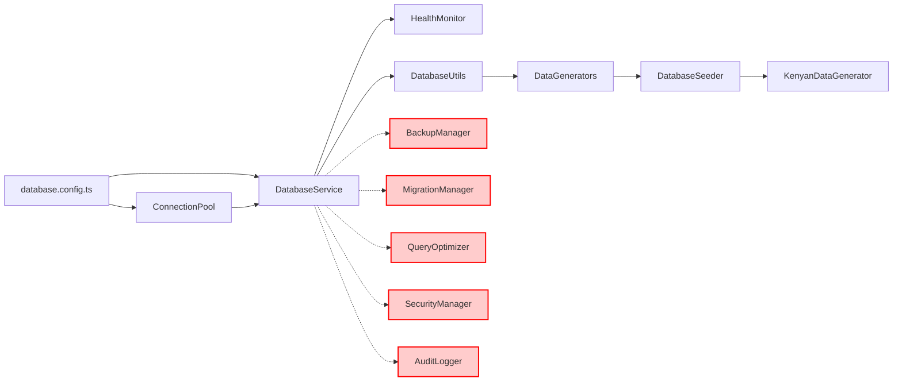
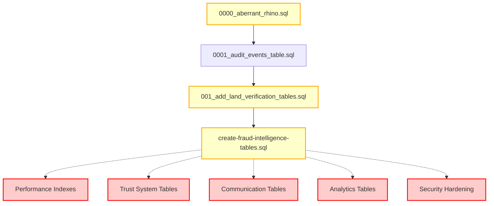

# Database Dependency Map

## Schema Dependencies



## Service Dependencies



## Migration Dependencies



## File Structure Dependencies

```
database/
├── config/
│   ├── database.config.ts ✅
│   ├── backup.config.ts ❌
│   └── security.config.ts ❌
├── schemas/
│   ├── consolidated.ts ✅ (exports all)
│   ├── core/index.ts ✅ (8 tables)
│   ├── verification/index.ts ✅ (6 tables)
│   ├── trust/index.ts ❌ (empty)
│   ├── fraud/index.ts ❌ (empty)
│   ├── communication/index.ts ❌ (empty)
│   └── analytics/index.ts ❌ (empty)
├── migrations/
│   ├── core/ ✅ (15+ files, inconsistent naming)
│   ├── verification/ ❌ (empty)
│   ├── trust/ ❌ (empty)
│   ├── fraud/ ❌ (empty)
│   └── performance/ ❌ (missing)
├── services/
│   ├── service.ts ✅
│   ├── connection/production-pool.ts ✅
│   ├── health/health-monitor.ts ✅
│   ├── backup/ ❌ (missing)
│   └── security/ ❌ (missing)
├── seeds/
│   ├── database-seeder.ts ✅
│   ├── kenyan-data-generator.ts ✅
│   └── performance-data.ts ❌ (missing)
└── docs/
    ├── README.md ✅
    ├── kenya-land-verification.md ✅
    ├── performance-guide.md ❌
    ├── security-guide.md ❌
    └── backup-procedures.md ❌
```

## Critical Path Analysis

### High-Impact Dependencies (Must Fix First)
1. **Schema Fragmentation** → All development work
2. **Missing Trust Schemas** → User reputation system
3. **Missing Fraud Schemas** → Security and compliance
4. **Migration System** → Deployment capability

### Medium-Impact Dependencies
1. **Missing Backup System** → Data safety
2. **Performance Indexes** → Query performance
3. **Security Hardening** → Production readiness

### Low-Impact Dependencies
1. **Analytics Schemas** → Business intelligence
2. **Communication Schemas** → User experience
3. **Documentation** → Operational efficiency

## Circular Dependencies (None Found)
✅ No circular dependencies detected in current schema structure
✅ Clean separation between core and domain schemas
✅ Proper foreign key relationships without cycles

## Orphaned Components
- `server/infrastructure/database/schemas/consolidated` - Legacy file, should be removed after consolidation
- Empty domain schema directories - Should be populated or removed
- Unused migration scripts - Need cleanup and reorganization

## Import/Export Analysis

### Current Import Patterns
```typescript
// ❌ Fragmented imports (current state)
import { users } from 'src/shared/schema';
import { properties } from 'database/schemas/core';
import { landVerificationSessions } from 'database/schemas/verification';

// ✅ Consolidated imports (target state)
import { users, properties, landVerificationSessions } from 'database/schemas/consolidated';
```

### Export Consolidation Status
- **Core Schemas**: ✅ Properly exported through consolidated.ts
- **Verification Schemas**: ✅ Properly exported through consolidated.ts
- **Trust Schemas**: ❌ Not implemented
- **Fraud Schemas**: ❌ Not implemented
- **Communication Schemas**: ❌ Not implemented
- **Analytics Schemas**: ❌ Not implemented

## Recommendations

### Immediate Actions (Week 1)
1. **Eliminate Schema Fragmentation**
   - Remove `server/infrastructure/database/schemas/consolidated` after migration
   - Update all imports to use `database/schemas/consolidated`
   - Ensure backward compatibility during transition

2. **Implement Missing Domain Schemas**
   - Trust system: 3 tables, 2 days
   - Fraud detection: 4 tables, 3 days
   - Communication: 3 tables, 2 days

3. **Reorganize Migration System**
   - Standardize naming convention
   - Create domain-specific migration directories
   - Implement rollback procedures

### Medium-term Actions (Week 2-3)
1. **Performance Optimization**
   - Add comprehensive indexing
   - Implement query optimization
   - Create performance monitoring

2. **Security Hardening**
   - Implement row-level security
   - Add audit logging
   - Create backup system

3. **Documentation Completion**
   - Operational procedures
   - Security guidelines
   - Performance optimization guide

This dependency map provides a clear view of the current database architecture and highlights the critical path for consolidation and optimization efforts.